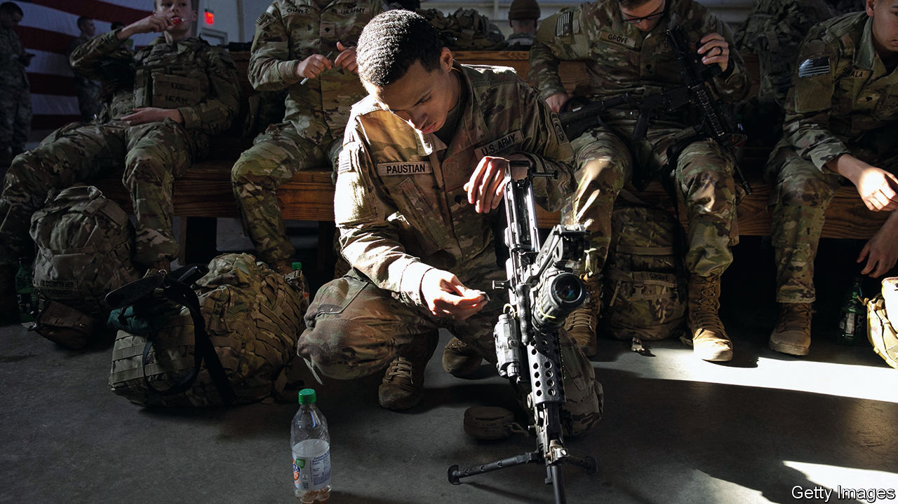
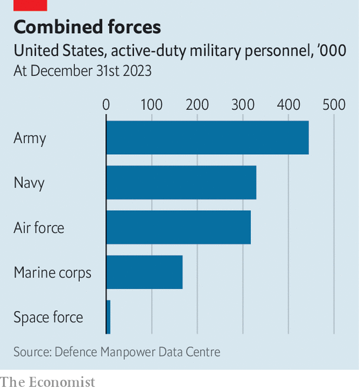

###### From sand to sea

# Does the American army’s future lie in Europe or Asia? 

##### It could not wage wars in both at the same time 

 

> Feb 19th 2024 

THE YEAR 1973 was pivotal for America’s army. The force was  from Vietnam. In January the defence secretary announced the end of conscription; two months later the last combat troops left Vietnam. But the Arab-Israeli war which broke out on Yom Kippur in October planted the seeds of renewal. The lessons of that war, absorbed by American officers sent to Israel, helped reshape America’s army into the modern and professional force which would vanquish Iraq in 1991.

Today’s generals, who came of age during that transformation, are keenly aware of the resonance. “There’s a loose analogy between the early 1970s and the army of Desert Storm,” says General James Rainey, who leads the army’s Future Command, “and the army which invaded Iraq in the early 2000s and where we need to be in 2040.” Two decades of war in Afghanistan and Iraq , equipment and ideas. A recruitment shortage remains unresolved. Now the rise of China and the lessons from the  have prompted introspection, renewal and reform. 

Among army civilian and military leaders there are three big unsettled questions, according to people familiar with those debates. One is whether profound shifts in the character of war, some evident in Ukraine, might render ground forces less important, if not irrelevant.

A second is how to balance resources between Asia and Europe (Asia being the Pentagon’s priority, and Europe where Russia is rearming fast). The army can prepare for conflicts in both places, but it cannot actually wage those wars at the same time—and it is no longer asked to do so. The 2018 National Defence Strategy ended the “two war” standard, a change accepted by the Biden administration. 

That leads to a third question, and the most existential for the army. What, beyond the provision of logistics and air defence, would be the role of a ground force in a future war in the Pacific?

When General Randy George, the army’s chief of staff, was recently asked for book recommendations, he cited “The Arms of the Future” by Jack Watling, a young British analyst. The book describes how in recent rounds of Warfighter, a big annual exercise led by America, combat brigades facing increasingly good sensors and longer-range and deadlier munitions took huge losses, emerging with 20% combat effectiveness. Artillery devastates infantry and armour well before they can get within sight of the enemy.

The war in Ukraine has reinforced those findings. Some argue that America’s army, better trained and armed than Ukraine’s, and with air cover, would fare better. General Rainey assumes the worst. “We’re going to fight under constant observation,” he says, “and in constant contact of some form. There is no break. There is no sanctuary.” He says American “lessons learned” teams were in place three days before the invasion to collect observations. They will have had some nasty surprises. American-made GPS-guided shells and rockets at first worked well; more recently, they have struggled against Russian jamming.

The army recognises that whereas it could once patiently muster its forces before launching a large offensive—as it did against Iraq in 1991 and 2003—it now has to prioritise dispersal, mobility and concealment. The drone attack which killed three soldiers in Jordan on January 28th was the first successful attack on American troops by aircraft since the Korean war. Katie Crombe, an army officer, and John Nagl, of the US Army War College in Pennsylvania, note in a recent paper that Ukraine’s battalion command posts comprise seven soldiers who dig into the ground and move twice daily. “That standard”, they warn, pointing to stubborn habits of more static command posts, “will be hard for the US Army to achieve.”

The commanders of battalions (about 1,000 soldiers) and brigades (a few thousand), the core units of combat in Afghanistan and Iraq, would be consumed by this intense fighting in a way they were not during counterinsurgency missions. The army is thus reorganising so that more of the burden of planning, logistics, command and control, and long-range firepower falls on divisions—larger formations typically led by two-star generals which stand farther back from the front lines and have more time and space to orchestrate the frenetic battles of the future.

What remains unsettled, says Billy Fabian, a former infantry officer and Pentagon planner, is how, precisely, the army’s combat forces should be organised for future wars: the balance between firepower on the one hand, dominant in Ukraine, and so-called manoeuvre elements, such as infantry and armour, on the other. “Fighting land wars is the army’s raison d’être,” he says, “and Ukraine raises tough questions that challenge deeply ingrained elements core to the army’s self-conception.”

Army dreamers

Hanging over these reforms is the larger question of where the army will be asked to fight. National defence strategies published by the Trump and Biden administrations instruct the Pentagon to focus on China. Yet the army increased its footprint in Europe after Russia’s first invasion of Ukraine in 2014. It has since reinforced the continent with a corps and division headquarters, an infantry and armour brigade, a rocket artillery battalion and numerous other support forces. In contrast, relatively few new forces have flowed into Asia.

For years the army’s principal role in the Pacific was to guard bases, provide air defence and handle logistics. To the extent it was a “manoeuvre” force, in military parlance, it was focused on North Korea. Other services have looked down their noses at it. “The navy has a stranglehold on the leadership of Indo-Pacific Command,” says Stacie Pettyjohn of the Centre for a New American Security, a think-tank in Washington. “They see the army only in a supporting role in a maritime theatre.”

 


General Charles Flynn, the commander of the US Army Pacific, vigorously rebuts such ideas. “Humans have this unique tendency to live on land,” he says. “At the end of the day, decisions are going to be made by the pointy end of a gun.” The primacy of land is as true in Asia as it is in Europe, he argues, not least because the region’s largest countries, like India and Indonesia, have military forces dominated by armies. By building ties to them in peacetime, the army can position itself to project military power westward.

The growing pace of exercises (more than 40 take place annually) is a core part of that. General Flynn points to the examples of Talisman Sabre in Australia and Garuda Shield in Indonesia. Both were once relatively modest army-to-army exercises. They have grown and now involve the navy and air force. Both also involved the army’s Joint Pacific Multinational Readiness Centre, in essence physical and virtual training equipment that can be deployed around the region to do things which could only have been done at a large base in Louisiana. Such drills are morphing into a near-permanent presence: the army is deployed in the region for eight months of the year.

Alongside that is a reimagining of how the army would fight. The premise is that China has optimised its forces to attack American satellites, ships and air bases. “What it’s not designed against”, says General Bernard Harrington, “is to find, fix and finish land formations that are distributed, mobile and networked.” That has prompted the creation of three experimental “multi-domain task forces”, or MDTFs, the first of which is focused on Asia and commanded by General Harrington.

Each MDTF has four battalions which can deploy small units along the first island chain which runs from Japan to the Philippines. The idea is that these can fight not just on land—soldier v soldier, tank v tank—but across domains. Imagine that America needs to target a Chinese ship. The MDTF’s “effects” battalion might jam the vessel’s radar and hack its networks; if that does not neutralise the ship, it makes it more likely that anti-ship missiles launched by a “fires” battalion will get through. The force’s long-range hypersonic missiles, which arrived last year, have a range of nearly 3,000km—enough to reach from Japan to Taiwan, or from the Philippines to the South China Sea.

Initial experiments with the MDTFs have shown promise, though some are sceptical that this high-tech vision of war would survive contact with reality. Two MDTFs are currently devoted to Asia, with a third for Europe. The original plan envisioned a total of five, with an additional one in the Arctic and one for global tasks.

All this would seem to offer a definitive answer to the army’s identity crisis: Asia first. Inside the Department of the Army, nestled within the Pentagon, there are doubts, though. One question is whether its own plans mesh with those of the armed services as a whole. “The army still feels marginalised in the Pacific,” says Ms Pettyjohn. Another is whether the army itself has pivoted ruthlessly enough. Its fleet of water craft has shrunk dramatically in recent years, for instance. “Water craft are an absolute indicator of true commitment to the Pacific,” says J.P. Clark, another Army War College professor. “They are quite expensive, only really useful for that theatre, and absolutely essential.”

Hard choices ahead

The MDTFs themselves remain “niche” formations, argues Mr Fabian. The largest allocated to the region is the 25th Infantry Division in Hawaii, he points out, a light-infantry division. “It seems like the army is trying to have it both ways,” he says. “Talk about fires and air defence for the Pacific, but stay a combined-arms force organised for close combat like it’s always been.” The army hedges its bets, says an insider, because it rarely wages the war it expects.

Trade-offs abound. Short-range artillery is vital for Europe; less so in Asia. “I just don’t know what you’d fire a 155-round at out in the Pacific other than the water,” quipped a top Pentagon official recently. The army will have to make firm choices in the next year or two, say officials. In part that is because it is creating more units than it can reliably man. The army expected to finish last year short of 10,000 recruits, a 15% shortfall and the second consecutive year of under-enlistment. Much of that is the result of America’s tight labour market, but it also reflects waning enthusiasm for military service, and for combat arms in particular.

The fall in the size of the “individual ready reserve”—reservists not allocated to a unit—from 450,000 in 1994 to 76,000 in 2018 worsens the problem. Ukraine shows how intense wars tend to chew up regular armies, requiring an infusion of citizens with military experience. Today’s shortage of combat soldiers is tomorrow’s shortage of reservists. Ms Crombe and Mr Nagl are among those who have floated the notion of “partial conscription”, an idea backed by just 20% of Americans. Now, as in the pivotal moments of the mid-1970s, the army finds itself wrestling with profound questions over its size, shape and purpose: questions that will eventually touch, as they did back then, its relationship to American society. ■


