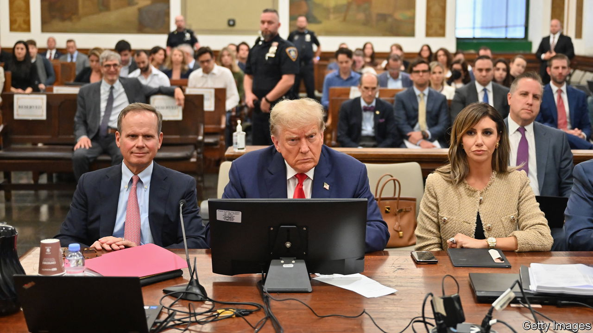

###### Voters’ views

# How might Donald Trump’s trials sway voters? 

#####  

 

> Feb 22nd 2024 


Polling suggests that most Republicans think the trials against Donald Trump have been conducted unfairly. Though 62% of Democrats say being a criminal is one of the worst traits a president can have, only 34% of Republicans say the same. But in a close election Mr Trump cannot afford to lose ground or put off undecided voters. ■


