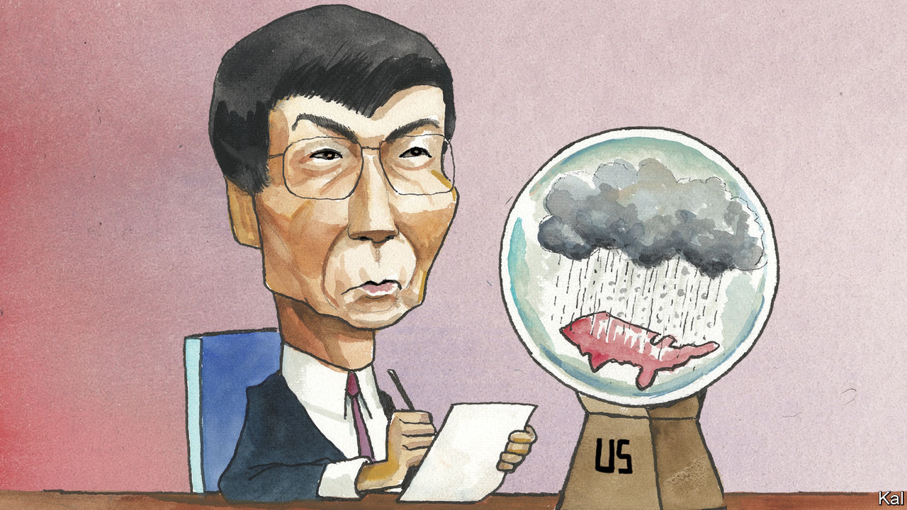

###### Lexington

# The flaws that China’s chief ideologue found in America 

##### As a young visitor decades ago, Wang Huning saw “an unstoppable undercurrent of crisis” 

 

> Feb 22nd 2024 

In August 1988 an inquisitive young Chinese political scientist named Wang Huning came to America for a six-month visit. He admired the Gateway Arch in St Louis, Missouri, and analysed the town government of Belmont, Massachusetts, watched a football game at the Naval Academy in Annapolis, Maryland, and toured a detergent factory in Iowa City, Iowa. He was shocked by the many people begging in the streets and amazed by the softness of the waterbeds in the furniture stores. One question preoccupied him: how had such a young country raced so far ahead of his homeland, with its history of more than 2,000 years? He found a lot to respect in the dynamism of America, but he also identified contradictions that could tear it apart.

China-watchers debate the extent to which Mr Wang’s American sojourn influenced the course of China’s modernisation. What is known is that he left academia just a few years later, cutting off his torrent of published work, to help define the Communist Party’s message and maybe its policies for three successive presidents. Now Xi Jinping’s chief of ideology and propaganda, he is one of seven members of the Communist Party’s ruling body. 

Americans should have learned from him, too. They still can. His book about his inquiry, “America against America”, is a time capsule from back before the cold war ended and the internet smashed a virtual world into the real one, back when a Chinese visitor might marvel that Americans could sharpen pencils with electric gizmos and order pizza over the phone. Mr Wang’s book reminds the American reader that in those days, too, Americans were anxious about big problems, from racism to homelessness.

America was an alien land to Mr Wang, and he saw important, enduring patterns in what the natives might overlook as the wallpaper of their lives. He spotted subtle controls everywhere. The police did not have to mandate identity cards because the government persuaded each citizen to volunteer to have one by calling it a driver’s licence and issuing it through a motor-vehicle agency. Big corporations such as Coca-Cola relieved the government of management over the lives of millions. 

Because just about everything could be denominated in dollars, the voluntary pursuit of financial wherewithal, rather than any ideology or political system of coercion, was the ultimate source of stability. “People manage money, and at the same time they use money to manage people,” he wrote. Technological superiority had become the source of Americans’ sense of national superiority: “If you want to overwhelm the Americans, you must do one thing: surpass them in science and technology.”

Mr Wang was astonished by the public libraries. Ancient Chinese thought was unique, he argued, but failed to influence the world because of a lack of means to share it. By contrast American libraries gave everyone access to the knowledge of generations. “The purpose of building a reservoir is not to store water, but to irrigate,” he wrote. Knowledge was the source of social progress, but also social conflict. How to get the former without the latter? 

Visiting Plymouth plantation and the Liberty Bell, Mr Wang admired how Americans put their thin history to work inculcating a shared political tradition. In light of recent events, his book’s most poignant passage describes the inauguration of President George H.W. Bush. Mr Wang was impressed by the pageantry, by the creation of a tradition strong enough to guarantee the transfer of authority. The important result, he wrote, “is not that the new president has power, but that the old president thus loses power”.

But Mr Wang did not think America’s unifying forces and traditions could withstand its centrifugal forces. He has been called the Chinese Tocqueville, but he disdained one of Tocqueville’s key conclusions. Mr Wang wrote that only someone such as Tocqueville, from an even more unequal society, could look at America and perceive a country achieving equality of conditions. Americans might claim to value both liberty and equality, but these values inevitably conflicted, and Americans prioritised freedom. They resented paying taxes that might yield greater equality, and the result was a destabilising divide between rich and poor. 

Americans also claimed to treat the family as the basic unit of society, “but in spirit, the family is being hollowed out” because Americans actually emphasised the individual. Mr Wang was unsettled that parents put children younger than one to bed in separate rooms and encouraged their children to leave home starting at 18, to enter society “like entering a battlefield”. These children would have no time to take care of their parents as they aged, and yet because of the resistance to taxes the government would not be able to care for them, either, or for others left behind.

Who lost America?

Mr Wang was taken with Allan Bloom’s “The Closing of the American Mind”, published in 1987, which lamented a shift to cultural relativism in higher education. Mr Wang believed an abandonment of shared values was precipitating an American “spiritual crisis”. He thought the American system—“based on individualism, hedonism and democracy”—was losing out to the Japanese system “of collectivism, self-forgetfulness and authoritarianism”. 

Mr Wang got that one wrong. And the Chinese model does not look so hot these days, either. But many Americans have come to share a version of his conclusion, that America’s contradictions are creating “an unstoppable undercurrent of crisis”. A record low of 28% say they are satisfied with “the way democracy is working in this country”, according to a recent Gallup poll. Sensible Americans still think that if only supporters of Donald Trump would wake up to the threat he represents to American institutions, they would reject him. The chilling reality is that that is what they like about him. Mr Wang may not have anticipated Mr Trump, but he did identify the corrosion of civic virtue that is letting the once and possibly future president tear so much to pieces. ■


