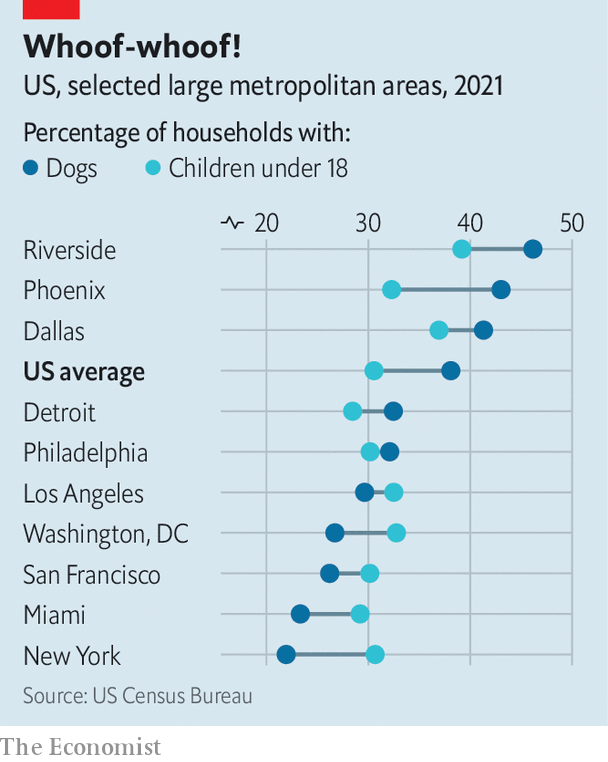

###### Counting canines

# These American cities are obsessed with dogs 

##### They are probably not the ones you think 

 

> Feb 22nd 2024 

ONE OF THE caricatures of millennials (along with eating too much avocado toast, as if that’s possible) is that they treat their pets like children. Precious pups are carted around in prams. Spot isn’t just a dog, he is a “fur baby”. Except he is probably not called Spot. Human names for pets are . There is even some overlap between the top-ten names for dogs and babies. “Luna” and “Theodore” grace both lists, though for dogs it is the cuddlier “Teddy”. 

So when it came out in recent years that San Francisco probably has more dogs than children, it seemed like an idiosyncrasy befitting a city filled with tiny flats and wealthy millennials. But San Francisco is not the only place where this may be true (Denver claims more pups than tots too). Nor is it even close to the most dog-obsessed area in America. 

It is tricky to do a systematic comparison of the populations of dogs versus children in big cities. Counting canines is not a precise process. Local parks departments or animal-control agencies may have a ruff estimate, but their methods can differ by city. 

 


To try to rank cities by their dog obsessiveness,  used Census data to compare the proportion of households with children under 18 to that of households with dogs in the 15 biggest metropolitan areas in America. Riverside—which contains the suburbs east of Los Angeles—takes the biscuit. Nearly half of homes there have a tail-wagging tenant. Phoenix and Dallas round out the top three for dog ownership (see chart). 

Six of the 15 cities, as well as the country as a whole, have more homes with dogs than tots. San Francisco is not one of them. What explains which places are pup-sessed? There is no clear geographical trend. The cities with the biggest gaps between the number of homes with dogs and those with kids are in the Sunbelt. But Detroit, Seattle and Philadelphia are just behind. There is a correlation, however, between household space and high rates of dog ownership. Dogs are more prevalent in cities where single-family homes are common. Just 22% of homes in New York City have a dog. Pity the pup cooped up in a closet-sized flat in Tribeca. The paw thing would go barking mad.■


