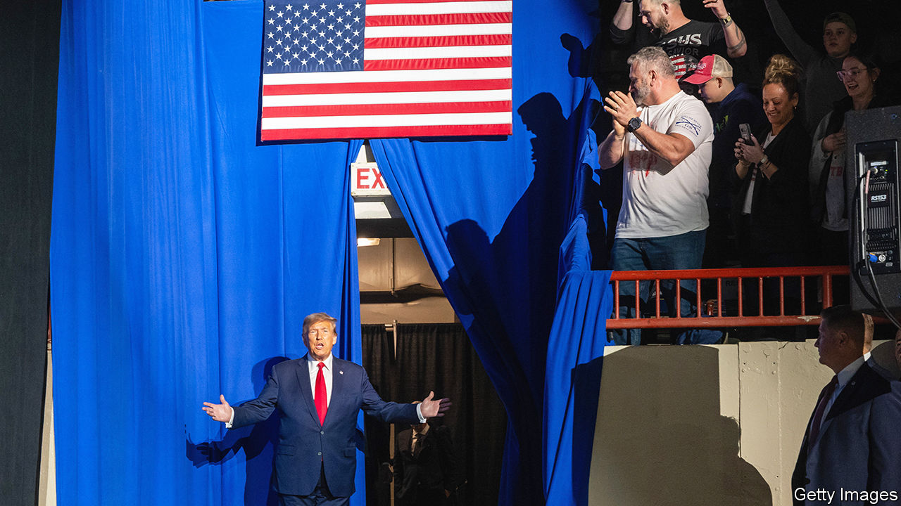

###### The Trump trials

# Why those who wish to see Trump jailed soon will be disappointed 

##### The flimsiest of the cases is set to go first, and all face delays 

 

> Feb 22nd 2024 

The prosecutors trying to convict Donald Trump face a highly unusual deadline. Retaking the presidency would offer Mr Trump his best escape from jeopardy: once back in the White House, he would be able to squelch or pause the four criminal cases lodged against him. Hence prosecutors’ urgency—and a public interest—in concluding those trials before November. Miss that opportunity and he may never be held accountable in a court of law for his alleged crimes.

The 91 felony charges against Mr Trump are both serious and picaresque. The weightiest are related to his role in the attack on the Capitol on January 6th 2021. His attempt to overturn his defeat in the 2020 election was the most shocking and serious assault on the constitution in decades, if not since the civil war; whether a jury would see Mr Trump as guilty or innocent has obvious salience as voters prepare to decide whether to return him to the presidency. There are additional allegations about election interference in Georgia and the mishandling of state secrets. And (as if a Trump saga could not be without a splash of tabloid entertainment) there is also a plot involving a payment to a porn star.


The pending criminal cases come on top of heavy losses Mr Trump has endured recently in adjudicated civil lawsuits. On February 16th a judge in New York fined Mr Trump and his business $355m (plus $99m and rising in interest) for misrepresenting asset values to lenders, and barred him from serving as a corporate director in the state for three years. Add the $88m in damages awarded to E. Jean Carroll, a writer whom Mr Trump sexually assaulted decades ago and then defamed, and he owes more than $500m. The judgments—which he will appeal against—could deplete his cash holdings and compel him to sell some of his assets.

Mr Trump insists he has done nothing wrong in any of the cases discussed in this article, and has so far incorporated all of them deftly into his restoration narrative of victimhood and revenge-seeking. The fact that two of the criminal indictments were brought by district attorneys elected to their offices as Democrats has provided ballast for his claims that he is being targeted by political enemies. Still, he will frequently appear before judges as an accused felon over the remaining eight months of the campaign. Indeed, Americans are already growing accustomed to a split-screen of scowling courtroom appearances and MAGA rallies that has no precedent in past presidential elections.

Yet Democrats who wish to see him locked up by election day will be disappointed. It seems probable that at most one or two trials will conclude before voting starts, and even if the former president is convicted of one or more felonies, he is likely to avoid or at least delay a prison term until after the election is decided. 

A trial in the January 6th case could take place in summer or early autumn, depending on how Mr Trump’s appeals unfold. If it does go forward during the campaign, wall-to-wall news coverage will refresh memories of how Mr Trump’s Big Lie and his attempt to stop Congress from certifying the vote led hundreds of his supporters to storm the Capitol. Five people died as a result of the attack and more than 150 police officers were injured.

However, instead of a trial-of-the-century about an event of plain historical significance, the flimsiest of the four cases may go forward first. That trial is scheduled for March 25th in Manhattan. 

Alvin Bragg, a Democrat who is the borough’s elected district attorney, brought an indictment that does not lack ambition. Mr Trump stands accused of 34 felonies for falsifying business records to hide hush money paid to Stormy Daniels, a porn actress, before the 2016 election. Prosecutors allege that Mr Trump ordered his lawyer, Michael Cohen, to buy Ms Daniels’s silence for $130,000. After he won the election he reimbursed Mr Cohen and marked those payments as legal expenses.

First but not foremost

The case is convoluted. Normally the charge would be a misdemeanour. To elevate it to a felony, prosecutors must prove the records were falsified with intent to commit another crime. Mr Bragg has alluded to several other offences in legal filings. He could say the payments violated federal campaign-finance laws since they were not declared as contributions, or that taxes were not paid on them. 

Mr Bragg’s case falls in a legal grey area. Federal election law pre-empts state prosecutors from bringing cases about federal races. By pursuing an untested legal theory Mr Bragg has bolstered Mr Trump’s claim that he is the target of a partisan prosecution, says Jed Shugerman of Boston University School of Law. 

There are other problems with Mr Bragg’s case. The star witness, Mr Cohen, lacks credibility, having lied to Congress and a federal judge. The carnivalesque nature of the trial—a former tabloid publisher and a former  model will probably testify—will play to Mr Trump’s advantage, making the case seem like reality TV, a format in which he is highly practised. Even if Mr Trump is convicted, there seems to be little chance that the judge would sentence him to prison on such novel charges involving the manipulation of records.

The January 6th case was lodged in federal court in Washington, DC, by Jack Smith, a special counsel in the Department of Justice (DoJ). Mr Smith charged Mr Trump with four crimes, including conspiracy to defraud the United States and to deny voters their rights by using lies, “fake” electors and other schemes to thwart the lawful certification of the electoral-college vote by Congress on January 6th. The indictment was tight, conservative and designed to move quickly, says Ryan Goodman of New York University School of Law. Though it lists six alleged co-conspirators, only Mr Trump was charged. (The others may be later.) No count relates directly to the violence of the Capitol riot. That would have been a heavier lift for prosecutors. 

A charge of insurrection or seditious conspiracy—used to convict a number of far-right militia leaders who stormed the Capitol—would have required proof that Mr Trump knew the protests that day would turn violent. Incitement would have elicited a potentially strong First Amendment defence. Still, Mr Smith will need to show criminal intent. Mr Trump’s lawyers contend that he genuinely believed he won and that advisers said his pressure tactics were legal. That may not be a winning defence: plenty of people repeatedly told him he had lost. But it is a viable one. Rebecca Roiphe of New York Law School cautions against calling the case rock-solid.

Mr Smith faces another vulnerability. Two of the four charges—obstruction of an official proceeding and conspiracy to do so—relate to the disruption of the counting of electoral-college votes. More than 150 Capitol rioters have been convicted of or pleaded guilty to those felonies. Some of them have challenged the charges by arguing that the underlying criminal statute, which was passed after the Enron accounting scandal, applies only to evidence-tampering. This spring the Supreme Court will hear a Capitol defendant’s bid to invalidate the charges. A decision will come by July and could oblige Mr Smith to cut his indictment in half.

The biggest question-mark is the trial’s timing. Initially the presiding judge, Tanya Chutkan, an Obama appointee, moved the case along quickly. But in mid-December she froze trial preparation so that Mr Trump could argue in a federal appeals court that the case should be thrown out on presidential-immunity grounds. A three-judge appellate panel unanimously rejected his request earlier this month. The Supreme Court will probably decide by early March whether to take it up. If the justices agree to hear the case, that will add a delay of weeks and perhaps months.

By July at the latest Judge Chutkan should have a green light from the Supreme Court to unfreeze the proceedings. (Hardly anyone expects the justices to side with Mr Trump on immunity, assuming they even agree to take his case.) Several weeks of preparation will need to be recouped before the trial actually gets under way. Then the trial itself will take about two to three months. That gives decent odds of a verdict by election day.

If Mr Trump is convicted, sentencing will be up to Judge Chutkan. She has required prison time for every convicted Capitol rioter whose trial she has overseen. But that seems highly unlikely for a former president. A more plausible scenario would be a fine, probation or house arrest. In any event he would remain free while he appealed against the conviction.


If Mr Smith’s federal indictment over election interference is a targeted harpoon, its state counterpart in Fulton County, Georgia, is a giant trawl net. Both rely in essence on the same facts and witnesses. The big difference is that Fani Willis, a Democrat who is the elected district attorney in Fulton County, named 18 co-defendants alongside Mr Trump, whom she charged with 13 felonies. All were indicted under an anti-racketeering statute first used against the mafia. A conviction can result in prison time of five years or longer. Ms Willis says she wants the trial to start in August and, given the number of co-defendants, expects it to run into 2025. Three have pleaded guilty so far.

But the case has been derailed by revelations of an affair between Ms Willis and a lawyer she hired onto her team. The defendants want her disqualified, prompting a mini-trial about the nature of the relationship. They argue that Ms Willis has a personal stake in prosecuting them, to see her paramour enriched—he made $728,000 on the job, and paid for at least a share of the couple’s holidays together. Ms Willis denies any impropriety and delivered combative testimony in her own defence at a hearing on February 15th.

If the judge, Scott McAfee, disqualifies her, a state agency will appoint a new prosecutor, which could take a year or more. Her replacement could alter or even dismiss the charges. Even if Judge McAfee lets her stay, he will probably allow the defendants to appeal against his decision and pause the case. Don’t bank on a trial before the election, in other words. The best chance of that happening is if Ms Willis voluntarily takes a leave of absence and her deputy severs Mr Trump’s case from his co-defendants’, says Clark Cunningham of Georgia State University College of Law. Nothing suggests that will actually happen. But as the only televised trial it could have the biggest impact of the four.

On the face of it, the case brought by Mr Smith involving Mr Trump’s alleged mishandling of classified documents is the most straightforward. But the judge randomly assigned to the case, Aileen Cannon, who was appointed to the bench by Mr Trump, has moved slowly, and there appears to be little chance that it will reach trial before November. 

Here the facts and the law are uncomplicated. Federal prosecutors charged Mr Trump with 40 felonies over his alleged wilful retention of national-defence papers and his refusal to give them back. According to prosecutors, after Mr Trump left the White House, he ordered aides to hide dozens of classified documents from the FBI. They were caught on video shuffling boxes. He appears to have misled his own lawyers, who certified to investigators that everything had been handed over. It took a raid on Mar-a-Lago, his Florida estate, to get them back. Some dealt with America’s nuclear arsenal. Mr Trump is said to have twice shown documents to visitors and acknowledged that they contained secrets. 

What makes the case thorny has less to do with its merits than with procedural hold-ups. In national-security prosecutions the government tries its best to withhold classified evidence from the defence, not to mention jurors. The judge decides what material has to be disclosed and to whom; those decisions are contentious and can be appealed against. The back-and-forth means delays.

Judge Cannon has scheduled hearings and filing deadlines with unusually long gaps in between, says David Aaron, a former prosecutor who handled similar cases. Brandon Van Grack, another former DoJ lawyer, doubts the trial will begin before November despite a tentative start date of May 20th. Judge Cannon’s decisions so far, he says, show scepticism towards prosecutors who want to limit the disclosure of evidence. That could portend more adverse rulings, which would prompt appeals and drag things out.

Whenever the trial does start it will be held in Mr Trump’s backyard in Florida and could draw a sympathetic jury. A single holdout juror can block criminal convictions, which require unanimity in America. Even if he is convicted, sentencing will be up to Judge Cannon. In normal circumstances someone found guilty of the alleged crimes would risk going to prison for a few years. But again that seems unlikely in this instance.

I beg my pardon?

Say Mr Trump wins in November, and gets convicted and sentenced in any of the four cases before taking office: what then? If he is convicted in either of the two federal cases, he will appeal. After the inauguration he might try to pardon himself, or better yet issue a blanket prospective self-pardon. (His attempt to pardon himself would not help him in either of the state cases, since presidential pardons do not cover state crimes.) No president has ever attempted that. When Richard Nixon contemplated it during the Watergate scandal, the DoJ said it was improper and he was let off by his successor, Gerald Ford. In any event the Supreme Court would have the last word. 

A surer bet would be for Mr Trump to appeal against his conviction, and then, while the case was winding through higher courts, order his attorney-general to drop it. Again, that trick would not work in Georgia or New York, since state cases sit outside the Justice Department’s purview. Yet DoJ policy says a sitting president cannot be prosecuted, and while the advisory opinion is unclear about state matters, it seems likely that all of Mr Trump’s criminal cases would be paused while he held the presidency. Prosecutions might resume in 2029 when he leaves the White House. At that point he would be 82. 

Mr Trump is partly right about the charges he faces. They are political—not in the sense that the cases are partisan attacks, but because of how they may or may not change . Over the next eight months the American justice system will be tested by Mr Trump’s defiance and delay. How that system performs will provide a measure of its own integrity and resilience. It will also determine whether a candidate who sneers at the rule of law is able to manoeuvre his way past the charges against him long enough to win in November and become a law unto himself. ■


