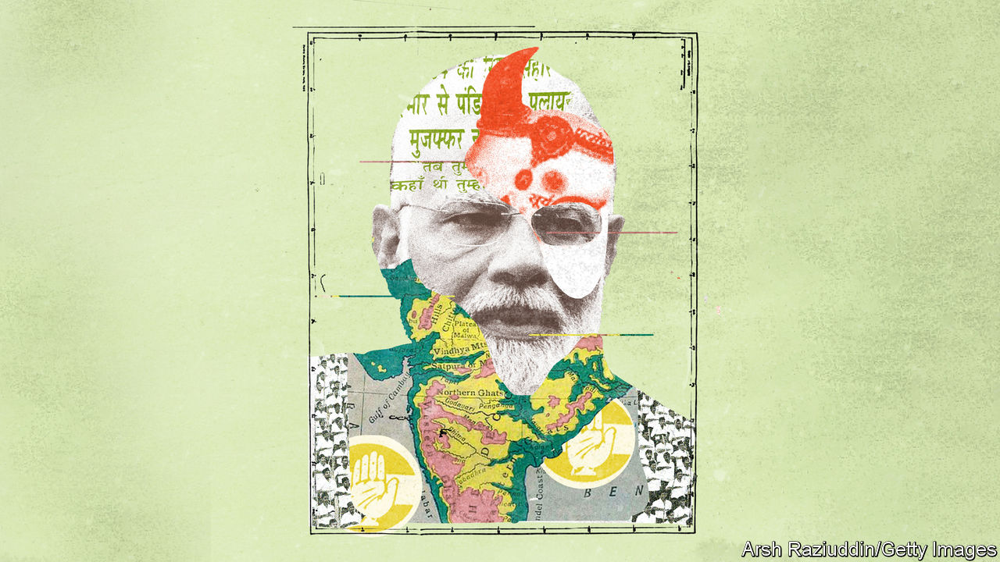
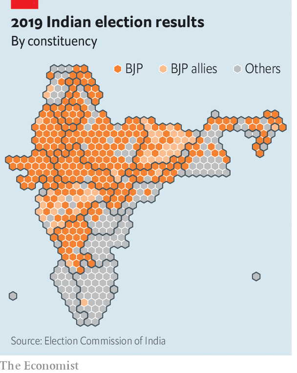
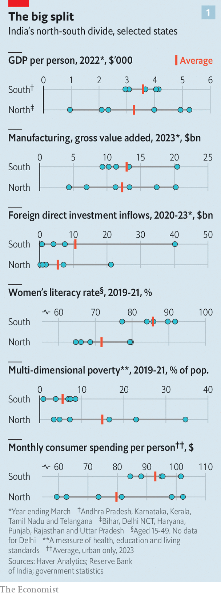
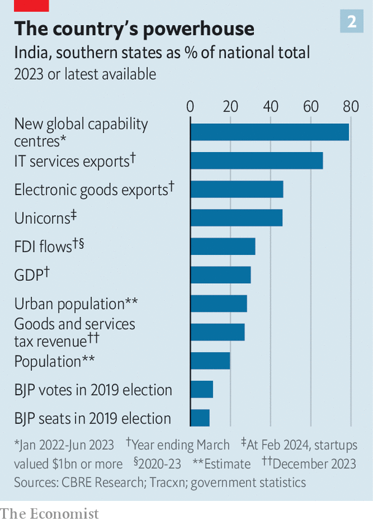

###### India’s north-south divide

# Inside Narendra Modi’s battle to win over the south 

##### Can the BJP woo the country’s richer, better-educated states? 

 

> Feb 29th 2024 

The odds, on balance, favoured Modi the bull. The beast, named in honour of Narendra Modi, India’s prime minister, charged full pelt into the arena at a recent bull-taming contest in the southern state of Tamil Nadu. Its challenge was to reach the other end without being “tamed” by any of the young men competing to grab it by the hump. One got hold for a moment, only to lose his grip. “He’s very aggressive,” explained the bull’s owner, K. Annamalai. But the key, he said, was its “360-degree situational awareness”.

Much the same could be said of Mr Annamalai’s approach to politics. At 39 years old, he leads the Bharatiya Janata Party, or BJP, in Tamil Nadu. With a general election due by May, he is also a key part of one of Mr Modi’s political and economic priorities. The BJP controls India’s central government and many of the states in the poorer, more populous north. But it has struggled to make inroads in the richer, better-educated south, which is India’s economic engine. Mr Annamalai’s job is to dramatically turn that around.

 joined him on the campaign trail for three days to get a sense of the BJP’s strategy and prospects in the south. Careening across Tamil Nadu at white-knuckle speed in a motorcade with an armed police escort, Mr Annamalai led a series of marches and rallies to complete a seven-month state tour. That culminated on February 27th with Mr Modi’s appearance at a rally in the state’s west.

 


The BJP officially launched its campaign in south India in January. Unofficially, that push began three years ago. It recruited thousands of activists there and changed local leaders. Mr Modi has visited the south 17 times in the past year. There is even talk of him standing for a national parliament seat in Tamil Nadu, the south’s most populous state, as well as his current one, Varanasi in the north. More importantly, the BJP has tweaked its messaging in the south to focus more on development and less on its Hindu nationalist ideology, which critics say foments hostility towards Muslims and other minorities. That raises a big question: is Mr Modi willing to trade ideological aims for national unity? 

A country divided

The BJP’s southern push is firstly about electoral arithmetic. It has long captured the majority of the parliament seats in the Hindi-speaking north and central parts of the country, as well as Mr Modi’s home state of Gujarat in the west. In 2019 it won most of the north-east. That gave the BJP 303 of 543 seats in the Lok Sabha, the lower house (see map). 

 


This year the BJP is widely expected to win again and has set a target of 370 seats. Some of those it aims to add are in the north and west. But it needs to do better in the south in order to fully consolidate its control over the country. In 2019 it won 29 of 129 Lok Sabha seats representing the five southern states of Andhra Pradesh (AP), Karnataka, Kerala, Tamil Nadu and Telangana. In three of those states, it won none. Among BJP voters nationally, only 11% were in the south in 2019. 

A second motive for the BJP’s emphasis on the south is its strategy to displace its main rival, the Congress party, as India’s only truly national political force. Although Congress no longer dominates the south as it did in its early years, it won state elections in Karnataka and Telangana last year. More than half its Lok Sabha seats are in the south. And while it competes for local votes with ruling parties in Kerala and Tamil Nadu, they are all in the opposition Indian National Developmental Inclusive Alliance, or INDIA.

However, the BJP also has compelling economic reasons to target the south. Mr Modi’s image rests to a large extent on his claim to be an effective steward of the world’s fastest-growing major economy. But it is the southern states that have generated much of India’s economic success. Bangalore and Hyderabad, the capitals of Karnataka and Telangana, are home to most of India’s leading tech companies as well as global giants, such as Amazon and Microsoft. Some 46% of India’s tech “unicorns” are from the south, while 66% of the IT-services industry’s exports come from there. Of Apple’s 14 suppliers in India, 11 are in the south.

It looks like the future

Along with Chennai, Tamil Nadu’s capital, Bangalore and Hyderabad are also big destinations for foreign companies establishing “global capability centres” to provide in-house back-office services for a fraction of the cost back home. Of those that were set up recently, 79% were in the south. Fully 16% of India’s factories are based in Tamil Nadu, making it a manufacturing hub. 

As a result, living standards in the south are a world apart from the north. About 20% of India’s population live in the five southern states, while some 26% do in just two of the poorest states in the north, Uttar Pradesh (or UP) and Bihar. Compared with those two places, GDP per person in the south is 4.2 times higher, while infant mortality rates are less than half. The average literacy rate of women aged between 15 and 49 in the south is among India’s highest, averaging 86%. In UP and Bihar, the average is 70%.

The north-south divide is cultural, too. The BJP seeks to establish a Hindu-centric national identity that it says was suppressed for centuries by Muslim and British invaders. But that idea resonates far less in the south, where Islam arrived earlier and spread more peacefully. The region also has a long history of social activism aimed at modernising Hinduism and promoting local identity. 

The BJP’s challenge is particularly acute in Tamil Nadu. It has been controlled since the 1960s by parties stemming from the Dravidian movement, which began as a revolt against Brahmins (the highest of India’s castes) dominating the civil service. That grew into a campaign to abolish the caste system and protect local language and culture. In the past Dravidian leaders agitated for an independent nation, too. 

 


To try to break Dravidian parties’ grip on power, the BJP appointed Mr Annamalai, a charismatic Tamil, as its state chief in 2021, two years after he resigned as a police officer. A farmer’s son from a relatively low caste, he has run an aggressive campaign to mobilise young voters, especially in rural areas, and to counter Dravidian parties’ accusations that the BJP is dominated by northern Brahmins. “Look at me: I’m a pukka Dravidian south Indian,” he says. “I’m rooting the BJP to the ground here.”

And to build the party’s presence in the state, he says he is putting “growth, growth and growth” at the centre of its campaign. “I don’t think we need to respond to ideology with ideology,” he adds. In particular, the BJP has to tread carefully on the idea of making Hindi a national language, as it has sometimes advocated. That issue has often provoked protests in the south, including deadly riots in Tamil Nadu in 1965.

When Mr Modi addressed the rally on February 27th, he avoided that subject but spoke of his love for local language and culture, recalling that he had quoted from a 6th century BC Tamil poem at the UN. He also avoided mentioning his inauguration of a controversial Hindu temple in northern India, despite its centrality to his campaign elsewhere. While outlining his government’s support for Tamil Nadu, he praised the state’s entrepreneurial spirit. (He mostly spoke in Hindi, however.)

Another problem for the BJP is that economic disparities between the north and the south have amplified political tensions. This is especially the case since Mr Modi introduced a national goods-and-services tax in 2017. Southern leaders complain that they get back from the central government only a fraction of their tax contributions. In February, they protested in Delhi, the capital, saying that Mr Modi’s policy of distributing tax revenues among states based on population size effectively punished the south for its more successful family planning.

The marks of history

The north-south dispute could escalate further with a revision of electoral boundaries, due after 2026. The process, known as “delimitation”, could expand parliament’s lower house from 543 seats to around 753, with most new ones going to the north. Tamil Nadu’s chief minister, M.K. Stalin, has been especially critical, telling the local assembly on February 14th that “delimitation is a sword hanging over the head of Tamil Nadu.”

BJP officials dismiss that as separatist scaremongering. Privately, though, they admit frustration with their party’s performance in the south. They now believe that the combination of this year’s election, delimitation and state polls in Kerala and Tamil Nadu in 2026 give it a rare chance to establish more of a foothold in the south. And they want to do that while the face of the party is still Mr Modi, whose popularity extends well beyond the Hindi heartland. “It’s important to them to make the claim that they’re not limited to Hindi-speaking India,” says Sandeep Shastri, an expert on Indian politics. “They want to become a truly pan-Indian party,” he says.

One southern state where the BJP has already made inroads is Karnataka, where it won 25 of 28 seats in 2019. It then lost a state election to Congress last year, partly because of alleged corruption and a backlash to a ban on Muslim students wearing the hijab. Still, the BJP will probably retain its lead there in this year’s national poll: people who oppose it at the state level often still back it in general elections, thanks to Mr Modi’s immense popularity.

By the same logic, the BJP could gain a few more national parliament seats in Telangana. Although Congress won last year’s state election there, the BJP doubled its vote share to 14%. It may pick up one or two seats in Kerala, which is currently governed by the Communist Party of India (Marxist). And it could form an alliance with local parties in Andhra Pradesh. But the battle will be hardest fought in Tamil Nadu, whose 39 Lok Sabha seats make it the biggest electoral prize in the south.

The BJP is aiming for up to seven seats in Tamil Nadu this year and to boost its vote share to 20% from 4% in 2019. It then hopes to anchor an alliance to topple the ruling Dravida Munnetra Kazhagam party (or DMK) in a state election in 2026.

Mr Annamalai concedes that the odds are steep. He attracted thousands of often wildly enthusiastic supporters to his marches and rallies over three days in the western city of Coimbatore, in the southern district of Tenkasi and in the central city of Madurai. Away from the crowds, though, many were sceptical. Subbalakshmi, a 38-year-old Hindu doctor in Tenkasi, said that Mr Modi was “working hard to serve people” and the BJP was less corrupt than other parties. But she was scathing about what she saw as BJP efforts to present Muslims as enemies of Hindus.

Some of the BJP’s public statements in the south also raise doubts about how far it is willing to soften its Hindu nationalist rhetoric. In Kerala, party officials have accused young Muslim men of engaging in “love jihad” by seducing young Hindu and Christian women to make them convert. In Tamil Nadu, Mr Annamalai is being sued by a local activist over his suggestion in an interview on YouTube in 2022 that Christian missionaries sought to ban firecrackers during the Hindu festival of Diwali. Mr Annamalai denies using hate speech. 

However he also accused the Tamil Nadu chief minister’s son of parroting Christian missionaries’ “malicious ideology” last year in likening a conservative form of Hinduism, widespread in north India, to a disease. Mr Annamalai says he prefers to keep religion as a “very personal thing” but felt compelled to speak because Hinduism was under attack.

Still, he wants to focus more on economic issues, as well as alleged corruption and dynasticism in the DMK (which denies those allegations). While the DMK accuses Mr Modi of stifling growth, Mr Annamalai says Tamil Nadu has relied on central subsidies to attract foreign investment and is losing its competitive edge, especially in advanced manufacturing. “Other parts of India, they’re preparing for tomorrow,” he says. “We’re living in the past.”

If the BJP sticks to that message, it may stand a chance at the ballot box in the south. The party’s pan-Indian aspirations might even restrain its more ideological impulses elsewhere. The risk is that if Mr Modi fails to convince southern voters, he may rely more on delimitation, financial pressure and other less democratic means to get his way. And history suggests that would ultimately backfire, reviving separatist sentiment in the south. In politics, as in bull-taming, situational awareness trumps brute force. ■


