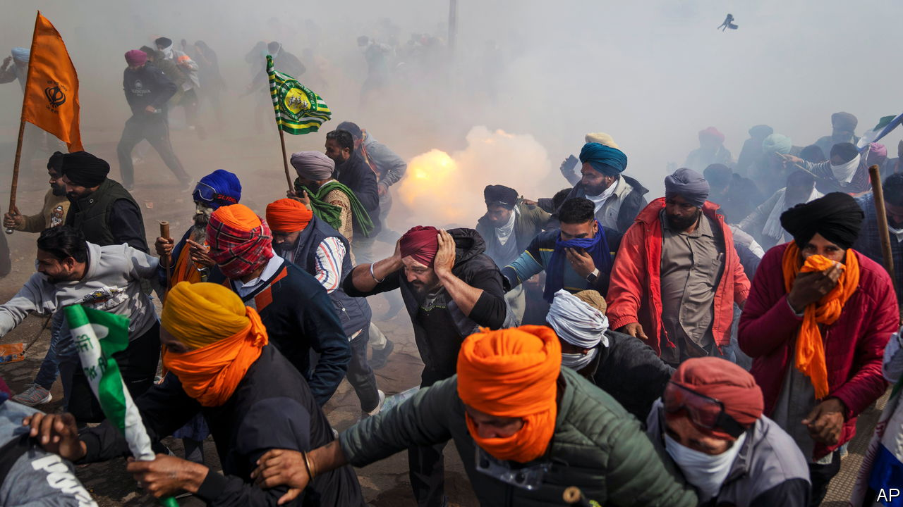

###### The actual opposition?

# Massive farmers’ protests are a headache for Narendra Modi 

##### Even if the recent ones have been contained, discontent remains 

 

> Feb 29th 2024 

Protesting farmers are an alarming sight for India’s government. With nearly two-thirds of Indians dependent on farming for their livelihood, agricultural workers can make or break elections. They can also stymie policy making. Prime Minister Narendra Modi and his Bharatiya Janata Party (BJP) discovered this three years ago, when farmers marched on Delhi, the capital, eventually forcing the government to repeal a big set of reforms intended to deregulate India’s agricultural market. It was one of the few political defeats Mr Modi has suffered in a decade in power. 

Given this, the decision by several groups of farmers earlier this month to resume protests ahead of an election due by May clearly alarmed officials. With a fractured opposition that looks unable to mount a serious challenge to Mr Modi, the farmers could pose the biggest threat to his smooth return to power this year. 

India’s warped farm policy is partly to blame. Because the main aim is to provide enough cheap food to a population that is still mostly poor, it is heavily tilted towards consumers. More than 800m of India’s 1.4bn people are eligible for free food grains, distributed by the state at an annual cost of $28.4bn. 

That is the single biggest outlay for a subsidy in the budget. It also makes the government an important customer for farmers. The biggest share of the wheat and rice distributed by the government is procured from the northern state of Punjab, where farmers sell their produce mostly through brokers in highly regulated wholesale markets known as . The system is supposed to ensure that farmers receive guaranteed minimum prices for their produce, but it is beset by price-fixing, lack of transparency and collusion among traders. Alternative local markets are hampered by government export bans and stockpiling limits. 

The reforms Mr Modi was forced to abandon in 2021 would have radically liberalised the sector. They would have given farmers more of a say over how to sell their produce and allowed them to build stockpiles to take advantage of price fluctuations. But farmers were not convinced. Those who produce wheat and rice in northern India benefit from a range of subsidies and price guarantees which they would lose if the system was reformed. Smaller farmers also feared that more competition would further reduce prices and allow bigger competitors to force them out of the market.

On February 11th farmers from Punjab and Haryana, two agricultural states close to Delhi, assembled at their common border and announced that they would embark on another march to the capital. The farmers’ main demand was a higher guaranteed price for all their produce, not just the rice and wheat distributed by the government. Farm workers also want higher minimum wages and pensions. 

In contrast to the protests in 2021, when the government was forced into an about-turn after a year, this time it has been keen not to lose control from the start. It says it will not meet the farmers’ main demand, which economists reckon would raise prices for 23 crops by at least 25%. It blocked the social-media accounts of many farm leaders and turned off the internet across parts of Punjab and Haryana. Police met the protesting farmers with barricades and tear gas dropped from drones. 

Some have criticised this approach. But because of the emphasis on containing the protests, there have been far fewer chaotic scenes like those of three years ago. Back then farmers reached the Red Fort, an important landmark in central Delhi, and scuffled with police. After one protester was killed in clashes with the police last week, the farmers put their march to the capital on hold; a planned tractor parade from western Uttar Pradesh to Delhi fizzled out before it reached the motorway.

The government has been helped by a lack of unity among the farmers, who agree on their demands but not on how to get them. Groups that organised the protests of 2021 have stayed away from the march on Delhi, citing political differences. 

Yet even though the protests pose no serious threat for now, the dissatisfaction they reflect is likely to persist. The farmers have rejected the government’s offer of minimum prices on a selection of crops for five years. There are plans for another protest in Delhi later in March—around the time the date of the election is expected to be announced. Without the major overhaul of agriculture that Mr Modi attempted and failed to push through back in 2020, farmers will remain a major headache for the government. ■


