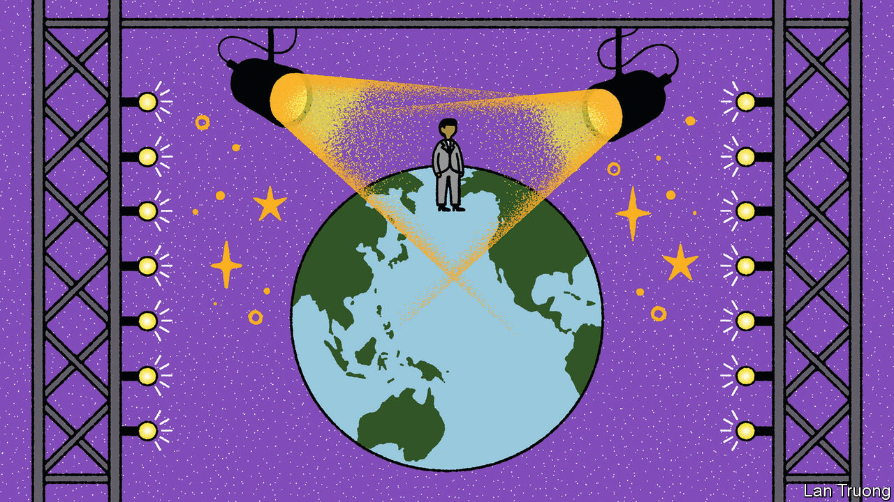

###### Banyan

# What will Prabowo Subianto’s foreign policy look like? 

##### Indonesia’s new president wants his country to play a bigger role 

 

> Feb 29th 2024 

On the news that Prabowo Subianto had won Indonesia’s election on February 14th to succeed Joko Widodo (Jokowi) as the country’s president, global political leaders rushed to toast him. Such enthusiastic scenes would have once been unthinkable regarding Mr Prabowo, an impetuous former special-forces general who was once barred from entering Australia and America for being implicated in human-rights abuses under the dictatorship of Suharto, his late father-in-law, though he always denied wrongdoing.

Anthony Albanese, the prime minister of Australia, which took Mr Prabowo off its blacklist in 2014, boasted about being the first foreign leader to congratulate him. President Joe Biden has not yet called. But it is likely he will when the official tally is released—American policymakers seem relaxed about relations with his administration.

Mr Prabowo wants Indonesia to be more influential in South-East Asia and on the global stage. To date it has been a diplomatic lightweight. Jokowi never attended the UN General Assembly in person. The limelight-loving Mr Prabowo may never miss it. There is a strong case that the country should be more influential. It is the world’s 16th-biggest economy with a population of 276m. It can be a “bridge”, as Mr Prabowo sees it, between developing and rich countries. The West, meanwhile, views Indonesia as a counterbalance to China in South-East Asia. 

Defence is a potential area of deepening international links. America lifted its ban on Mr Prabowo in 2019, when he became defence minister. Since then he has reinforced military ties that go back to infantry training in the 1980s. He has presided over an ongoing shopping spree for Western weaponry in order to modernise the armed forces. That endears him to America, France, Britain, Turkey, Australia and other suppliers. 

In Singapore—whose late leader, Lee Kuan Yew, described the young Mr Prabowo as smart, but with “a reckless streak”—recent negotiations over air-traffic and defence co-operation agreements have boosted confidence in him. On February 23rd Australia said it expects to strike a “very significant” new defence partnership with Indonesia soon.

What could go wrong? Brought up in London, Zurich and Kuala Lumpur, Mr Prabowo is multilingual, articulate and at home with foreign diplomats. Yet a feature of his style is to fire off blockbuster initiatives, only a few of them sensible. An example last year was a peace plan for Ukraine that Vladimir Putin could have written. Indonesian diplomats squirmed, and it was dropped. Mr Prabowo will need an effective foreign minister if he is to bring consistency to Indonesia’s international engagement. 

A lurch towards authoritarianism under Mr Prabowo is another worry, and it would alarm some countries. The hope is that democratic norms nurtured since Suharto’s fall in 1998 still count for much, despite recent erosions under Jokowi. And perhaps power, patronage and influence are too diffuse for a would-be strongman to dominate. Voters backed Mr Prabowo not because they have turned against democracy but because he promises to continue “Jokonomics”: the drive for investment in infrastructure and green metals such as nickel, for which Chinese support is vital.

That promise will greatly determine his approach abroad. It means wooing China ever harder. Indeed, the man who used to play on anti-China sentiment sounds only positive about it these days. As for some of his anti-Western campaign rhetoric, it has to be taken with a pinch of salt: Western markets and technology still count.

Perhaps the greatest threat is simply that Mr Prabowo is unable to deal with the competing loyalties that Indonesia’s stance inevitably creates. Non-alignment has long been the Indonesian creed. But what if Chinese fishing fleets or naval vessels encroach further into Indonesian waters? Or if America blocks Indonesian electric vehicles deemed to have too much Chinese content? 

Mr Prabowo claims that Indonesia has only friends and no enemies. That will not always work as a guiding principle. Presumably he would push back hard against Chinese encroachment. But then he would face Chinese dudgeon, with consequences for investment. Squaring American defence procurement with American protectionism might prove equally challenging. Such scenarios raise questions that Mr Prabowo has not answered—and may not really have asked. ■


