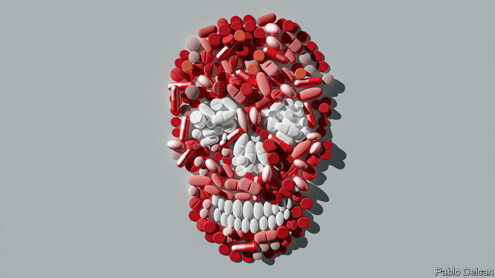
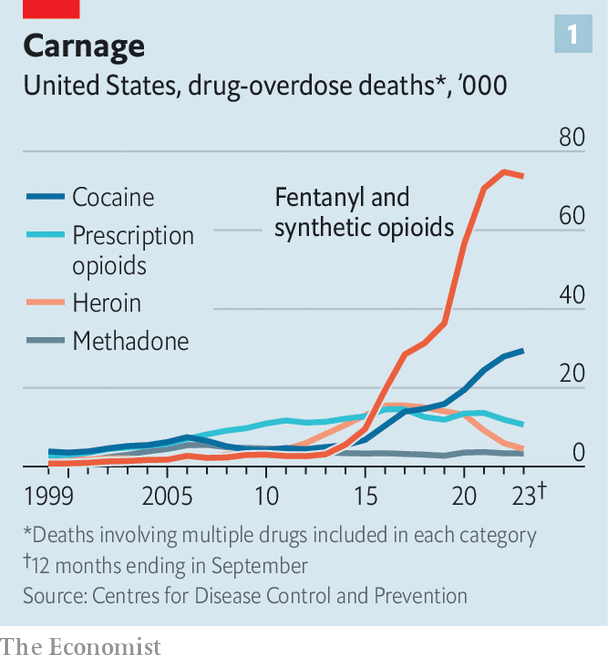
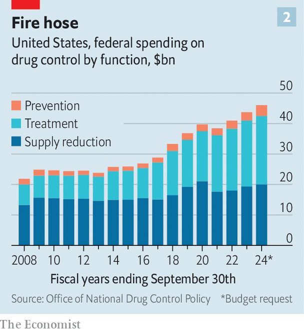
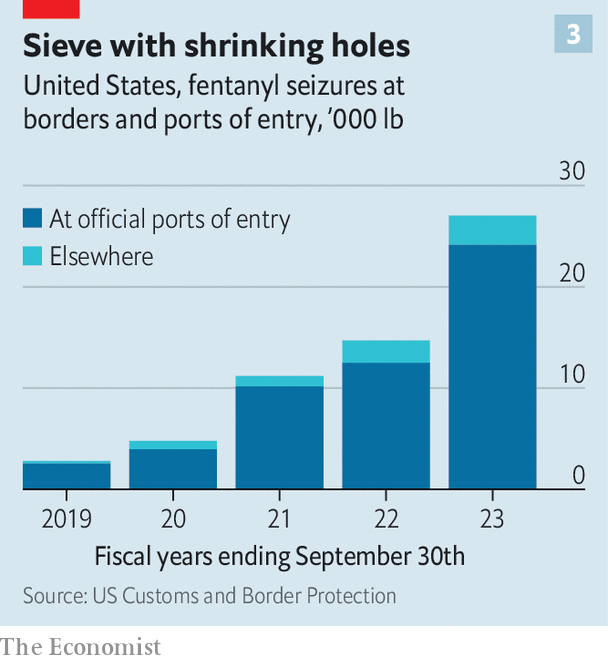
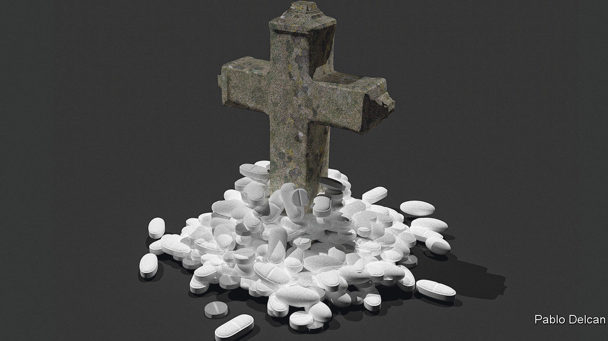

###### Relentless reaper

# America’s ten-year-old fentanyl epidemic is still getting worse 

##### The government is spending record amounts, just to slow its growth 

 

> Feb 29th 2024 

IT IS TESTIMONY to the intractable nature of America’s fentanyl epidemic that officials measure progress not in falling numbers of deaths, but in a slowing rate of growth. After a decade of horrifying ascent, the administration of President Joe Biden points out, the yearly number of fatal overdoses appears at last to be slowing to a gentle climb (see chart 1). The figure for 2022 was just 5% higher than that of 2021. That still leaves fentanyl and other synthetic opioids like it killing some 75,000 people a year—more than double the figure of 2019. But in the fight against the deadliest narcotic in American history, that is what passes for success.

 


The meagre results are not for lack of effort. The federal government has been spending record sums trying to curb the epidemic. It is also trying to be creative in its policies. Alejandro Mayorkas, the secretary of homeland security, explained to  this week how his department is using artificial intelligence (ai) to increase seizures of fentanyl at the Mexican border. In another interview Antony Blinken, the secretary of state, described a blizzard of diplomatic initiatives to fight trafficking and regulate international trade in the chemicals needed to make fentanyl. Both also emphasise efforts to reduce demand for the drug within America.

 


Since Mr Biden became president, the federal government has, for the first time, devoted more money to treatment than to interdiction (see chart 2). “We’re putting billions of dollars, tens of billions of dollars, into everything from public awareness, to treatment, to recovery, to antidotes,” notes Mr Blinken. Mr Mayorkas, for his part, argues the human toll would be much worse, and the profits of the drug traffickers even bigger, were it not for the administration’s efforts. 

Frontier justice

Yet at the border itself, the scale of the challenge is clear. Fentanyl is highly concentrated and therefore relatively easy to smuggle. As Juan Gonzalez of the National Security Council points out, the agents are hunting not for narcotics shipped by the tonne, as cocaine is, but for caches of tiny pills. Traffickers can conceal them in any nook or cranny of a lorry or car. They hide them in commercial shipments, stuffed into Coca-Cola bottles, coconut shells, lawn ornaments or car batteries. They pack them into tyres and gear shafts. Small quantities are enough: fentanyl is so potent that it is commonly said that three lorry-loads from Mexico could supply all of America’s demand for a year.

 


Seizures of fentanyl at the border almost doubled last year (see chart 3). Mr Mayorkas is pleased with this growing haul, but it is hard to know whether it reflects more effective screening or simply higher volumes being trafficked. The AI that he trumpets is used to determine whether there is anything odd about an x-ray of a vehicle that warrants further investigation. At the beginning of 2023, he says, there were 11 such systems operating at border posts. Now the number is 31, with 26 more being installed.

Yet only about 20% of lorries and less than 5% of cars are x-rayed as they enter America. The administration wants to increase that and send more agents to the border to curb both drug-trafficking and illegal immigration. (The two problems are quite distinct, Mr Mayorkas points out: the vast majority of drugs are intercepted at regular border crossings, not carried into America by undocumented migrants.) But last month Republicans in Congress killed a bipartisan bill that would have beefed up policing of the border, at the behest of Donald Trump, the presumptive Republican nominee for president.

Mr Trump seems to have wanted to deprive Mr Biden of any achievements to crow about regarding the border. Attention paid to America’s opioid epidemic rises and falls with the political cycle. Expect to hear a lot more about it as November’s election draws closer. Mr Trump delights in denouncing “border chaos” under Mr Biden. While migration is his main theme, that also includes fentanyl. He first floated the idea of sending American troops to destroy the drug gangs, with or without Mexico’s co-operation, in 2020. The idea has since become doctrine within the Republican Party, along with officially labelling them terrorist organisations. 

As politicians grandstand, the traffickers adapt. As recently as 2022 more than half of all fentanyl seized at the border was intercepted near San Diego, California. But lately the stretch of the border south of Tucson, Arizona, has become the main transit point. “Everything comes through us,” says an officer in Nogales, Arizona, as he leads his sniffer dog, Rex, around yet another car. Some officers protect themselves with shoe covers, gloves and masks in case they come in contact with fentanyl while searching a vehicle. Others carry naloxone, a medication used to treat overdoses, in case of accidental exposure. 

Trip up

Their caution is warranted. Fentanyl is 50 times stronger than heroin. Some people die the first time they take it. It has long been prescribed in small doses as a painkiller. It is easy to make, so when American authorities began to crack down on the abuse of prescription opioids sold by pharmaceutical companies in the 2010s, drug gangs began to peddle fentanyl to addicts cut off from their former supply. Its potency is part of the appeal. A.J. Haynes, a former addict in Tucson, recounts her first experience of it: “I tried it, and then lost three days of my life. I was like, ‘Whoa, that was crazy. I want to do that again.’” 

It is hard to overstate how much fentanyl has blighted the country and the speed with which it has done so. In 2013-22 it killed more than a third of a million Americans. Deaths shot up during the covid-19 pandemic and have not diminished since. One reason for its rapid spread is how cheap it is. Ms Haynes first tried it because it was cheaper than heroin. A single dose can cost less than a dollar—and “one pill can kill”, as America’s Drug Enforcement Agency (DEA) puts it in a public-awareness campaign it launched three years ago. 

Ms Haynes thinks she is alive only because she never took fentanyl by herself. She tended to smoke it as a powder, often mixed with methamphetamine, another powerful, addictive, synthetic drug whose use is on the rise in America. (The meth helped to keep her awake, so she could “do more fentanyl”.) She often asked strangers to keep an eye on her when she inhaled these concoctions. They would check her heartbeat and, if she seemed to have overdosed, administer naloxone. She overdosed seven times before she managed to escape what she calls fentanyl’s “demonic” grip, with the help of a treatment centre where she now works. 

At first most fentanyl came to America directly from China. In 2019, however, China outlawed the sale of finished fentanyl and two of the chemicals most commonly used to make it. At that point Mexico assumed a critical role in the supply chain, importing different precursor chemicals from China, which are then “cooked” and sent north. Ashley, another former addict now in recovery in Tucson, used to be a partner of the Mexican gangsters who run this business. Having become a regular user first of prescription opioids, then of heroin and finally of fentanyl, she decided to cut out the middleman and go straight to the source: the Sinaloa cartel, a criminal gang based in north-western Mexico which, the DEA believes, is the country’s main fentanyl producer.

Ashley used to take cash to Culiacán, the capital of Sinaloa state, and other cities in Mexico. She would pay for large amounts of fentanyl, cocaine and meth. “They would deliver it over here to us so that we didn’t have to worry about crossing it through, because it was just too big of an amount and I just wouldn’t take that risk,” she recalls. Eventually the American authorities caught her anyway. In 2022 she was charged with drug-trafficking. She expects to serve 5-10 years in prison.

Hugs and thugs

The American authorities, naturally, have tried to take the fight to the Sinaloa cartel. But that effort is complicated by the reluctance of Mexico’s president, Andrés Manuel López Obrador, to admit that any fentanyl is made in Mexico, despite ample evidence. (A year ago, for instance, the Mexican army said it had seized over half a million fentanyl pills in a drug lab in Culiacán.) He has lashed out against drug charges that were laid in April by American prosecutors against leaders of the Sinaloa cartel, calling them “abusive, arrogant interference that should not be accepted under any circumstances”. Mr López Obrador’s government has amended a security law to make it harder for foreign narcotics agents to work in Mexico. He advocates the use of “hugs not bullets” to suppress the gangs, meaning that the government should boost help for the poor in order to reduce the allure of crime. 

Despite the unhelpful rhetoric from on high, however, Mexico has recently stepped up its efforts to curb fentanyl trafficking. Messrs Blinken and Mayorkas both insist co-operation is close. Last year it enacted strong laws aimed at controlling imports of fentanyl’s precursors. A year ago the Mexican army arrested one of the Sinaloa cartel’s four main bosses, called the “Chapitos” because they are the sons of Joaquín “El Chapo” Guzmán, the founder of the cartel, who is now in prison in America. In September the captive Chapito, Ovidio Guzmán, was extradited to America. A few days later signs started to appear around Sinaloa warning people not to make fentanyl. They purported to be messages from the remaining Chapitos, and were interpreted as an indication that the cartel, fearing more pressure from the authorities, is trying to distance itself from fentanyl production, on paper at least. 

In the back of a shop in Culiacán, a 22-year-old man wearing a black baseball cap explains that he heads one of four local patrol groups who are enforcers for “the bosses” (he won’t specify the Chapitos, but that is what he means). “We have the order to track down people cooking fentanyl without permission.” He reckons his group alone has killed “15 or so”. Those allowed to keep producing are “close to the bosses”. 

A fentanyl cook who got the message is a 29-year-old man who has clearly made a good living from his trade. He owns a newly built house on the outskirts of Culiacán and several other properties around Sinaloa. He drives a jeep and wears a Boss T-shirt and gold signet-ring. He used to make heroin, but switched to fentanyl three years ago. He got the necessary chemicals via powerful people who had imported them from China or from firms that use the chemicals for more benign purposes as well. He says his profits doubled, but “everything changed” when America promised millions of dollars for information leading to the arrest of the Chapitos. “They threatened me. They said you move or cook a gram and you die and we will take all your property: my house, my ranch, my other properties, my car. So I stopped.”

A 50-year-old fentanyl trafficker in Culiacán says he is also out of the business. He entered it two years ago, picking up precursors from airports, the coast and elsewhere and delivering them to others, as well as distributing finished fentanyl pills to mules. He made 15 to 20 such deliveries a month. Now he says he has no work “because of pressure from the US government”. He has started farming corn and wheat on land where he used to grow marijuana and opium poppies.

Spoils of defeat

A Mexican official shows your correspondent around a warehouse in Culiacán that he says contains at least 2m fentanyl pills seized in police raids. Several confiscated pill-presses stand in the courtyard. Each can make 10,000 pills an hour. Despite the impressive haul, the official laments, stopping the drug trade is impossible. Sinaloa is big and rural. Roads are so bad that it can take five days to reach some parts of the state. Fentanyl cooks have plenty of places to hide and plenty of warning from informants in government that a raid is coming. Meanwhile, it can take “two to three weeks” to unload, disassemble and thoroughly search a single lorry before making it good again, the official says. The army and police help, but his unit is woefully understaffed given the scale of the problem. Even tripling his force would not guarantee success, however: “The US has all the technology and they can’t stop this.” 

An American indictment last year said the Sinaloa cartel could turn $800-worth of precursors from China into $640,000 in profits. If the Sinaloa cartel really is reining in fentanyl production (as opposed to being more discreet about it), that will not stop the northward flow of the drug. Instead, American officials in Mexico say, production is simply becoming more diffuse and atomised. The former fentanyl cook says he has been invited to help set up fentanyl labs in Chiapas, a southern state, and Veracruz in the east, as well as Mexico City. “Los Chapitos can’t control all of Mexico. It’s so easy—I could set up a new lab easily,” he explains. “This won’t end unless another drug takes over.”

The game of whack-a-mole is being played in China, too. As in Mexico, the government’s efforts to fight fentanyl vary in intensity depending on how well it is getting on with America. In 2018 the administration of Donald Trump praised China for making a “wonderful humanitarian gesture” by adopting its ban on fentanyl and the two precursors. It appeared a calculated move: Mr Trump was waging a tariff war against China in an effort to reduce America’s trade deficit. Offering America a seeming gain in the fight against fentanyl appeared aimed, in part, at persuading Mr Trump to go easier on trade. 

But the relationship between China and America has remained fraught. Mr Trump’s successor, Mr Biden, has retained Mr Trump’s tariffs and imposed wider curbs on exports of American technology to China. He has sought to strengthen America’s military alliances in Asia in order to counter China’s rise.

China does not seem to consider fentanyl an especially pressing topic. It denies it has a fentanyl problem, although officials there are known to have covered up abuse of prescription opioid painkillers. Its leaders claim they are being unfairly blamed for a problem of America’s making. In 2022 China cut off talks with America about fentanyl in response to a visit to Taiwan by the speaker of America’s House of Representatives at the time, Nancy Pelosi. 

American officials are now a bit more cheery. At a meeting with Mr Biden in San Francisco in November, Xi Jinping, China’s leader, agreed that his government would resume talks about fentanyl: the two sides duly met to discuss the problem in January. According to an American official, the Chinese authorities have put chemical firms “on notice” that they will start to crack down on trade in precursors. “A similar notice to industry that China sent out in 2019 led to a drastic reduction in seizures of fentanyl shipments to the United States from China,” the official said. “We’re starting to see reductions in seizures of precursors at some US airports already.”

Since the leaders’ encounter, China has taken “concrete steps to increase law-enforcement co-operation and restrict the activity of specific chemical companies of concern”, says the White House’s homeland-security adviser, Liz Sherwood-Randall. Mr Blinken says this shift has “the potential to make a real difference in the lives of Americans”. He believes China understands that “to be seen as a responsible actor on the international stage…they have to be responsive to the need, the demand, for their positive engagement, for their leadership” on the fentanyl problem as it grows in other countries.

Chemical imbalance

But it is still easy to find sellers in China of numerous chemicals that can be used to make fentanyl, meth, ecstasy and other drugs.  located several online. On Facebook, “Libby”, purporting to represent a chemical firm in the northern province of Hebei (home to many precursor-making companies), posted a message in January offering N-tert-Butoxycarbonyl-4-piperidone, a chemical commonly used in fentanyl production and not specifically banned in China. Payment was required in cryptocurrency ($200 a kilogram); the product would be delivered to the customer’s door, with all customs procedures to be taken care of by the vendor (ie, do not declare this to the authorities in your country). As usual with such offers, a Chinese mobile number was provided for secure communication by WhatsApp. 

It will be hard for China to rein in the precursor trade. The country has a vast chemical industry. Companies that make precursors often enjoy the protection of local officials: they create jobs and tax revenue, and are happy to give bribes. The firms are nimble. If the government bans more precursors, they will produce other chemicals that can do the same job but are not yet proscribed. The Americans want China to adopt a “know your customer” regime that would make it incumbent on sellers to ensure their wares—even if not proscribed—are not used by criminals. China insists it is up to importers to make sure chemicals are used legally. 

 


Sino-US tensions will make progress even harder. China often snipes at America about fentanyl. In October the Chinese embassy in Mexico said China had played a “significant role in preventing the illegal production, trafficking and abuse” of fentanyl-type substances. It accused America of making “unfounded negative remarks” about China’s role in the crisis, and of “trampling on the spirit of international rule of law”. Mr Xi only agreed to renew talks on the matter after America said it would lift sanctions it had imposed on a Chinese police forensics institute for alleged complicity in human-rights abuses in Xinjiang in China’s far west. “Ultimately we decided that given the steps China was willing to take to cut down on precursor trafficking, it was an appropriate step,” said a State Department spokesman.

Even if Sino-American co-operation over fentanyl continues without further interruption, supply chains are always evolving. Recently India has emerged as an alternative source of some chemicals used to make fentanyl. Its regulators may not have the same political gripes as China’s, but they may also not be as efficient. By the same token, some precursors are now flowing from China to Mexico via America itself, since that route is seen to be subject to less scrutiny.

A world of pain

In July America launched a “global coalition” to fight synthetic drugs, with such trends in mind. Senior officials from more than 80 countries took part in the first virtual meeting. China was not among the participants. But American officials hope that its view will change as it begins to recognise that this is not just an American problem, but a global one that will probably afflict China, too, sooner or later. “If a country thinks that it is only a transit country and therefore safe from the scourge of fentanyl, it is terribly and tragically mistaken. We have seen transit countries become countries of destination,” says Mr Mayorkas. “Mexico is not suffering as acutely as we are, but it is certainly seeing a rise in fentanyl.”

It is more likely to be the calculations of drug gangs, rather than users’ preferences, that decide how fentanyl and synthetics like it spread. Often users do not even know they are taking such drugs. Dealers may mix them in with others, such as heroin, meth or cocaine, to enhance their potency. Careless mixing can result in “hot spots”—lethal concentrations of fentanyl that a user cannot detect.

Vanda Felbab-Brown of the Brookings Institution, an American think-tank, notes that it was more than a decade after cocaine had swept America before it eventually reached Europe, too, in the 1990s. That was a result not of changing consumer tastes, but of a decision by Mexico’s cartels to find a new market, she says. Ms Felbab-Brown argues they will do the same again with synthetic opioids.

Europe may seem an especially tempting target at the moment, since a crackdown by the Taliban regime in Afghanistan on the cultivation of opium poppies has reduced the supply of heroin to Europe, and thus left addicts looking for an alternative fix. More generally, drug gangs have an incentive to promote synthetic drugs like fentanyl over ones derived from plants, such as heroin and cocaine, since the former can be made anywhere, and so are not dependent on the rain or the political climate in any particular country.

As it is, fentanyl use is already spreading in Canada, where there were nearly 4,000 opioid deaths in the first half of 2023, up by 5% over the same period a year earlier. Recent autopsies by NGOs in northern Mexico showed that at least a third of bodies that were brought to morgues had traces of fentanyl. Britain has seen a recent spike in deaths tied to a different class of synthetic opioids called nitazenes. 

America’s experience should be a cautionary tale for these countries. In 2022 Mr Biden set out what he called a “unity agenda” in his State of the Union address, saying his first goal was to “beat the opioid epidemic”. Federal spending on drug control has more than doubled since 2008, according to the Office of National Drug Control Policy. The Biden administration has also made it easier to access proven treatments for opioid addiction, such as methadone and buprenorphine. Methadone, a milder opioid which reduces symptoms of withdrawal and cravings for stronger ones, could previously only be taken under supervision at a clinic. But a new rule that goes into effect this year will allow patients to take it at home and abolishes a requirement that a recipient must prove they have been addicted to opioids for at least a year.

The Biden administration has also worked to make it easier to obtain naloxone, the overdose antidote. It can now be sold over-the-counter at pharmacies. Some schools have begun to stock it, too, as fentanyl claims ever more young lives. The ultimate goal, says Rahul Gupta, the Biden administration’s drugs tsar, is to make it part of the standard furniture of public places, much like fire extinguishers.

But treatment and prevention programmes depend not just on the federal government, but also on the states and local authorities. Some are alarmingly disengaged. The state of Wyoming, for example, has no opioid treatment programmes that offer methadone.

State banquet

States are starting to receive millions of dollars in settlement money from pharmaceutical companies and distributors who promoted the widespread use of prescription opioid pills in the 1990s and 2000s, getting many Americans hooked. More than $50bn will be disbursed, which could lead to a boom in treatment. The market for such services is projected to grow by about 9% each year through 2030, according to Capstone Partners, a consultancy. 

Funding for prevention efforts, such as education about drugs in schools, has also nearly doubled since 2008, although it remains a tiny fraction of total counter-narcotics spending. Such programmes have a poor reputation. Studies have concluded that in the 1980s and 1990s the Drug Abuse Resistance Education programme, or DARE—in which police officers visited classrooms and told children to “just say no” to drugs—did not reduce drug use. But it could be different with fentanyl. It is vital to teach young people how much more dangerous it is than anything used before. Promoting the use of fentanyl-test strips, which can tell if the opioid is present in other drugs, would also save lives. 

As sensible as all this is, America still has a long way to go. It has at least 6m opioid addicts. Four out of every ten Americans know someone who has died from an overdose. The epidemic’s seeming plateau is very much welcome, but fentanyl remains one of the deadliest scourges America has ever faced. ■

