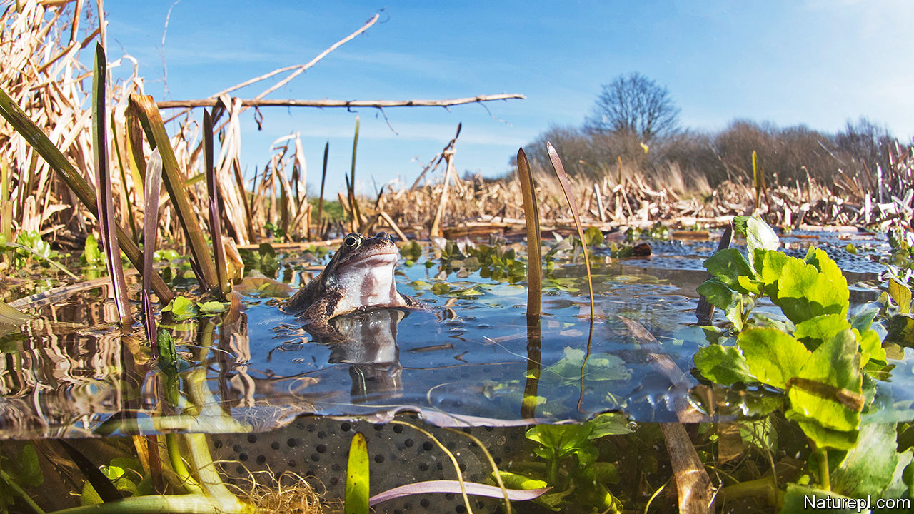

###### Just add water

# More than half of Britain’s ponds have disappeared 

##### But “ghost” wetlands can be resuscitated 

 

> Feb 27th 2024 

The 20th century was not kind to ponds in Britain. Many were drained to create more farmland or filled in to make room for new developments. Some ponds went to waste and others were stuffed full of it. 

The traffic was not all one-way: in 1940 Marlow, a town in Buckinghamshire, suddenly acquired 43 ponds as craters left behind by the Luftwaffe filled with water and welcomed moss, molluscs and mallards. Britain still has 500,000 ponds in rural areas, according to the Wildlife Trusts, a group of charities (the country is also home to 3m private garden ponds). But more than half of those recorded in the late 19th century have since vanished. 

Almost. Ponds have a surprising afterlife. Even 150 years after they pass, they can leave a watery mark on the landscape: marshy depressions in fields or areas of land where crops struggle to grow. Hundreds of thousands of such “ghost ponds” haunt Britain, and they can be summoned back to life.

Carl Sayer, head of the Pond Restoration Research Group at University College London, a conservation group, spends much of his time restoring polluted and neglected ponds with shears and shovels. But sometimes his work is more magical. 

Old Ordnance Survey maps can reveal a lost pond’s precise whereabouts. Once located, Dr Sayer starts by digging a trench roughly where he thinks the centre of the pond is. Soil and debris are removed until he finds the original pond sediment, which is dark and fine to the touch. Then he digs another trench, across the first, to create a cross that reveals the pond’s dimensions. The crater is dug out and left to fill with water naturally. In less than two years, thriving underwater worlds return to be enjoyed by leeches and great crested newts. 

So far Dr Sayer has restored 20 ghost ponds in Norfolk. Now he is helping to bring back more in Lancashire, Gloucestershire and the West Midlands. Ponds support more plants and animals than any other freshwater habitat in Britain. They are the life-source of fields, says Dr Sayer, tripling the number of rare species in them. That means more bees, bats and farmland birds. 

Ponds are also particularly crucial for newts. The Newt Conservation Partnership, a charity, pledges to create four ponds for every one that is home to a great crested newt and is then lost to development. Forgotten species can be resuscitated too. Buried sediments act as seed banks that, with a little water and light, stir again. In one of Dr Sayer’s revived ponds the slimy-fruited stonewort, once thought to be extinct in Britain, grows merrily. 

Ponds are self-effacing, says John Lewis-Stempel in “Still Life”, a book published in 2019. They sit at the back of landscapes, rippling in John Constable’s oil paintings, pooling at the corners of John Clare’s bucolic verse. But they can be quietly miraculous. ■


