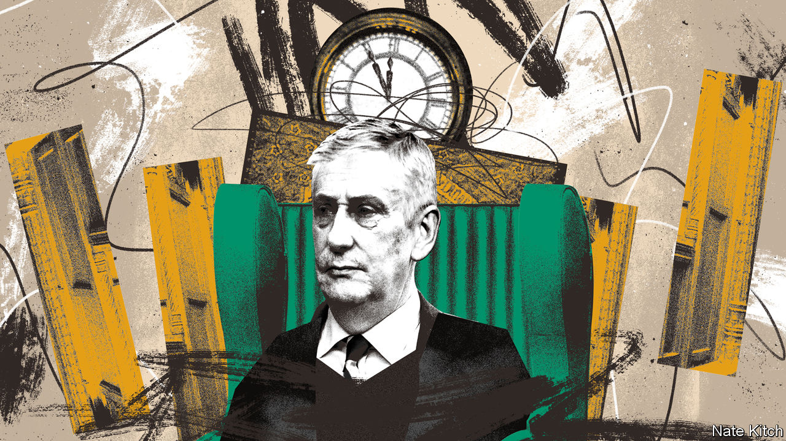

###### Bagehot

# Speaker Hoyle and the strange politics of human resources 

##### A concern with MPs’ well-being scuppers a crucial debate 

 

> Feb 26th 2024 

Speaker of the House of Commons is unlike any corporate job. Since its creation in 1377 several occupants have been beheaded by the monarch, not a fate likely to befall a Unilever executive. The benefits package includes the use of a small palace overlooking the Thames, a portrait and a set of frilly robes. The job itself is a strange hybrid. The speaker is a kind of general counsel, issuing rulings according to precedent from his chair at the head of the chamber. He is also a chief executive, in charge of a sprawling Commons administration. 

To this mix of roles Sir Lindsay Hoyle, the 158th speaker, has added another: chief people officer. Managers everywhere are increasingly preoccupied by how “engaged” their employees are. Sir Lindsay’s speakership, too, seems to owe as much to 21st-century leadership books like “Win the Heart: How to Create a Culture of Full Engagement” and “Fish! A Proven Way to Boost Morale and Improve Results” as it does to “Erskine May”, a 19th-century handbook of parliamentary procedure. A concern with lawmakers’ well-being has made Sir Lindsay unusually popular among mps. But it has done little for faith in politicians: just 9% of Britons trust them to tell the truth, according to Ipsos, a pollster, down by five percentage points on 2019. And now it has jeopardised his career. 

When Sir Lindsay was elected speaker in 2019, the Commons could rival the most toxic of workplaces for venom. His predecessor, John Bercow, was later found guilty of bullying by an independent standards watchdog. Three years of parliamentary deadlock over Brexit saw one mp weep on television; another seized the ceremonial mace in a fit of frustration. The customer feedback was dire: protesters gathered outside Parliament, some menacingly. Democracy itself seemed to be in peril.

Sir Lindsay’s response was in the spirit of a company that responds to a round of bad employee surveys by offering fortnightly pizza and mindfulness apps. It is not in his power to offer more pay. Nor could he change the thankless and capricious nature of a political career. But unhappy mps would at least be heard. Draw some of the poison out the chamber, Sir Lindsay thought, and public faith in the institution would return. 

“We are all equal in this House when we come to speak,” he said. A “health and well-being agenda” promised MPs and Commons staff an on-site doctor and mental-health services, an overhaul of grievance procedures and anti-bullying training. Sir Lindsay would tackle online trolling, beef up security and seek a “fair and balanced relationship” with the Independent Parliamentary Standards Authority, which many members resent. His own constituency of Chorley in north-west England had voted for Brexit; his rolling Lancashire accent and anecdotes about his many pets seemed to soothe a chamber that had torn itself apart over the question of Britain’s relationship with the EU. About the core business of Parliament—amending legislation and scrutinising the executive—he was much quieter. 

Happy workforces tend to produce better outcomes for their institutions than miserable ones. Yet the interests of workers and organisations are not always aligned. So it proved on February 21st, during a debate on a ceasefire in Gaza that had been called by the Scottish National Party (SNP). Worried by weeks of harassment of MPs by pro-Palestinian campaigners, Sir Lindsay yielded to lobbying by the Labour Party to ditch usual parliamentary procedure and avoid a vote on an SNP motion that it regarded as imbalanced. 

Cue outrage among many MPs, and an apology from Sir Lindsay that could have come straight from human resources. “I have a duty of care,” he said. “If my mistake is looking after members, I am guilty.” In other words, the personal welfare of mps had triumphed over the institutional interests of the House of Commons. A chief executive would have directed the vote to go ahead; the chief people officer determined that procedure should be abandoned. 

That is too much for the 92 MPs who, as  was being published, had signed a motion of no confidence in Sir Lindsay. They are a mixture of Scottish and Welsh nationalist mps, out for revenge for what they regard as a partisan favour, and Conservatives who think allowing threats of violence to dictate the business in the chamber was unforgivable. At Prime Minister’s Questions on February 28th, Rishi Sunak accused Sir Keir Starmer, the Labour leader, of bending to “mob rule”. It was a rowdy session but Sir Lindsay remained seated, unusually reticent to intervene. 

HR! HR!

For a parliament to fail to vote on an issue because it is too controversial is like a fire brigade opting not to enter a building because it is too hot. But the episode is of a piece with Sir Lindsay’s tenure. In 2021 Sir David Amess, an mp, was stabbed to death by an Islamist terrorist who wanted to avenge British air strikes on Syria. In response his colleagues proposed “David’s Law”, which would have banned anonymity on social media. Sir Lindsay, long concerned by this same issue, redoubled a call for legislation. Politicians have understandably been made miserable by a barrage of hostility on social media and by the threat of violence. But two distinct policy issues that require wildly different solutions became jumbled. Trolling is unpleasant, but it is not the same as jihadism. 

If a focus on MPs’ welfare can make for bad policy, keeping the employees engaged can also be bad for their own health. The Victorian Palace of Westminster is laced with asbestos, and blighted by fires, falling masonry and leaks. Builders want it to be fully vacated so that it can be stripped bare. Many mps hate this idea: it will be expensive, which makes it hard to justify to their constituents, and in any case they like the old place. Sir Lindsay has sided with his colleagues, preferring repairs that will keep them in situ. MPs’ well-being has again triumphed over the institution’s interest. A chief people officer might strive to keep the workforce happy. The speaker has much more important things to prioritise. ■


