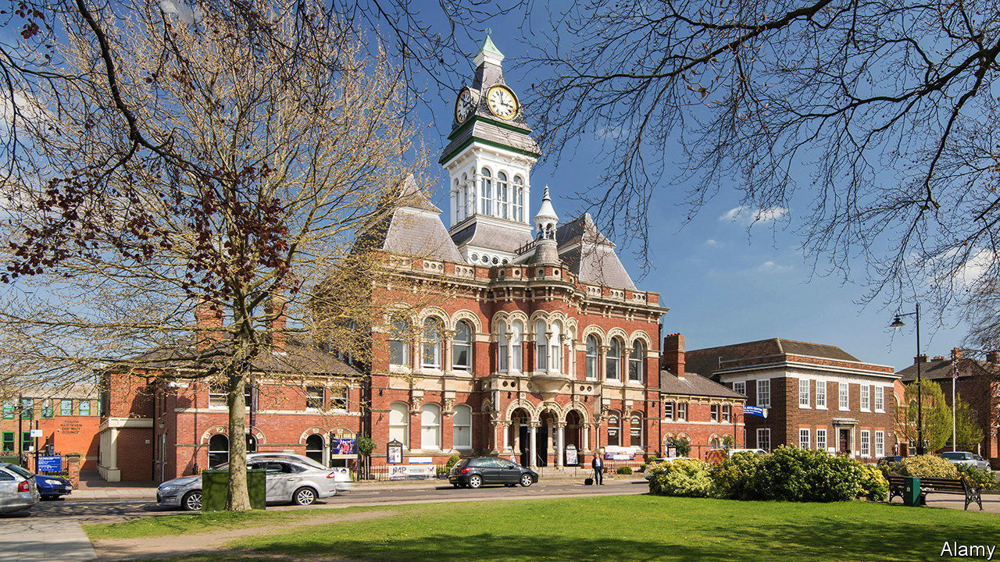

###### Local politics

# The institution that taught Margaret Thatcher about politics 

##### Grantham town council, of course—what else? 

 

> Feb 29th 2024 

“We could certainly fit 22 in here,” says Lee Steptoe, a Labour Party councillor, as he surveys an upstairs room in Grantham’s Guildhall. The room is large and imposing, with Victorian arched windows and faux Corinthian columns. Long ago weighty political decisions were made in the building. Perhaps, after the forthcoming local elections, they will be again. 

In May the people of Grantham, a town of 45,000 in the East Midlands, will elect a local council for the first time in half a century. The 22 councillors will have hardly any powers at first, and will not be paid. The council’s budget for the first year will be a measly £46,000 ($58,000). The election will nonetheless be one of the most delightful political events this year. For Conservative Party history buffs, it might be the most resonant. 

From the 1920s to the 1950s a grocer named Alfred Roberts served as a councillor, an alderman and briefly a mayor in Grantham. He helped balance the books, questioned officials about road signs, handed out prizes at a swimming gala and presided over a meeting of the English Bowling Federation. Sometimes he was accompanied by his daughter Margaret, a diligent girl who went on to study chemistry at Oxford University. She acquired a taste for politics, and then, as Margaret Thatcher, .

To judge by old issues of the , a local newspaper, the father resembled the daughter. Roberts had a nice turn of phrase and a confrontational streak. During the second world war, he strenuously objected to army vehicles ignoring traffic lights. He declared that farming was mostly about collecting subsidies, drawing spluttering outrage (but no good counterarguments) from local growers. Roberts could also behave with grace. After he was booted out of office in 1952, he declared that he had been happy in power and would be happy out of it. Thatcher later wrote that she had tried to behave similarly after she was evicted from Downing Street in 1990. She didn’t quite succeed.

Town and parish councils are sprouting across England, partly because the more powerful authorities that oversee larger areas have grown impoverished and incapable. In Grantham the new council will be a return to form. The town governed itself from 1463 to 1974, switching from an oligarchic corporation to an elected borough council in the 19th century, says John Manterfield of the local civic society. The council was then abolished during a systematic reorganisation of local government. Grantham was lumped together with many other towns and villages in the district of South Kesteven, which is almost 1,000 square kilometres in size. 

The new council will not have much power, but it will have one crucial one: developers will have to consult it about their plans. The townsfolk are very much looking forward to that. Some believe that Grantham is more easily pushed around than settlements with parish or town councils because it lacks an institutional voice. Witness the South Kesteven local plan, which assumes that half of the new houses in the entire district will be built in Grantham. “The other towns were better organised to push back on planning,” says Graham Jeal, a Tory councillor. 

Roberts himself was immensely keen on housebuilding. In 1946 he boasted that Grantham was on track to build almost 600 homes in a single year. “Until we get comfortable houses for our people, we cannot expect any spirit of content or satisfaction in general among the residents of the town,” he declared. That might still be true. But these days the is Labour. ■


