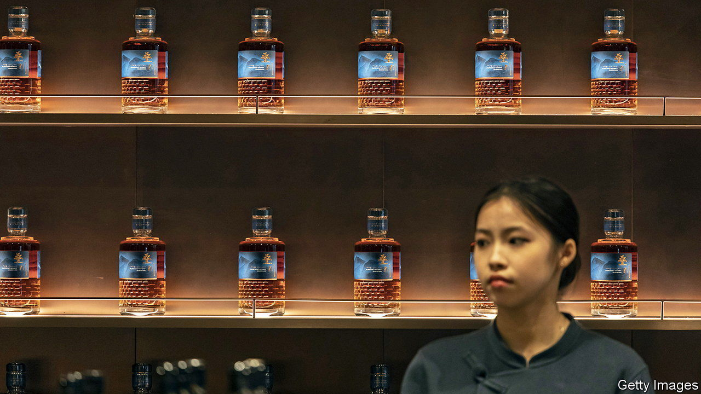

###### Barrelling along

# Can whisky conquer Chinese palates? 

##### Western spirit pedlars think so 

 

> Feb 29th 2024 

SICHUAN IS THE land of . The south-western Chinese province produces more of the throat-scorching grog than any other. Pernod Ricard wants to make it the land of whisky. In December the first batch of The Chuan Pure Malt, made at the French firm’s five-year-old distillery in rural Sichuan, went on sale. The company hopes to make its tipple as indispensable as  at Chinese banquets.

China has certainly taken to whisky of late. It imported about $585m-worth in 2023, three times as much as in 2018. Whisky bars are now common in big cities. A recent report from Baiping, an online spirits marketplace, found that more than half of Chinese imbibers were born after 1990. Many are splashing out on pricier bottles; whereas the volume of imports rose by 6.4% in 2023, their value soared by 23%. These affluent young are the target market for Pernod Ricard, says Alexandre Ricard, its chief executive. His rivals are eyeing the same drinkers. Diageo, a British firm, will launch its own locally produced whisky at a distillery it built in neighbouring Yunnan province. Angus Dundee, a Scottish distiller, has similar plans. 

Whisky is an outlier when it comes to premium Western consumables in China. Most such fare has had a rotten few years. The Chinese middle class, singed by loss of income amid the harsh covid-19 lockdowns of 2022, has put hoarding savings ahead of hedonism. After a surge in demand for foreign cheese in 2021, imports fell year on year in 2022, the first decline on record. Imports of cream, similarly exotic to the Chinese stomach, declined last year, as did those of foreign beer. Wine imports were 70% lower than five years earlier. “Status buying” of Western wine for gifting, entertaining and banqueting is down, notes Jim Boyce, an expert on wine and  in China. Local vineyards, which sprang up around China in the early 2010s, mainly in the arid Ningxia province, are nursing a hangover: production fell from 1bn litres in 2017 to 143m litres in 2023. 

Converting the Chinese to Western flavours has also proved difficult. They often prefer a pungent fermented form of tofu to roquefort. A Chinese cheesemaker told local media in October that households still find cheese unfamiliar.  makes up the bulk of China’s $150bn in annual spirits sales—a banquet is deemed incomplete without a bottle of the stuff.

There is little Western whisky pedlars can do about Chinese consumer sentiment. But they are trying to make their products more agreeable to Chinese palates. Although many ingredients that go into The Chuan must be imported from Europe or America to create recognisable whisky flavours, Pernod Ricard uses some Chinese malts at its Sichuan distillery. Adding to the local character, some of the barrels are made of Chinese oak along with the more typical American or French variety. 

At The Chuan’s launch party, a gaggle of Communist Party officials, including a top leader of a nearby town, indulged heavily in the foreign spirit throughout the evening. Asked if he enjoyed it, one nodded woozily with a smile. But he also stuck out his tongue and fanned his mouth, as if to say it was not quite hitting the spot. ■


