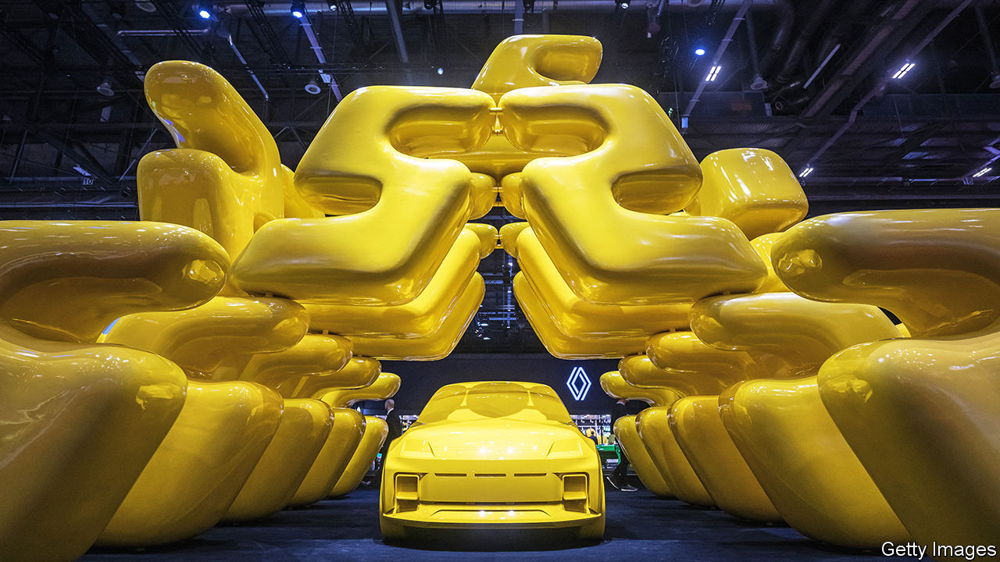

###### Motor no-shows

# Car shows in the West are in terminal decline 

##### Chinese firms are keeping them on life support 

 

> Feb 29th 2024 

Shifting trends in the car industry are best illustrated by the plight of Geneva’s hoteliers. Securing a place to stay during the city’s annual motor show once required booking at least a year ahead and paying an extortionate rate for even basic accommodation. This year rooms in the city were plentiful. Organisers’ hopes for 200,000 visitors seem optimistic. An event that once no car firm could afford to miss, and that attracted crowds of over 700,000, was attended sparsely—chiefly, it seemed, by journalists who got a preview before the show opened to the paying public on February 28th. The few companies that turned up were characterised by one car executive as “China, China, China and Renault”. They occupied less than a quarter of the floor space of previous years. 

Geneva is not the only big car event in decline. Frankfurt and Paris, which took it in turns to host Europe’s other big annual show, have dramatically downsized. The Paris jamboree of 2022 was a shadow of its former self. The German bash moved to Munich and became smaller. In both cases domestic firms were outshone by Chinese rivals such as byd and Great Wall Motor. 

America’s premier event in Detroit has also suffered an exodus of firms. A scheduling shift from the depths of Michigan’s harsh winter to the summer months has failed to revive interest. It will now revert to its winter date in 2025. But the changing nature of cars, which rely on software to lure buyers as much as sleekly bent metal, makes events such as the Consumer Electronics Show in Las Vegas more appealing showcases for manufacturers.

Reduced relevance makes the high price tag of turning up at shows harder for carmakers to stomach. Elaborate stands cost millions to build and then reconstruct at the next event halfway across the world. Car firms started to question the logic of competing to unveil the latest models at a single event when they could command more attention with dedicated launches or significant announcements at a time and place of their choosing. 

Often such occasions now coincide with motor shows. On the eve of Geneva’s opening, Fiat (part of Stellantis, whose biggest shareholder part-owns ’s parent company) released a video of its new Panda concept cars. (Reports on February 27th that Apple was abandoning its ten-year effort to build an electric car were probably not intended as a spoiler.) As a way of attracting buyers, cash can these days be far more effectively spent on marketing through other means, especially on social media. 

In the absence of prominent Western marques—many of which still bitterly resent the Swiss organisers for calling off the show in 2020 at the last minute as covid-19 was spreading and then refusing to issue refunds—the atmosphere in Geneva this year was dull even by Switzerland’s exacting standards. Renault drummed up some buzz with its new electric Renault 5, an affordable, neatly styled runaround. Another company to make a splash was BYD, with the European debut of the Yangwang U8, a luxury hybrid SUV with the amphibious ability to move on water. These days it is mostly Chinese carmakers that are keeping Europe’s big shows afloat. ■


