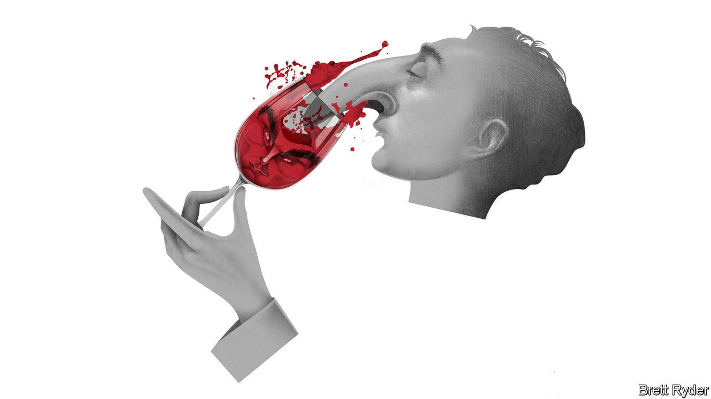

###### Schumpeter

# How Argentine businessmen size up Javier Milei 

##### Is it time to invest in a spot of Malbec? 

 

> Feb 29th 2024 

If you ever had a dream of chucking it all in and heading to the southern hemisphere to buy a vineyard, there are few places more alluring than the wine-growing regions around Mendoza, a charming tree-lined city in western Argentina. Your vines would be watered by snowmelt from the Andes mountains, which tower majestically overhead. You are on the doorstep of a city that is fast becoming a Napa-style mecca for wine-buffs and foodies from across Latin America. And because of repeated devaluations, your hard currency goes far. So far, in fact, that if you change dollars on the black market, you walk away with a sackful of pesos.

This is, moreover, the land that gave the world Malbec, a brand as Argentine as Maradona and Messi. Unlike so much else in Argentina, Malbec is a product of the free market. It first came to prominence globally in the 1990s when the country was enjoying an economic boom. After that experiment in economic orthodoxy ended in 2002, the industry survived the decades of Peronist interventionism, and failed stabilisation efforts that followed, mostly because of a fortuitous hedge: when the peso weakens, exports go up; when it strengthens, more bottles sell at home. 

In short, settle in the province of Mendoza and you will find yourself in a pro-business environment not unlike next-door Chile. Its conservatism may explain why in November’s presidential election a whopping 71% of  voted in support of Javier Milei, the mop-haired libertarian promising shock therapy to stabilise the hyperinflation-racked country. Yet before you splash out on your oenological fantasy, talk to Patricio Santos, whose father, Ricardo, pioneered Malbec exports. He will quench your thirst, but also some of your enthusiasm for winemaking in his country. Though he supports Mr Milei, he and other vintners harbour reservations about whether his remedies will work. 

Not for nothing is Mr Santos’s wine labelled , or stubborn. Listening to him, it quickly becomes clear how doing business in Argentina requires mule-like determination—and rat-like cunning. Winemaking is a case in point. It is a long-term business. Between six and seven years elapse from planting a vine to bottling the juice. Money circulates slowly and margins are meagre, Mr Santos says. Argentine inflation is galloping at more than 20% a month, making it all the harder to invest in the future. 

Exports help but are no nostrum. Before Mr Milei came to power, a hard-currency shortage meant exporters had to repatriate the dollars that they earned abroad at a central-bank rate far below the black-market one. Underbilling proliferated, but tax inspectors quickly caught on. To export, you often need imports, such as corks. For a while, the central bank had no dollars available for such purchases. An executive of one big winemaker says that as a workaround, his firm’s American importer paid his Portuguese cork supplier on its behalf and was repaid in wine. 

Transport in Argentina is also a nightmare of bad roads and high prices. Mr Santos says sending 10,000 bottles of wine on the one-day journey from Mendoza to the nearest port, which is in Chile, costs him almost a third more than sending it by boat from Chile to China. Moreover, with inflation out of control, trade finance is unavailable, so payments have to be cash on the nail. To cap it all, Mr Santos says, economic hardship is hitting consumption at home just as Malbec is losing some cachet abroad. No wonder he sought salvation in Mr Milei. 

He continues to support the new president, he insists, while acknowledging that Mr Milei’s first few months in office have been disconcerting. A 50% devaluation of the peso in December helped make exports more competitive, though import restrictions remain. A government proposal to slap export taxes on wine, as part of an “omnibus bill”, provoked a strong backlash from the industry. It was shelved, winemakers say, before Mr Milei was forced to withdraw the entire package because of a lack of support in Congress. Nervousness persists. Mr Milei’s priority is a draconian fiscal adjustment aimed at taming inflation and curbing the size of the state. The IMF, which backs Mr Milei’s programme, notes that he continues to rely on “distortive measures” like trade taxes.

More worrying is the impact of the president’s policies on society, Mr Santos says. “Things as violent as this often don’t end well.” March, when the summer holidays end in the southern hemisphere and reality kicks in, could be an excruciating month for Argentines. Electricity, gas and transport prices are expected to soar as real wages plummet. Social assistance to protect the vulnerable will be vital. According to press reports, the government is hinting that inflation fell sharply in February, though figures have not been released. Unless hyperinflation is suppressed quickly, the fear is that Mr Milei will lose popular support and his plan will fail.

Besides shock therapy, Mr Milei has one more weapon up his sleeve, Mr Santos thinks. Call it bread and circus. As an outsider whose party controls only about a tenth of seats in Congress, he uses social media to rally fans, either by vilifying political enemies in the legislature, the provinces and the unions, or by taking flamboyantly to the world stage. Mr Santos reckons this may help distract people from their harsh day-to-day realities. 

Grape expectations

Some Argentine winemakers lap it up. They relished Mr Milei’s recent speech in Davos, when he called business people “heroes”. His radical message, they say, is stirring interest among foreign investors, including those in the wine trade. But others fear that his taste for sideshows has distracted him from legislative reforms that are critical for long-term stabilisation. “It is hard to tell whether there is a genius or a fool behind this,” Mr Santos says. If it is the genius, that would benefit not only Argentina. It could send a pro-business message across Latin America. If it is the fool, say goodbye to free-market experiments in Argentina. And forget all about that vineyard. ■


