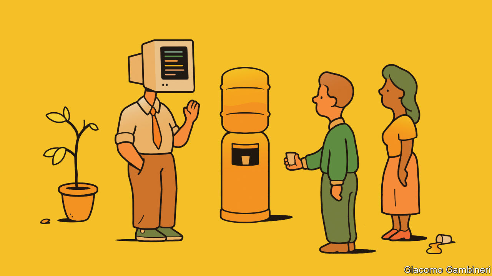
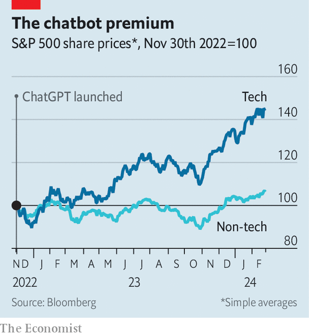
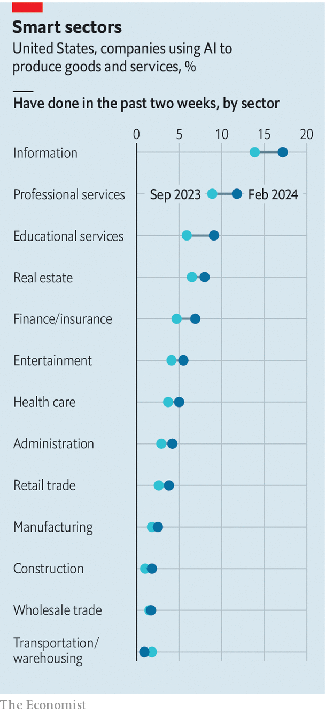

###### Meet your new copilot

# How businesses are actually using generative AI 

##### Some experiments with chatbots are more useful than others 

 

> Feb 29th 2024 

IT HAS BEEN nearly a year since OpenAI released GPT-4, its most sophisticated artificial-intelligence model and the brain-of-sorts behind ChatGPT, its groundbreaking robot conversationalist. In that time the market capitalisation of America’s technology industry, broadly defined, has risen by half, creating $6trn in shareholder value. For some tech firms, growing revenue is starting to match sky-high share prices. On February 21st Nvidia, which designs chips used to train and run models like GPT-4, reported bumper fourth-quarter results, sending its market value towards $2trn. AI mania has also lifted the share prices of other tech giants, including Alphabet (Google’s corporate parent), Amazon and Microsoft, which are spending big on developing the technology. 

 


At the same time, big tech’s sales of AI software remain small. In the past year AI has accounted for only about a fifth of the growth in revenues at Azure, Microsoft’s cloud-computing division, and related services. Alphabet and Amazon do not reveal their AI-related sales, but analysts suspect they are lower than those of Microsoft. For the AI stockmarket boom to endure, these firms will at some point need to make serious money from selling their services to clients. Businesses across the world, from banks and consultancies to film studios, have to start using ChatGPT-like tools on a large scale. When it comes to real-world adoption of such “generative” AI, companies have trodden gingerly. Yet even these baby steps hint at the changing nature of white-collar work. 

 


Previous technological breakthroughs have revolutionised what people do in offices. The spread of the typewriter put some workers out of a job: “With the aid of this little machine an operator can accomplish more correspondence in a day than half a dozen clerks can with the pen, and do better work,” said an observer in 1888. The rise of the computer about a century later eliminated some low-level administrative tasks even as it made highly skilled employees more productive. According to one paper, the computer explains over half the shift in demand for labour towards college-educated workers from the 1970s to the 1990s. More recently the rise of working from home, prompted by the covid-19 pandemic and enabled by video-conferencing, has changed the daily rhythms of white-collar types. 

Could generative AI prompt similarly profound changes? A lesson of previous technological breakthroughs is that, economywide, they take ages to pay off. The average worker at the average firm needs time to get used to new ways of working. The productivity gains from the personal computer did not come until at least a decade after it became widely available. So far there is no evidence of an AI-induced productivity surge in the economy at large. According to a recent survey from the Boston Consulting Group (BCG), a majority of executives said it will take at least two years to “move beyond the hype” around AI. Recent research by Oliver Wyman, another consultancy, concludes that adoption of AI “has not necessarily translated into higher levels of productivity—yet”. 

 


That is unsurprising. Most firms do not currently use ChatGPT, Google’s Gemini, Microsoft’s Copilot or other such tools in a systematic way, even if individual employees play around with them. A fortnightly survey by America’s Census Bureau asks tens of thousands of businesses whether they use some form of AI. This includes the newfangled generative sort and the older type that companies were using before 2023 for everything from improving online search results to forecasting inventory needs. In February only about 5% of American firms of all sizes said they used AI. A further 7% of firms plan to adopt it within six months (see chart). And the numbers conceal large differences between sectors: 17% of firms in the information industry, which includes technology and media, say they use it to make products, compared with 3% of manufacturers and 5% of health-care companies. 

When the Census Bureau began asking about AI in September 2023, small firms were likelier to use the technology than big ones, perhaps because less form-ticking made adoption easier for minnows. Today AI is most prevalent in big companies (with more than 250 employees), which can afford to enlist dedicated AI teams and to pay for necessary investments. A poll of large firms by Morgan Stanley, a bank, found that between the start and end of 2023 the share with pilot AI projects rose from 9% to 23%. 

 


Some corporate giants are frantically experimenting to see what works and what doesn’t. They are hiring AI experts by the thousand, suggest data from Indeed, a job-search platform (see chart). Last year Jamie Dimon, boss of JPMorgan Chase, said that the bank already had “more than 300 AI use cases in production today”. Capgemini, a consultancy, says it will “utilise Google Cloud’s generative AI to develop a rich library of more than 500 industry use cases”. Bayer, a big German chemicals company, claims to have more than 700 use cases for generative AI. 

This “use-case sprawl”, as one consultant calls it, can be divided into three big categories: window-dressing, tools for workers with low to middling skills, and those for a firm’s most valuable employees. Of these, window-dressing is by far the most common. Many firms are rebranding run-of-the-mill digitisation efforts as “gen AI programmes” to sound more sophisticated, says Kristina McElheran of the University of Toronto. Presto, a purveyor of restaurant tech, introduced a gen-AI assistant to take orders at drive-throughs. But fully 70% of such orders require a human to help. Spotify, a music-streaming firm, has rolled out an AI disc-jockey which selects songs and provides inane banter. Recently Instacart, a grocery-delivery company, removed a tool that generated photos of vendors’ food, after the AI showed customers unappetising pictures. Big tech firms, too, are incorporating their own AI breakthroughs into their consumer-facing offerings. Amazon is launching Rufus, an AI-powered shopping assistant that no shopper really asked for. Google has added AI to Maps, making the product more “immersive”, whatever that means.

Tools for lower-skilled workers could be more immediately useful. Some simple applications for things like customer service involve off-the-shelf AI. Most customers’ questions are simple and concern a small number of topics, making it easy for companies to train chatbots to deal with them. A few of these initiatives may already be paying off. Amdocs produces software to help telecoms companies manage their billing and customer services. The use of generative AI, the company says, has reduced the handling time of customers’ calls by almost 50%. Sprinklr, which offers similar products, says that recently one of its luxury-goods clients “has seen a 25% improvement” in customer-service scores. 

Routine administrative tasks likewise look ripe for AI disruption. The “top examples” of Bayer’s 700 use cases include mundane jobs such as “easily getting data from Excel files” and “creating a first draft in Word”. Some companies are using generative AI as cleverer search. At Nasdaq, a financial-services firm, it helps financial-crime sleuths gather evidence to assess suspicious bank transactions. According to the company, this cuts a process which can take 30-60 minutes to three minutes.

Giving AI tools to a firm’s most valuable workers, whose needs are complex, is less widespread so far. But it, too, is increasingly visible. Lawyers have been among the earliest adopters. Allen &amp; Overy, a big law firm, teamed up with Harvey, an AI startup, to develop a system that its lawyers use to help with everything from due diligence to contract analysis. Investment banks are using AI to automate part of their research process. At Bank of New York Mellon an AI system processes data for the bank’s analysts overnight and gives them a rough draft to work with in the morning. “So rather than getting up at four in the morning to write research, they get up at six,” the bank says. Small mercies. Sanofi, a French drugmaker, uses an AI app to provide executives with real-time information about many aspects of the company’s operations. 

Some companies are using the technology to build software. Microsoft’s GitHub Copilot, an AI coding-writing tool, has 1.3m subscribers. Amazon and Google have rival products. Apple is reportedly working on one. Fortive, a technology conglomerate, says that its operating companies “are seeing a greater-than-20% acceleration in software-development time through the use of gen AI”. Chirantan Desai, chief operating officer of ServiceNow, a business-software company, has said that GitHub Copilot produces “single-digit productivity gains” for his firm’s developers. With the help of AI tools, Konnectify, an Indian startup, went from releasing four apps per month to seven. Surveys from Microsoft suggest that few people who start using Copilot want to give it up.

Pinterest, a social-media company, says it has improved the relevance of users’ search results by ten percentage points thanks to generative AI. On a recent earnings call its boss, Bill Ready, said that new models were 100 times bigger than the ones his firm used before. L’Oréal, one of the world’s largest cosmetics firms, has caught the eye of investors as it improves BetIQ, an internal tool to measure and improve the company’s advertising and promotion. L’Oréal claims that generative AI is already generating “productivity increases of up to 10-15% for some of our brands that have deployed it”. 

This does not mean that those brands will need 10-15% fewer workers. As with earlier technological revolutions, fears of an AI jobs apocalypse look misplaced. So far the technology appears to be creating more jobs than it eliminates. A survey published in November by Evercore ISI, a bank, found that just 12% of corporations believed that generative AI had replaced human labour or would replace it within 12 months. Although some tech firms claim to be freezing hiring or cutting staff because of AI, there is little evidence of rising lay-offs across the rich world. 

Generative AI is also generating new types of white-collar work. Companies including Nestlé, a coffee-to-cat-food conglomerate, and KPMG, a consultancy, are hiring “prompt engineers” expert at eliciting useful responses from AI chatbots. One insurance firm employs “explainability engineers” to help understand the outputs of AI systems. A consumer-goods firm that recently introduced generative AI in its sales team now has a “sales-bot manager” to keep an eye on the machines. 

Though such developments will not translate into overall productivity statistics for a while, they are already affecting what white-collar workers do. Some effects are clearly good. AI lets firms digitise and systematise internal data, from performance reviews to meeting records, that had previously remained scattered. Respondents to surveys conducted by Randy Bean, a consultant, reported big improvements in establishing an internal “data and analytics culture”, which plenty of businesses find stubbornly difficult to nurture.

AI adoption may also have certain unpredictable consequences. Although AI code-writing tools are helping software engineers do their jobs, a report for GitClear, a software firm, found that in the past year or so the quality of such work has declined. Programmers may be using AI to produce a first draft only to discover that it is full of bugs or lacking concision. As a result, they could be spending less time writing code, but more time reviewing and editing it. If other companies experience something similar, the quantity of output in the modern workplace may go up—as AI churns out more emails and memos—even as that output becomes less useful for getting stuff done. 

Polling by IBM, a tech firm, suggests that many companies are cagey about adopting AI because they lack internal expertise on the subject. Others worry that their data is too siloed and complex to be brought together. About a quarter of American bosses ban the use of generative AI at work entirely. One possible reason for their hesitance is worry about their companies’ data. In their annual reports Blackstone, a private-equity giant, and Eli Lilly, a pharmaceutical one, have warned investors about AI-related risks such as possible leakage of intellectual property to AI model-makers. Last year Marie-Hélène Briens Ware, an executive at Orange, a telecoms company, explained that the firm had put data guardrails in place before commencing a trial with Microsoft’s Copilot. 

Ultimately, for more businesses to see it as an open-and-shut case, generative AI still needs to improve. In November Microsoft launched a Copilot for its productivity software, such as Word and Excel. Some early users find it surprisingly clunky and prone to crashing—not to mention cumbersome, even for people already adept at Office. Many bosses remain leery of using generative AI for more sensitive operations until the models stop making things up. Recently Air Canada found itself in  after its AI chatbot gave a passenger incorrect information about the airline’s refund policy. That was embarrassing for the carrier, but it is easy to imagine something much worse. Still, even the typewriter had to start somewhere. ■


