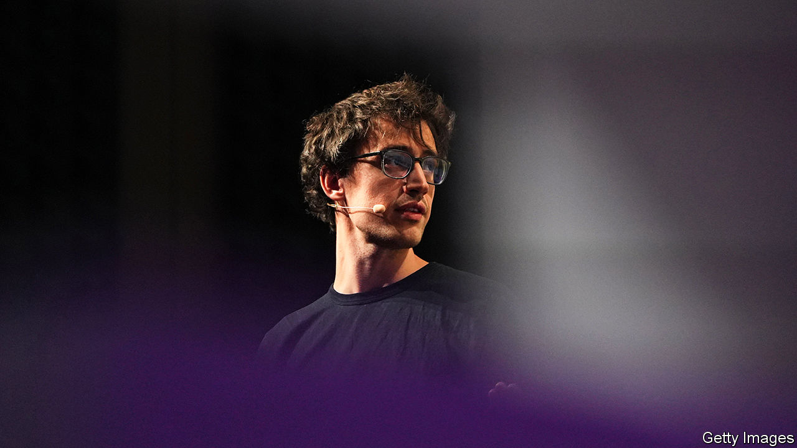

###### The meaning of Mistral

# Meet the French startup hoping to take on OpenAI 

##### Mistral unveils its latest large language model—and a deal with Microsoft 

 

> Feb 26th 2024 

SOME RACES are over before they get going. So it can seem in the contest to make large language models (LLMs). These algorithms power ChatGPT-like “generative” artificial intelligence. OpenAI, the human-sounding chatbot’s American creator, appears leagues ahead. It has made the world’s most powerful LLM, called GPT-4. The firm is gobbling up talent, data and computing power to build cleverer models. That allows it to attract more users, and with them more capital to pour into even more sophisticated algorithms.

But a French startup called Mistral is trying to throw a spanner in this AI flywheel. On February 26th it released a new LLM. Mistral-Large is smaller than GPT-4, measured by the number of parameters it uses (a common gauge of model power). Even so, it nearly rivals GPT-4 in its ability to reason. Mistral also unveiled a ChatGPT competitor, Le Chat (pronounced le shah, like the French word for cat rather than the English homograph). And it announced a deal with Microsoft, an AI juggernaut which already has a deep partnership with OpenAI. The tech giant will take a small stake in Mistral and make the French firm’s models available via its Azure cloud.

Mistral is proof that the industry is becoming more open—and less American. If it can mount a serious challenge to OpenAI, this could show once and for all that in generative AI, size is not everything. “It’s no longer about being bigger—it’s about being creative and being fast,” says Arthur Mensch, Mistral’s chief executive.

The French firm’s rise has been as brisk as the northwesterly wind after which it is named. It was founded less than a year ago and has just 25 employees. Yet its LLMs are leading the growing pack of open-source models, the statistical innards of which are, in contrast to proprietary black boxes like GPT-4, publicly available and can be modified by anyone. That has allowed Mistral to tap an impressive €490m ($531m) in funding, valuing the company at more than $2bn. Big investors include leading Silicon Valley venture capitalists such as Andreessen Horowitz and General Catalyst, as well as tech luminaries like Eric Schmidt, a former boss of Google. 

Mistral owes its early success to cleverly mixing the key technical ingredients of AI—talent, data and computing power—with politics, which is growing in importance as governments ponder the technology’s potential. When it comes to talent, Mistral is a “match made in heaven” between French engineering education and American big-tech firms, says Stanislas Polu, a co-founder of Dust, another Parisian AI firm. Three of Mistral’s six founders, and its technical brains—Mr Mensch, Timothée Lacroix and Guillaume Lample—are products of France’s elite technical schools. Like many top AI scientists they have worked at the research labs of Google and Meta, another American tech titan—though in the trio’s case they were building LLMs at those labs’ offshoots in the French capital rather than in London or Silicon Valley. This places them among the 100 or so people worldwide who really know how to train cutting-edge models. 

They appear particularly adept at marshalling training data—the second ingredient of AI success. Mr Mensch will not say how exactly Mistral curates its training sets; it is the source of his firm’s competitive advantage, he explains. But industry insiders confirm that Mistral is, in the words of one, “really clever” at filtering out information that is repetitive or does not make sense. This has allowed Mistral’s models to be much smaller: their parameters number in the billions, compared with an estimated 1.8trn for GPT-4 (both firms are mum on the precise sizes). This allows customers to run them on their own computers rather than in a vast data centre, which many proprietary models require.

According to Mr Mensch, Mistral’s focus on data curation lets the firm use computing power, AI’s third crucial component, more efficiently than its competitors. Training Mistral’s latest model cost much less than the $100m that OpenAI apparently spent to develop GPT-4. Mistral’s approach also makes it cheaper for customers both to fine-tune its models with their own data and then to run them.

In technical terms, startups like Mistral enjoy a “second-mover advantage”, benefiting from all the work OpenAI and others have done, argues Jeannette zu Fürstenberg of General Catalyst. Critically, in Mistral’s case these technical chops are complemented by political nous, which is helpful given many governments’ belief that home-grown LLMs confer economic and strategic advantages. Another of Mistral’s co-founders is Cédric O, a former French digital minister. Mr O retains a direct line to the country’s president, Emmanuel Macron. When a draft of the EU’s AI Act last year threatened to force Mistral to divulge its data recipe, Mr O co-ordinated, with Mr Macron’s backing, a Franco-German effort to oppose such provisions. These were duly excised from the bill. 

The question now is whether Mistral, which has yet to generate meaningful revenues, can transform this enticing techno-political mix into profits. The firm’s bet is that many businesses, especially in Europe, want more control over LLMs than OpenAI is willing to give them, and do not want to be locked into another American tech platform. Such customers, the thinking goes, would be willing to pay Mistral to maintain and run their models. 

One worry potential customers may have is how the world will regulate open-source models. A heated debate about whether they will enable bad actors to build bio- and cyber-weapons has died down. The discussion among policymakers is turning from risks to possible rewards: greater transparency, more innovation and less reliance on a handful of powerful companies that have controlled the technology. Regulators on both sides of the Atlantic have so far tolerated open-source LLMs. But Mr O may have his hands full if the models keep getting cleverer or are found to be misused, for instance helping to spread disinformation during this year’s welter of elections around the world.

Avoiding a political backlash is, obviously, in Mistral’s interest—but lobbying success has a flipside. Regulatory forbearance may lead to more open-source competition. On February 20th Silo AI, a Finnish firm, unveiled a new LLM that is even more open than Mistral’s, furnishing information about the data on which it is trained and the software that did the job. A new version, due out in a few months, will be as good in most European languages as it is now in Finnish and English.

Most important, it is still unclear if size matters for generative AI. A test will come when OpenAI at last releases its next model, GPT-5. If it leaves Mistral-Large in the dust, then Mr Mensch’s talk of creativity and speed may ring hollow. Until then, Mistral’s story will continue to resonate. ■


