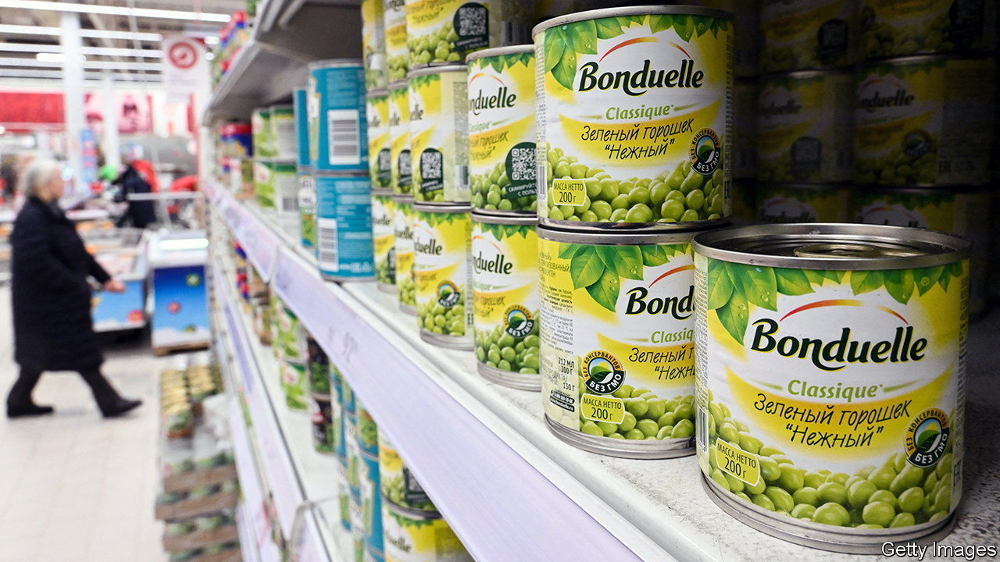

###### Divestment dilemmas

# Western multinationals’ Russian dilemmas 

##### Staying in Russia carries risks. So does leaving 

 

> Feb 29th 2024 

Doing business with an autocracy is always tricky. Doing business with a brutal warmongering one like Russia confronts bosses with unusually stark moral quandaries. They must juggle responsibility for their Russian employees and the well-being of Russian civilians, who may depend on Western-made basic goods, with their fiduciary duty to shareholders and the undesirability of funding Vladimir Putin’s war in Ukraine, to which any tax payments in Russia can be funnelled.. 

When Russia invaded its neighbour two years ago Western companies’ handling of this delicate balance was closely scrutinised. Global companies for which Russia was a marginal market, such as McDonald’s and Starbucks, packed their bags quickly. Others with more exposure, such as Henkel, a German maker of detergents, and Mercedes-Benz, a German carmaker, dragged their feet but quit when their reputations took a hit. Yet by the start of this year only 356, or 10% of all foreign companies in Russia, had completely severed their ties with the country, according to the Kyiv School of Economics. Nearly 1,800 have curtailed operations and investments, but remain. Almost 1,600 continue to operate much as before.

Big global businesses that have stayed put sell goods that are exempt from Western sanctions, such as food and life-saving drugs. Nestlé, a Swiss coffee-and-confectionary giant, remains in Russia but says that it has cut down its Russian assortment to basic brands (Nescafé is available but Nespresso is not, for example). It has also stopped advertising in Russia and halted all capital investments in the country. Mondelez, Nestlé’s American rival, has done the same. So have some other companies, arguing that this limits the amount of money going into Mr Putin’s war economy. 

Companies talk less about the fact that by slashing marketing and capital costs, such moves can bolster their Russian margins. Mondelez’s annual report talks of lower revenues (partly owing to less advertising) but higher profitability in Russia. Remainers can also grab market share from fleeing competitors. Last year’s increase in the Russian revenues and profits of Bacardi, a Bermudan spirits group (whose brands include Grey Goose vodka), follows the exit of Diageo, a British one (which owns Smirnoff, a rival fire-water). 

Under pressure from campaigners some firms, such as Ritter Sport (a German maker of chocolates, which gets 10% or so of sales from Russia) and Bonduelle (a French tinned-vegetable company, which gets around 5%) said they would donate all their Russian profits to humanitarian causes. Still, activists note that taxes on those profits, and on employees’ salaries, keep flowing to the Kremlin. According to B4Ukraine, a coalition of NGOs, American companies paid $712m in corporate taxes in Russia in 2022, German businesses paid $402m and Swiss ones $275m. 

The remainers argue that this is the price for providing essential goods to innocent Russian civilians (though some may wonder if things like Mondelez’s Toblerone chocolates, which remain on sale in Russia, qualify as a staple of anyone other than duty-free shoppers). They also point out that if they leave, their Russian assets could simply end up in the hands of Mr Putin and his cronies. Last July the Kremlin seized control of the local subsidiary of Danone, a French yogurt-maker, and of Baltika, a Russian brewer wholly owned by Carlsberg of Denmark. It is probably no coincidence that both had earlier signalled their intention to exit Russia. 

Carlsberg was forced to write down $1.4bn. Danone took a €700m ($758m) charge. According to the , the French firm is hoping to recoup some of its Russian investment by arranging a formal sale of the business to Vamin Tatarstan, a Russian dairy company. Vamin Tatarstan is owned by a businessman who was appointed to the Danone subsidiary’s board after the Kremlin’s takeover. Danone has declined to comment. As one Western boss ruefully puts it, in Russia “there are no pretty choices.” ■


