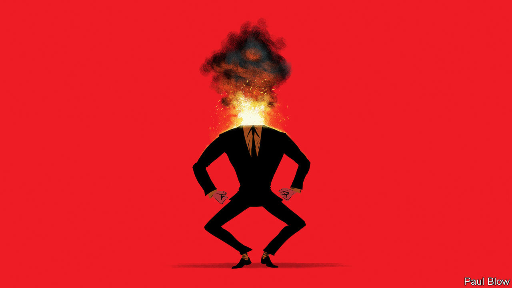

###### Bartleby

# Why you should lose your temper at work 

##### Sometimes. And without throwing anything 

 

> Feb 29th 2024 

Awareness days are meant to remind people of important causes and desirable behaviour. Among other things, February sees the International Day of Human Fraternity, World Day of Social Justice and—everyone’s favourite until it became a bit too commercialised—World Pulses Day. International Day of Happiness falls in March; you have to wait until November for World Kindness Day. 

Anger is far too objectionable to be celebrated with a special day of its own. There is an anger-awareness week in Britain, but the emphasis is on controlling tempers, not giving in to them. Yet in the workplace, as elsewhere, anger is more ambiguous than it seems.

Its destructive side is obvious. Furious people are not much fun to work with, and less fun to work for. A short-fused boss is likely to instil fear among employees and to discourage people from speaking up. Anger can also engender poor performance. Anyone who has ever been riled by a rude email or uncivil colleagues knows how in such circumstances suddenly nothing else matters. Every spare bit of cognitive power is redirected to thinking of devastating put-downs from which the offender will never recover; other tasks can wait.

In one paper on the effects of rudeness on medical professionals, Arieh Riskin of Bnai Zion Medical Centre in Haifa and his co-authors describe a training exercise in which teams of Israeli physicians and nurses treated a mannequin of a baby. The teams were joined by someone billed as a visiting expert from America, who offered studiously neutral comments to some groups and made unprompted and disparaging remarks about the quality of medical care in Israel to others. The teams that had suffered rudeness performed significantly worse. 

Being angry all the time is bad news for individuals and organisations alike. But so is being tremendously satisfied by everything all the time. Jeffrey Pfeffer, a professor at Stanford University who teaches a course on how to acquire power, reckons that displaying anger is an important skill for those who want to rise up the corporate ladder. It is associated with decisiveness and competence (though angry women are more likely to evoke negative emotions among other people than angry men do). Doctors who get angry if they are challenged about their medical advice are not judged to be less competent; if they show shame, patients take a dimmer view. 

Anger can have a galvanising effect in specific circumstances. A study by Barry Staw of the University of California, Berkeley, and his co-authors analysed half-time team talks by college and high-school basketball coaches in America, and found that expressions of negative emotions such as anger and disappointment were associated with better second-half outcomes—up to a point. When coaches reached the bulging-eyeballs stage, rage started to have the opposite effect. 

There are similar nuances in negotiations. A paper by Hajo Adam of Rice University and Jeanne Brett of Northwestern University found that as people got more upset, they were more likely to extract concessions. But being too angry was seen as inappropriate. And although displays of anger can work in one-off negotiations, they also invite retaliation in subsequent interactions. 

Anger has different effects on different types of people. Agreeableness is one of the “Big Five” personality traits recognised by most psychologists. Agreeable sorts value co-operation and courtesy; disagreeable ones are more cynical and more comfortable with conflict. 

In an experiment by Gerben Van Kleef of the University of Amsterdam and his co-authors, teams comprised of agreeable and disagreeable people were given feedback on their performance by an actor. The words were the same each time, but in some instances the actor looked and sounded happy and in others they looked and sounded angry. An angry evaluation spurred the more disagreeable teams to do better than a happy (or poker-faced) one; the reverse applied to the more agreeable teams.

By now the problem should be obvious. Anger involves a loss of control. But to be effective in the workplace, it needs to be carefully modulated. That means volcanic people need to find ways to rein themselves in before they spew invective everywhere. It also means that equable people need to learn to let fly occasionally. If there is room in the calendar for International Jazz Day, then there is certainly a case for World Calibrated Displays of Anger Day. ■


