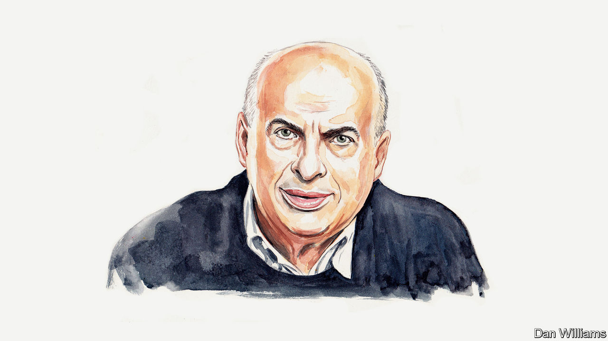

###### Russia after Navalny

# A former political prisoner on how the West should honour Alexei Navalny’s legacy 

##### It needs to rediscover its concern for Russian dissidents, argues Natan Sharansky 

 

> Feb 29th 2024 

AROUND A YEAR ago I received a letter from my alma mater: the Soviet gulag, where I spent nine years after being convicted of anti-Soviet activity, high treason and espionage, and from which I graduated in 1986. The letter was sent by Alexei Navalny from a , or “shizo” for short, the most extreme type of punishment cell in the gulag. He told me he was reading my book, “Fear No Evil”, and was surprised by the similarity of our experiences.

In my nine years in prison I spent 405 days in shizo, a kind of torture by cold and hunger. It is a small, dark cellar, three metres by two. You are so cold that you can’t sleep. You get three pieces of bread and three mugs of hot water a day. Nothing to read, nothing to write, nobody to talk to. The punishment is restricted to 15 days at a time, but if the system wants to crush you it puts you there repeatedly. As I wrote to Navalny, “Judging by all of your time in shizo, you will soon beat all of my records. I hope you don’t succeed in this.”

He did. In his three years in jail, he spent 300 days in shizo—100 days a year, double my rate. And unlike me, he never came out of the gulag. 

To keep your spirit in shizo you have to remind yourself why you are there, and that if you show weakness the whole world will collapse. Navalny understood this better than anybody else.

“In your alma mater everything is as it was,” he wrote to me. “Traditions are honoured. On Friday evening they let me out of shizo. Today on Monday—I got another 15 days. Everything according to ‘Ecclesiastes’: what was, will be. But I continue to believe that we will correct it and one day in Russia there will be what was not. And will not be what was.” 

There was one big difference between my time in prison and Navalny’s. In my time Western politicians understood the scale of historic struggle and saw the fate of Soviet political prisoners as part of their own security. Now they don’t. And this is a mistake of historic proportions.

Russia controls people mainly by fear. People can be divided into three categories: “true believers”—those who sincerely are loyal to the ideology of the regime; “doublethinkers”—those who don’t believe this ideology and don’t trust the regime, but are afraid to speak up; and “dissidents”—those who are not afraid to speak truth to power. On the surface there is no difference between doublethinkers and true believers; in truth, for example, we don’t know how many people support the war in Ukraine. But under dictatorship, inevitably, over time the number of true believers shrinks and the number of doublethinkers increases.

Big changes occur in society when doublethinkers cross the line of dissent in large numbers. Dissidents, simply by their presence and example, are a huge catalyst of this process. As I wrote to Navalny, “By remaining a free person in prison, you, Alexei, influence the souls of millions of people worldwide.” And that is the reason why democratic dissidents under dictatorships are important allies of the free world.

Of course, the West always respected Soviet dissidents as people of moral courage. But it took about 20 years after the death of Stalin in 1953 for people in the West to recognise the connection between their own security and the state of human rights, not least the fate of dissidents, in the Soviet Union. In 1975 this understanding was enshrined in the Helsinki accords, which divided the relationship with the Soviet Union into three baskets: security, trade and human rights. Soviet leaders agreed to the third one reluctantly, hoping that it would require only lip service, but it didn’t. In fact, it is the link between the third basket and the other two that spelled the death of the Soviet regime.

Archival documents recently released by the White House show how the administration of Ronald Reagan in the 1980s repeatedly insisted on raising three groups of questions with the Soviets: the arms race and disarmament; co-operation on trade, other economic issues and science; and human rights in the Soviet Union, with an emphasis on the fate of democratic dissidents. The Soviet reaction to the last of these was always “It is an internal affair”. America’s response was “Yes, but our public opinion is so sensitive to this issue that it doesn’t let us move on other parts of the agenda without having progress here.”

It is essential that the West adopt a similar approach today. Its confrontation with Vladimir Putin’s regime should consist of strengthening military deterrence on the borders with Russia, increasing support for Ukraine and developing a policy towards dissidents within Russia itself.

The experience of the cold war shows that this policy can only work if it is consistent, systematic and supported by Western public opinion. Implementing it is as urgent as supplying the Ukrainian army with artillery shells. 

After the murder of Navalny there is no doubt that the lives of other political prisoners are in grave danger, particularly those of Ilya Yashin, an opposition politician, and Vladimir Kara-Murza, whose 25-year sentence for treason was revenge for his advocacy of the West’s Magnitsky sanctions (imposed on human-rights abusers in Russia).

The West must understand that political prisoners are its main allies inside Russia. It should treat them as hostages who must be exchanged for accomplices of Putinism held in Western prisons (as Reagan and his predecessor, Jimmy Carter, did). Rather than simply expressing “concern” for their fate, the West must develop much harder tactics to ensure their freedom. Of course, the accomplices Putin wants the West to free are mostly assassins or other dangerous criminals whose release could violate basic tenets of national justice. It could be only justified by the West extracting a very high price in terms of the kind or number of dissidents and innocent citizens exchanged in return.

In his letters to me from prison, Navalny spoke about the spark of freedom which we dissidents of the gulag kept and turned into a “virus of freedom”. “It is no longer tens or hundreds as before, but tens and hundreds of thousands who are not scared to speak out for freedom and against the war, despite the threats,” he wrote.

In killing Navalny, Putin tried to extinguish that spark and prove that dissidents have no chance of survival. The West must show the opposite and fight for its allies in Russia. Even when I was in complete isolation in shizo, I knew that the free world was fighting for me. The best way for the West to honour Navalny’s legacy is to show the same concern for the fate of dissidents today.■


