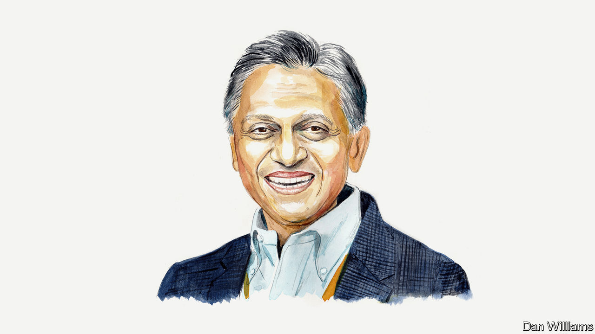

###### India’s election

# Ashoka Mody argues that India is stunted by a lack of moral leadership 

##### It needs better politicians and a more civic culture, says the academic 

 

> Feb 28th 2024 

LAST DECEMBER French authorities detained 303 Indians at Vatry airport. The passengers were on their way from the United Arab Emirates to Nicaragua, a hotspot for would-be migrants who pay touts to get them into America illegally. According to the Pew Research Centre, between 2017 and 2021 Indians were the fastest-growing nationality of illegal migrants entering America, with border-agency data suggesting a possible acceleration since. As the mirage of urban employment at home recedes, large numbers of Indians are risking their lives to slip into labour markets in North America, Europe and Australia.

In January 200,000 anxious Marathas—a traditionally well-to-do farming community—walked 400km from central Maharashtra to Mumbai’s outskirts. The march was the latest in a series of protests from groups demanding quotas, or “reservations”, in government jobs and college admissions.

Illegal migration and the clamour for reservations are symptoms of India’s persistent policy paralysis. Over 75 post-independence years, dignified jobs—those that offer a fair wage, decent working conditions and the opportunity for personal development—have been a rarity for India’s working-age aspirants, now over 1bn people. The situation could worsen in the coming decades, as hundreds of millions more seek jobs. 

This economic travesty persists because India increasingly devalues human dignity, equity and fairness, while undercutting civic virtues essential for social progress. Invoking such moral issues might appear unusual in an economic analysis, which typically concentrates on regulatory reforms, tax breaks and the like. But the ethical value that societies place on common welfare determines not just the wisdom and application of economic policies; it ensures a sharper focus on foundational public goods, such as education, gender equality, justice and a clean environment. These things make all else possible. 

As India’s national elections, expected in April and May, approach, the moral failure is evident. Political leaders pay lip service to jobs and public goods fundamental to people’s lives. But their actions focus on handouts—cynically dubbed “welfare programmes”—to pacify voters rather than help them stand on their own feet. 

Meanwhile, Indian economic development has regressed alarmingly in the past five years, during which 70m workers have piled into an unproductive agricultural sector. This highlights a perennial problem: India’s bias towards heavy industry has stymied the creation of dignified manufacturing and urban jobs. Outside agriculture the main options are in financially (and often physically) precarious construction jobs and low-end services like street-vending.

The world’s glitterati seemed oblivious to this predicament when they met in Davos in January. Thomas Friedman, a  columnist and self-declared “raging Indophile”, lauded the roll-out of physical and digital infrastructure implemented under Narendra Modi, the prime minister. America’s secretary of state, Antony Blinken, spoke of “remarkable achievements” on Mr Modi’s watch that have “materially benefitted so many Indian lives”.

These gentlemen are complicit in Indian leaders’ moral failures. Are they unaware of the country’s jobs crisis? Or its educational crisis? In India, high-quality mass education, vital for equity and growth, remains elusive. According to Stanford University’s Eric Hanushek, 85% of Indian students lack the basic literacy and numeracy skills required for today’s global economy. In China, just 14% do. 

Like education, gender equality is both inherently desirable and a spur to economic advancement. Yet Indian female labour-force participation is 28%, according to the World Bank, compared with over 60% in China. The number has ticked up recently, but mostly because more women report doing “unpaid household work”. 

Adam Smith stipulated that efficient markets need publicly funded education and a fair and effective judicial system. India’s justice system is broken, with a backlog of 50m cases. India has too few judges. And of the ones it has, many are poorly educated.

India’s rampant environmental damage is its most profound moral breakdown. Business tycoons mow down pristine forests. The government rolls back forest-conservation laws. Farmers accelerate the loss of groundwater by extracting it for irrigation. Unchecked dumping of waste and obstruction of flows is pushing rivers towards ecological collapse—and when rivers die, civilisations die. Compounded by global-warming-induced extreme weather events, environmental devastation is inflicting huge costs on the vulnerable, and on future generations.

For decades Indian politics has unravelled the country’s moral fabric. Politicians and officials, advancing their own interests rather than the public good, have become the antithesis of —the dedicated public servants esteemed in French civic culture. An alarming number of Indian legislators have criminal links. The embedding of Hindutva—the century-old ideology of Hindu-centric Indian nationalism—in political life under Mr Modi’s ruling Bharatiya Janata Party has promoted intolerance and violence. 

India’s human and social problems endure also because data gaps obscure them. In the absence of a census since 2011, or a Consumption Expenditure Survey with more than partial findings in recent years, the government and its acolytes flaunt fabricated statistics on poverty reduction and other matters. They trashed a survey in 2018 that showed that poverty had risen, and last year they forced out the director of another survey, which had found stubbornly high levels of stunting and anaemia. Why, if this data is wrong, does the government supply free food-grain rations to 60% of the population?

There are no magic policy fixes for the moral crisis that has widened India’s deficits in jobs, human capital, justice and the environment. The country needs to create a vibrant civic consciousness, bolstered by dedicated local governments. As Alexis de Tocqueville wrote, responsive local governments are the primary schools for greater civic engagement. 

Only such a transformation can foster policies that bring solace to Indians desperately seeking foreign shores and to farmers marching in protest. Many millions of Indians would rejoice. That joy—not the vacuous applause from the Davos elite—would signify a truly rising India. ■


