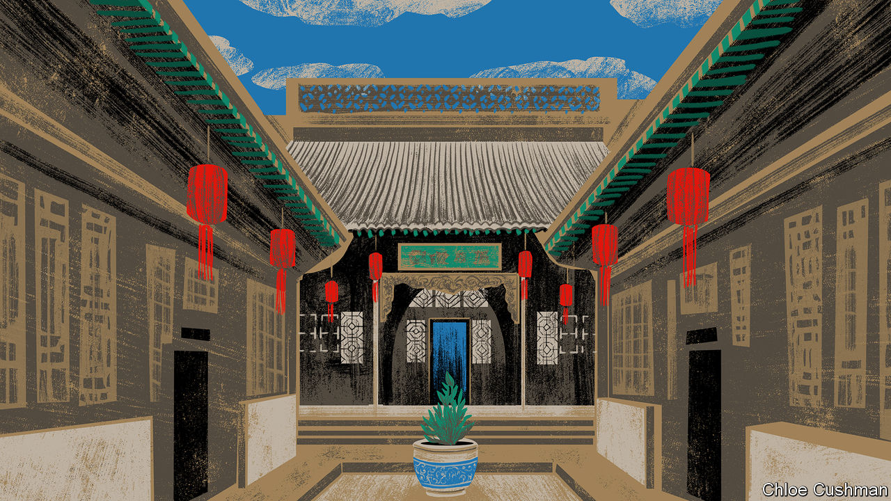

###### Chaguan

# China tells bankers to be more patriotic 

##### Financiers from 200 years ago are wheeled out as role models 

 

> Feb 29th 2024 

Open the wardrobe of a high-flying Chinese banker, and it would be no surprise to find handmade foreign suits, all sadly gathering dust. It is a year, almost to the day, since an anti-corruption agency ordered financiers to abandon “hedonistic” lifestyles, rectify “elitist” thinking and stop worshipping the West. Several bank bosses and former executives have been arrested for graft. Many workers in finance have seen their salaries cut. All in all, this is a prudent moment to leave the Savile Row pinstripes at home.

As a tool for making China’s financial system more efficient, market forces are not quite out of fashion. But as the economy slows, Chinese regulators are working to tailor market sentiments to the government’s tastes. Officials have loudly scolded brokers for undervaluing state-owned enterprises. Quietly, analysts are nudged to write bullish research notes. Seeking to halt stockmarket slides, regulators have moved to curb transactions that they consider harmful or “ill-intended”.

Now, China’s bankers face new orders: to develop a “financial culture with Chinese characteristics”. This ideological campaign emphasises the need for cautious, long-term investments that serve the real economy, as opposed to risky deals that shuffle virtual money around. Unveiled over several days in the , the Communist Party’s official mouthpiece, the campaign calls on financiers to “pursue profits through righteousness, not solely for the sake of profit”, and to be content with “reasonable returns”. Guided by “iron” self-discipline and strict external regulation, finance houses must serve the cause of “high-quality development”. That short phrase is code for a large ambition. It describes a drive by Xi Jinping, the supreme leader, to make China into a high-technology, low-carbon industrial superpower. On the way to achieving this goal, Mr Xi has made clear that central planners and state-owned firms will play a leading role, not least to ensure that wealth is more evenly distributed.

Late last year, Mr Xi chaired a meeting on financial policy that praised the party for “adapting Marxist financial theory to the specific realities of contemporary China”. The mood among economic reformers is bleak. They fear that Mr Xi is taking China back to a party-dominated economy, as if the reform and opening drive unleashed by Deng Xiaoping four decades ago were somehow a mistake. Foreign investors could be forgiven for worrying that the whole country is making a hard left turn, as if Chinese colleagues might turn up for their next meeting in Mao suits.

Actually, to understand Mr Xi’s politics, “left” and “right” are not always very useful terms. True, this is a statist moment, in which markets are expected to obey top-down political imperatives. Moreover, when Mr Xi speaks about China’s future, he uses vaguely Marxist jargon about “new productive forces” driven by innovation. But he also talks—a lot—about China’s cultural exceptionalism and its “excellent traditional values”. 

To illustrate the meaning of finance with Chinese characteristics, the  recalled a visit made by Mr Xi to Pingyao, an old walled city in Shanxi, a northern province. China’s first nationwide banks were born here in the early 19th century. They were founded by Shanxi merchants who, far from being proto-socialists, were stern conservatives steeped in Confucian values of thrift, discipline and deference to government. Mr Xi’s visit to Pingyao in January 2022 took him to the handsome, grey-brick courtyards and stone-flagged halls of Rishengchang, a famous Shanxi bank. There he suggested that studying Shanxi’s long-ago merchant culture could serve China’s development today.

Seeking clues about finance with Chinese characteristics, Chaguan took a hard-sleeper train to Pingyao and headed to Rishengchang. Faint traces of a revolutionary slogan may be glimpsed high on one courtyard wall, a legacy of the bank’s use in the Mao era as a co-operative distribution centre. But this is firmly a shrine to 19th-century commerce. Visiting party delegations and tourists learn about the bank’s reputation for honesty and integrity, and of the strict rules binding employees, who had to be locally born and to forswear gambling, opium and other sins. Though displays describe the bank founder’s wealth and show him in sable-trimmed robes, what is emphasised is his tireless work ethic.

A sign notes that loans were extended to trusted clients vetted by bankers. A calligrapher dressed in Qing-dynasty silks demonstrates anti-fraud technologies. Passwords were written on bank drafts by scribes whose brushwork was recognised in other branches, he explains. Merchants and government officials used drafts to send remittances nationwide, avoiding the need for physical convoys of silver that bandits might attack.

Crony capitalism, Qing dynasty-style

Though the exhibit is charming, Mr Xi’s praise for Pingyao’s ancient banks is not reassuring. Rishengchang was obliged to devise elaborate internal rules to avoid fraud because the Qing dynasty’s weak legal code offered private businesses few formal protections, notes Meng Wu, an expert on Shanxi banks, in a paper for the University of Manchester. Those loans to trusted clients were rarely backed by collateral, making Shanxi banks vulnerable to collapse (Rishengchang went bust in 1911).

Worse, according to a paper by Debin Ma of Oxford University, Shanxi merchants learned to thrive in a “patronage economy”. In this system property rights, particularly in the realm of commerce, rested on political connections rather than the law. Powerful officials granted merchants protection and lucrative monopolies, and in return expected them to fund government projects.

Mr Xi is using Shanxi bankers as symbols of graft-free patriotic commerce. In real life, Pingyao’s financiers were hidebound conservatives, whose remittance businesses did not survive the advent of modern Chinese capitalism. Propaganda aside, sable-trimmed robes hide as many follies as pinstripe suits. ■


