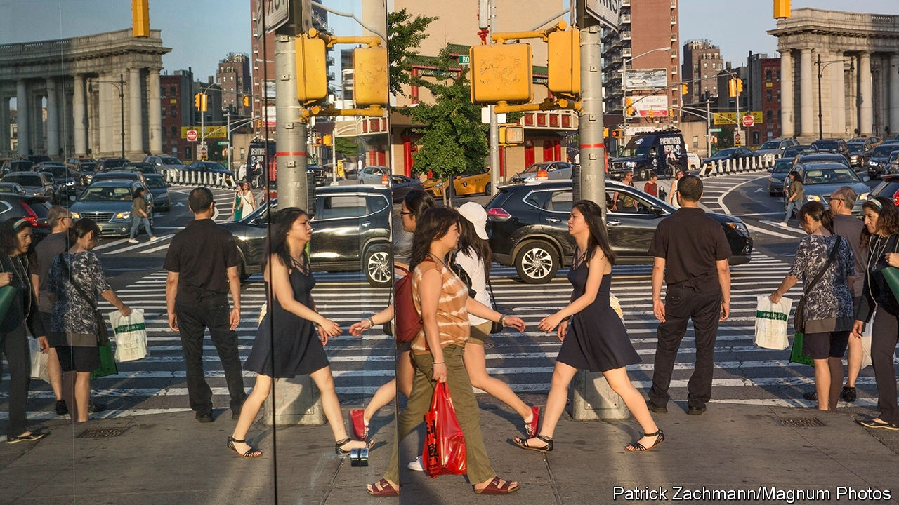
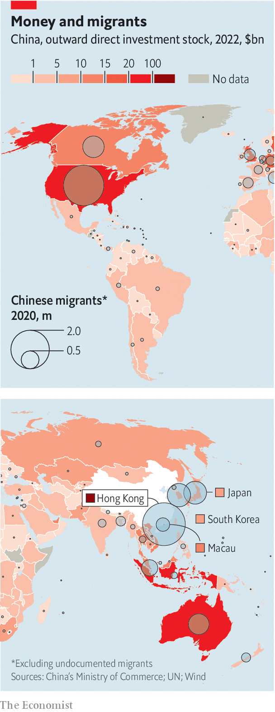
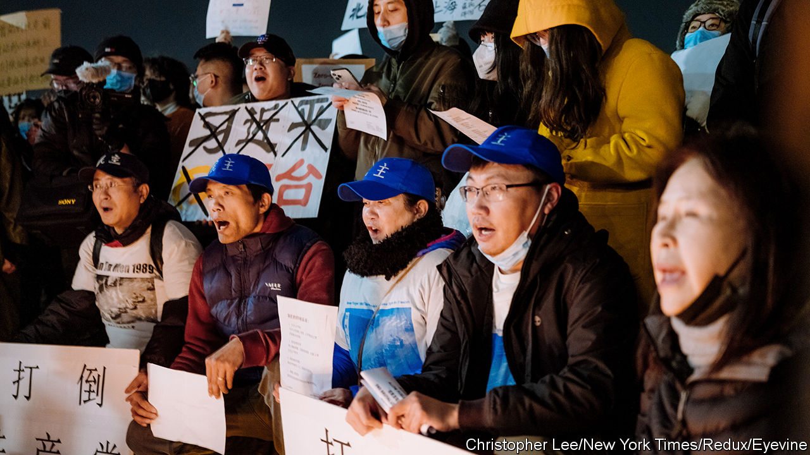

###### The Chinese diaspora

# Living outside China has become more like living inside China 

##### The Communist Party is trying to tighten its grip on the Chinese diaspora 

 

> Feb 26th 2024 

Song Xia does not want her real name used. The young professional is neither a dissident nor an activist, yet she fears the watchful eyes of the Chinese state. After she left Shanghai to work in the Netherlands in 2012 she kept in touch with friends on WeChat, a Chinese app. Then she realised some of her messages were being censored. Even in her new country she is careful what she says in public and only goes to places she considers “safe”—those where no members of the Chinese Communist Party are present.

Ms Song is typical of many Chinese who have moved to the West in recent years: well-educated and wealthy, unlike the labourers who dominated earlier emigrant communities. The number of Chinese abroad has doubled since 1990. It has risen particularly fast since 2000. The pandemic heightened the desire of many members of the elite to leave, as their resentment grew of covid-related controls and the party’s ever-tightening restrictions on freedom of expression. China ended its battle against covid late in 2022, but its faltering economy and high youth unemployment are fuelling people’s anxieties. Many young Chinese now use the term ,the art of running”, to convey their desire to flee.

There are about 10.5m people living outside mainland China who were born on the mainland. Only the Indian, Russian and Mexican diasporas are larger. Some of these Chinese are among the country’s richest people. In many countries, they have long dominated wealth-related visa schemes. More than 70% of the 81,000 investor visas issued by the American government to dollar-millionaires between 2010 and 2019 were given to Chinese citizens. Since 2012 some 85% of people who have received Australia’s “golden visas” for investing over A$5m ($3.3m) in the country have been from China. All but 41 of the 1,300 people who applied for the equivalent Irish scheme in 2022 were Chinese. 

Since the pandemic there have been signs that the outflow of extreme wealth is accelerating. Some 18% of China’s nearly 900 dollar-billionaires live abroad, according to the 2023 China Rich List published by Hurun, a research firm, up from 6% in 2019. Despite tightening capital controls, more than 13,500 people with investable wealth of $1m or more left China in 2023, according to Henley &amp; Partners, a consultancy. It says this equates to around 1.5% of Chinese with that level of wealth. 

The less affluent are leaving too, often by perilous means. In 2023 nearly 53,000 Chinese were detained at the American border, compared with just over 1,000 in 2018, a far faster increase than for overall border arrests. In the first eight months of 2023 more than 13,000 Chinese tried to make it to America via the dense, trackless jungle of the Darien Gap in Panama.

With greater wealth, the destination of Chinese émigrés has changed. Fifty years ago nine in ten people of Chinese descent lived in Asia; now just seven in ten do. Leavers from the mainland today have greater autonomy than the indentured labourers of much earlier times. A quarter of the Chinese diaspora live in America, another quarter live in Hong Kong, followed by Japan and Canada. Overall nearly half of Chinese citizens abroad live in the West.

But leaving China does not necessarily offer freedom from the regime’s strictures. Since China does not accept dual citizenship, many émigrés are now solely citizens of another country. Yet the party has the ability to influence even those who no longer have a Chinese passport. These days most people within China are free to make money and lead comfortable lives. The party leaves them alone so long as they express no political discontent. Increasingly, many people outside China face similar restraints. The scope of sensitive or taboo topics has widened since Xi Jinping became China’s leader in 2012, overseas as well as at home. Living outside China has become more like living inside it.

The meddle kingdom

The influence of the party on Chinese abroad takes three overlapping forms: direct intimidation of potential critics, propaganda aimed at the diaspora and pressure on people to censor themselves when discussing Chinese affairs. At home, the party ensures self-censorship by keeping people aware of the state’s proximity. This powerful tool is now in use abroad, too. 

When China opened up in the 1970s, officials viewed people of Chinese descent abroad as an economic resource. Later the party tried to lure back academics and entrepreneurs. A critical shift has occurred under Mr Xi. He sees the diaspora in a political light. He has increased the funding and status of the United Front Work Department (UFWD), which is in charge of boosting the party’s influence among Chinese abroad. The party hopes they will act as advocates for its cause. But it also fears those among them who openly criticise China. It believes they may infect China with foreign democratic thinking. Small wonder that the diaspora is under scrutiny like never before.

First consider the party’s use of direct intimidation against Chinese overseas. Most blatantly, it targets dissidents and activists. Its tactics include interference in their digital communications, bullying of their family members in China and direct physical threats. In 2023 Safeguard Defenders, a human-rights group, accused China of setting up over 100 police stations in 53 countries without permission. 

Repressed ethnic minorities in China are closely monitored abroad and often intimidated. The party tries to get some of them deported: between 1997 and 2021 over 400 Uyghurs were sent back to China on dubious grounds. Other Chinese nationals have also been extradited from foreign countries on trumped-up charges. (Some governments, such as Thailand’s, have turned a blind eye to these dodgy pretexts.) Chinese abroad are often pressured to return without ever involving a host country’s legal system. Those targeted are often wanted for economic crimes, but some are pursued for political reasons.

A far larger group is affected by the party’s efforts to control the diaspora’s news sources. Many people from mainland China dwell largely in a Chinese-language world, even when living abroad. In America, for example, over half of Chinese immigrants have limited English, according to an American government survey in 2021. 

To feed this market, the party reportedly allocated about $7bn in 2009 to extend the global reach of China’s state media. Under Mr Xi, their impact has expanded. The party has launched new Chinese-language media outfits and bought existing ones. It has pulled financial and coercive levers to influence opinions expressed in nominally independent outfits, America’s State Department said in a recent report. 

Chinese outlets abroad typically quash discussion of sensitive topics such as Tibet or the pro-democracy upheaval in China in 1989. They emphasise the shortcomings of democracies in an attempt to drive a wedge between diaspora communities and host countries. Free newspapers in Europe run articles that intersperse praise for the party with information on local life. In Australia Chinese-language media, which used to be broadly anti-Communist, now typically laud China’s leaders. They are subject to little scrutiny by regulators. In America, where TV news is the main information source for diaspora households, pro-party channels dominate cable offerings, according to Sarah Cook of Freedom House. The think-tank reviewed Chinese-language programming supplied by three big cable providers: Verizon, Comcast and Spectrum. It found that most of their Mandarin and Cantonese output was from Chinese state broadcasters or other providers sympathetic with the party.

 


These are not the only views on offer. In America publications such as the  run news in Mandarin that often criticises party policy. Falun Gong, a spiritual practice banned in China, distributes , a free newspaper, worldwide. But at a time when many existing media firms are struggling financially, particularly with the decline of advertising revenues, the party’s well-funded views have become increasingly prominent.

In the digital age, the party is trying to influence not just what people read and watch, but how they interact online. The most pervasive aspect of this involves WeChat, which is central to China’s social and business life. Diaspora Chinese also use it to contact family in China, as well as each other. The app is owned by Tencent, a technology firm with close links to the party, which actively surveys even accounts that have never been linked to a Chinese phone number, says Citizen Lab, a cyber-watchdog. WeChat automates censorship using frequently updated algorithms. It can access data relating to a user’s network operator, read a device’s ID and monitor a person’s physical activity, enabling Tencent to identify who is using the service. 

Learning to hide

China’s bid to control information access also extends into Western universities. One in ten Chinese abroad are now students, a number that does not include the many scholars who have stayed overseas after graduating. Mr Xi says he expects these students to be “grassroots ambassadors” for the country.

Under Mr Xi, rules have tightened for the 65,000 of them who are on scholarships funded by the Ministry of Education. According to UK-China Transparency, a research group, they have been required since 2019 to “support the leadership of the Chinese Communist Party”. The Chinese government sometimes asks them to give technical details of their own research or of patents obtained by colleagues, which can involve revealing confidential information. Many feel obliged to comply. Families must repay fees if a recipient breaches a scholarship agreement by “engaging in acts that damage the national interest”.

The Chinese state has increased its oversight of all Chinese students, not just government-funded ones. There are Chinese Students and Scholars Associations (CSSAs) on campuses worldwide. Many of them have close ties to diplomatic missions. Under Mr Xi, they have become better funded. Their services include greeting students at airports or helping them open bank accounts, but on some campuses they play a political role, too. Before the 2022 Winter Olympics the CSSA at George Washington University asked the university’s authorities to punish “severely” anyone who puts up posters decrying human-rights abuses in Xinjiang and Hong Kong. Chinese diplomats have also been known to interfere directly on foreign campuses. 

At times Chinese netizens and media outlets intimidate students who step out of line while abroad. The state frequently reminds Chinese students overseas that their status is “uncertain” and “impermanent”, says Yaqiu Wang of Freedom House. A brief flare-up of protests on mainland China in November 2022 against Mr Xi’s “zero-covid” policy provoked a flurry of sympathetic outbursts in the West by Chinese students and other members of the diaspora (a demonstration in New York is pictured). The Chinese authorities harassed some participants, such as by putting pressure on family members in China, Ms Wang’s organisation says.

 


The state’s vigilance also extends to academics in the diaspora, especially those who work on China, even if they were not born there. Visas to China have become “weaponised”, says Steve Tsang of the School of Oriental and African Studies in London. Scholars who are seen as critics may find their research in China curtailed.

All this encourages self-censorship, particularly by those with family in China. On foreign campuses, such caution has become routine. University lecturers in several countries tell of Chinese students who refuse to speak up in class or ask not to be taught alongside other Chinese for fear they may be informants. One graduate in the Netherlands speaks of “coming out” to fellow Chinese about her political views. Scholars pick their research with care. A professor in Florida says he may change the direction of his studies once he no longer has to be mindful of a need to return to China to visit his parents. 

Red flags

While focused mainly on those born in China, the party’s efforts to increase its influence covers all people of Chinese ancestry. There could be about 45m in this group—more by some counts. Mr Xi calls ethnic Chinese of any type “sons and daughters of the Chinese nation” and urges “great unity” among them; the UFWD’s tasks include co-opting ethnic Chinese born abroad. This sweeping approach fuels suspicion and racism in their countries of residence. A comparison with the Indian diaspora is illuminating. Both Asian groups are wealthy, educated and increasingly based in the West. But in business and politics the Chinese diaspora—often including people of Chinese ancestry born outside the mainland—is strikingly less successful in Western countries. 

Chinese-born entrepreneurs founded Zoom, NetScreen and WebEx, but there are far more people of Indian descent running giant firms, including Adobe, Alphabet (Google’s parent) and Microsoft, among others. Silicon Valley companies may recruit directly from India for leadership roles but typically choose not to do so from China, says Frank Pieke of Leiden University in the Netherlands.

When it comes to investing in foreign businesses, Chinese abroad also struggle. Their investments are scrutinised by governments in Europe and North America on national-security grounds, whereas deals involving people of Indian descent, say, raise less concern. In 2022 Britain introduced a law aimed at tightening scrutiny of foreign involvement in potentially sensitive sectors. In the first full financial year of its enactment, more than 40% of the projects examined were associated with China. Though there have been genuine cases of corporate espionage by the Chinese state, a presumption of suspicion towards anyone of Chinese descent quickly tips into racial profiling.

Consider the fate of the China Initiative, an American government programme intended to stop Chinese spying in universities and businesses. As part of this, more than 150 academics were charged by the Department of Justice between 2018 and 2022. About 90% of them were from China or had Chinese ancestry. But only a handful were convicted, some for minor offences. Many researchers of Chinese descent stopped applying for jobs or grants for fear of inciting suspicion, even after the initiative was ended in 2022. Some left America.

In politics, people of Indian origin fill some of the highest offices in Britain, Ireland and Portugal, yet there are few elected politicians of Chinese descent anywhere in Europe. The Chinese government is now encouraging such people to get more involved in local and national politics, hoping they will help to nurture more positive attitudes towards China in the countries where they live. 

Western governments have long hoped that the flow of Chinese abroad might foment democratic change in China. Instead, the party’s effort to control them may be stunting their opportunities in the West. People of Chinese ancestry are more likely to be viewed with suspicion and regarded as the party’s allies or even agents. Anti-Asian hate crimes increased in America after Donald Trump was elected in 2016. In many countries such assaults became more frequent during the pandemic. They remain more common.

The party’s actions perpetuate a vicious cycle. As fear grows about the power of the state abroad, diaspora groups become more insular, further fuelling distrust of them. The result may be that some Chinese abroad are driven back into the arms of the party. That, of course, would be precisely what it wants. ■


