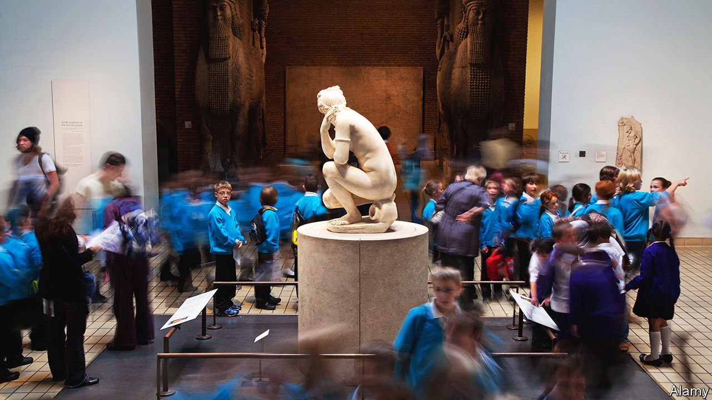

###### Money and the arts

# Britain’s arts still dazzle the world 

##### But they are being diminished by a funding crisis 

 

> Feb 29th 2024 

It was a cruel and dramatic scene. (Cue the sombre score.) On February 15th, during the final performance of , an opera based on Margaret Atwood’s novel at the London Coliseum theatre, singers and members of the orchestra were handed redundancy notices by the English National Opera (eno). The notices followed a deal the ENO had struck with its musicians, who had threatened to down fiddles and flutes over plans to cut work. (The ENO says staff will be rehired and offered new seven-month contracts to replace ten-month ones.) 

Funding cuts are largely to blame. In 2022 Arts Council England (ACE), which distributes money from the government and is the ENO’s biggest funder, removed the opera company from its national portfolio and said it must leave London to qualify for future cash, as it tries to bolster groups outside the capital. (ACE says it has concerns about the ENO’s business model.) Facing uncertainty over its future, the ENO has had to postpone several productions.

Financial troubles are squeezing Britain’s arts sector. As is the case in many Western countries, audience and visitor numbers remain stuck below pre-pandemic levels. In both Britain and America government funding during covid prevented the arts from collapsing completely. Yet it is becoming apparent that many people’s cultural habits may have changed irrevocably. Britain—where the arts, at their best, still dazzle the world—must decide how much it wants to invest to remain a magnet for artistic innovation and performances.

It does not require someone with Ms Atwood’s imagination to divine what has gone wrong. Stagnant wages, coupled with high living costs, mean many Britons are disinclined to go out to places that cost more than the pub or cinema. Cuts to central government funding during austerity (in 2010 ACE’s budget was slashed by 30%) have been followed in recent months by regional cuts, as local authorities go bust. 

Recently , a broadcaster and baron, warned the House of Lords that Britain was “sleepwalking into permanent mediocrity” and criticised ACE’s big shake-up of central government funding. To raise the fortunes of poorer regions, ACE is channelling cash away from world-famous institutions, including the Southbank Centre and the University of Cambridge museums, to lesser known (although often excellent) ones farther afield. Giving arts groups outside the capital more money is good, but taking funds from London’s institutions is “cultural vandalism”, he says. 

To cash in on this trend and to save itself the ENO plans to move to Manchester by 2029. ACE points out that cash is going to a greater number of recipients. But critics say it is still not nearly enough to . Meanwhile, great institutions that have long contributed to London’s—and thus Britain’s—global prestige and tourism revenue are being weakened by short-sightedness.

Politics have played a leading role. Arts in Britain have long been subsidised by the government. Even commercially successful plays benefit from public spending on theatres and human capital. Such investment makes sense: the arts contribute to economic growth. In 2020 every £1 ($1.27) generated in the arts and culture supported another £1.23 in turnover in the wider economy, according to a study by the Centre for Economics and Business Research, a consultancy, on behalf of ACE. That is because musicals, plays and art shows are popular, including among overseas tourists, who go to the theatre more than they do sporting events. 

The Labour government of 1997-2010 spent generously on the arts (among other things). The Conservatives who followed have been more circumspect. Between 2010 and 2023 ACE’s expenditure on the arts fell by 10% in real terms, amounting to a nearly 20% cut per person (factoring in population growth). Britain has had 12 culture secretaries since 2010. 

Will the next Labour government take culture more seriously? Money will remain tight, but some who work in the arts note optimistically that the shadow culture secretary, Thangam Debbonaire, is a cellist and has played in a professional orchestra.

The national picture is important, but local authorities have long been the biggest public funders of the arts in Britain, running festivals and building and maintaining museums and theatres, says Jack Gamble, director of Campaign for the Arts, a charity. Now, as more councils declare bankruptcy, arts funding is being reduced or scrapped. The amounts are paltry in terms of overall council budgets yet can leave valuable organisations close to the edge. Once they are lost, restoring them later is impossible. 

Some may argue it is appropriate for local governments to reduce their investment in the arts, if basic social services are also threatened. But cutting arts funding can also damage local economies, where relatively small public investments in the arts bring outsized returns. Take Nottingham, where the council declared itself effectively bankrupt last November. It is likely to scrap arts funding soon, which amounts to less than visitors to Nottingham Playhouse contribute in parking-meter payments, says Stephanie Sirr, the theatre’s boss. With these cuts, local authority funding to the award-winning theatre will have fallen from £433,000 in 2010 to nothing in 2024. 

Diversification into food, stand-up comedy and co-productions (run as joint ventures with arts companies) has helped the theatre cope. “The Kite Runner”, a play based on the novel by Khaled Hosseini, was incubated by Nottingham Playhouse and is currently touring America.

This suggests that financial woes can unleash inventiveness. Arts organisations are becoming more commercially minded. The Victoria and Albert Museum in London, for example, has formed partnerships with tech companies for education initiatives. The National Health Service works with theatres on “social prescribing”, sending people with mental-health difficulties to see a play. The link between happiness and the arts is established by research. The arts’ effect on young people’s literacy and oracy is especially valuable. 

Some hope the central government will step in and ensure that local authorities are able to support arts groups (just as it does with adult social care). But for now the mood is rather grim. In February ACE warned that organisations it funded should be careful about making “statements including about matters of current political debate”. Fury and claims of censorship followed. ACE responded with an assurance that it believed “unequivocally in freedom of expression”, but many remain sceptical. The fiasco has been a distraction from more important issues, such as how the country can maintain its leading position in the arts after Brexit. 

Off-stage drama

Demographic trends suggest more reasons to be worried about the arts’ future. Fewer students are taking art and music in state schools or at GCSE, exams written by 14-16-year-olds, because the government has underinvested in arts and music lessons. With exposure increasingly limited to those whose families can afford it, further declines in audience numbers could be in store. Nor is private patronage assured to make up for government shortfalls. Younger generations will not necessarily step into the shoes of prominent art patrons, including Jacob Rothschild (who died on February 26th). 

The effects of arts groups’ disappearance, here and there, will be largely invisible, says Douglas Rintoul, artistic director of the New Wolsey Theatre in Ipswich, which will soon lose its local-authority funding. He grew up poor before he became a playwright. But if he were growing up today, “there’s no way I’d consider” a career in theatre, he says. This should be heard as a warning. The arts help contribute to Britain’s economy—and its global standing. Theatre incubates content that can appear, lucratively, on television and cinema screens later. Britain still has the edge in such endeavours. But it risks losing it. ■


