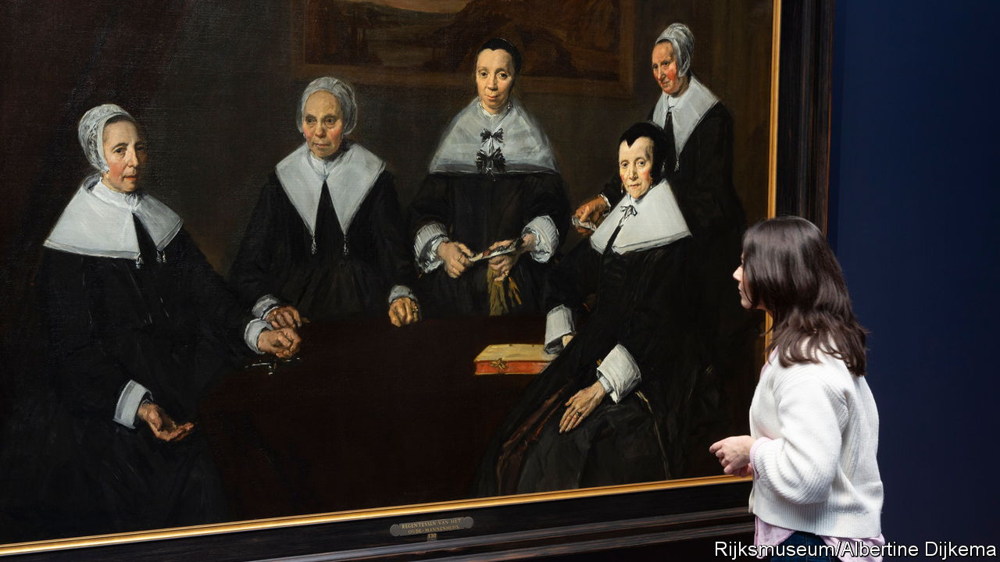
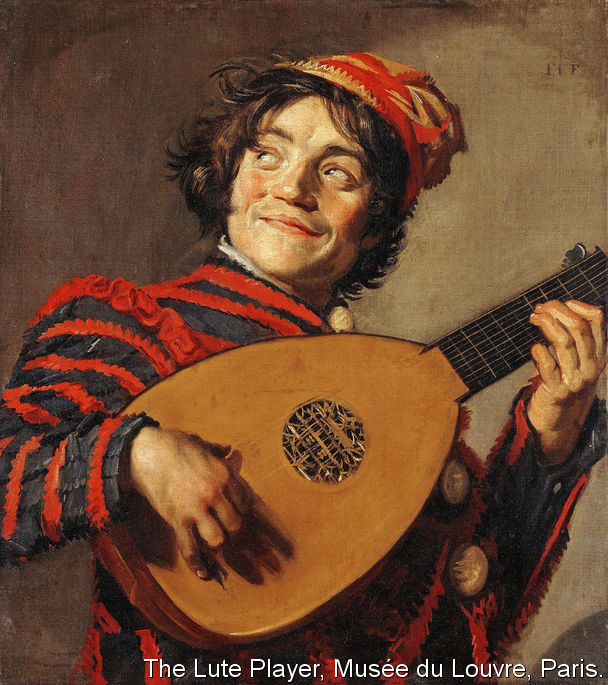

###### An artist’s artist

# Why did a once-revered painter, Frans Hals, fall out of favour? 

##### A new show at the Rijksmuseum pays tribute to an often overlooked Dutch master 

 

> Feb 29th 2024 

IN THE LATE 19th century, a pilgrimage became fashionable for Impressionist painters and other artists, who were striving to liberate painting from the stifling tradition of exactitude. Mary Cassatt,  and John Singer Sargent took the Netherlands’ first train line to Haarlem. There, in a small museum attached to the town hall, they could admire and copy the works of that city’s greatest artist, who more than 200 years earlier had achieved a freedom of style they strove to emulate, with bold strokes, rough fields of colour and a vivid sense of movement. 

 rhapsodised over the artist’s colours, claiming to have identified 27 shades of black. James McNeill Whistler stayed late and persuaded a guard to let him touch one of the most famous works, a portrait of “regentesses”. 

The artist was Frans Hals, who is the subject of a new exhibition at the Rijksmuseum in Amsterdam. (A different version was previously shown at the National Gallery in London.) Hals, who died in 1666, was among the most celebrated portraitists in Holland. He was renowned for his technique, which created shimmering effects at a distance but left his dynamic brush strokes visible from up close—a style resembling that of Rubens (whom he knew) and, later, Rembrandt. 

Such roughness fell out of favour, but in 1868 Hals’s reputation was resurrected by Théophile Thoré-Bürger, an influential French journalist. Around the same time Thoré-Bürger wrote effusively about a then little-known Dutch artist whose work he had seen in The Hague: 

At the turn of the 20th century Hals, Rembrandt and Vermeer were considered equals, the “big three” of the Dutch Golden Age. Yet Hals does not have the same standing today. Most people know Rembrandt’s “The Night Watch” and Vermeer’s “Girl with a Pearl Earring”; few would recognise “The Regentesses”. Following big exhibitions of Rembrandt and Vermeer, the Rijksmuseum’s show of Hals’s paintings tries to repair that neglect. Its 50-odd works include rarely seen paintings from private collections and several portraits of couples that normally hang separately. 

Hals’s burghers grin, smirk and exchange knowing glances. In one double portrait, a merchant and his wife emerge from the woods glowing with suggestive joy. Another merchant wryly tilts his chair back on two legs. The sumptuously clad nobleman known as the “The Laughing Cavalier”, whose portrait helped resurrect Hals’s fame when it was bought in 1865 for a then extravagant 51,000 French francs (roughly $230,000 in today’s money), looks down with amused satisfaction.

Why did Hals’s reputation ever wane? One explanation is that in an age of ubiquitous snapshots, people had less appreciation for one of Hals’s great strengths: his ability to convey fleeting expressions, especially smiles. These are tricky to pull off, with wrinkled eyes and curled lips, and most artists of the period avoided them. 

 


This skill with momentary gestures appealed to the Impressionists. Hals spent a lot of time in bars, and his actors, musicians and street types boast swinging arms and gap-toothed grins. Scans show Hals used no preliminary sketches. But the camera may have made his extraordinary technique seem less valuable, according to Taco Dibbits, the Rijksmuseum’s director: “Photography and film took over the need to depict movement.” 

Hals’s choices were often revolutionary, says Tamar van Riessen, the exhibit’s co-curator. In a study of a child playing the flute, the subject gazes out of frame, ignoring the viewer entirely; so does a jester playing the lute (pictured). Hals could create conventional, polished works, too: of sober Mennonites in black cloth, their lace ruffs evoked in meticulous detail. Yet he could also render those frills in what looks like a whirlwind of virtuosic brushstrokes. From a distance his portraits of officers, like Rembrandt’s, are convincing tableaux of strutting musketeers and shimmering fabric. Approach closer, and a silk bustle is a field of furious scribbles. 

To the Impressionists it felt as though they had looked back centuries and discovered a hidden modernist. To today’s viewers it feels the same way. ■


