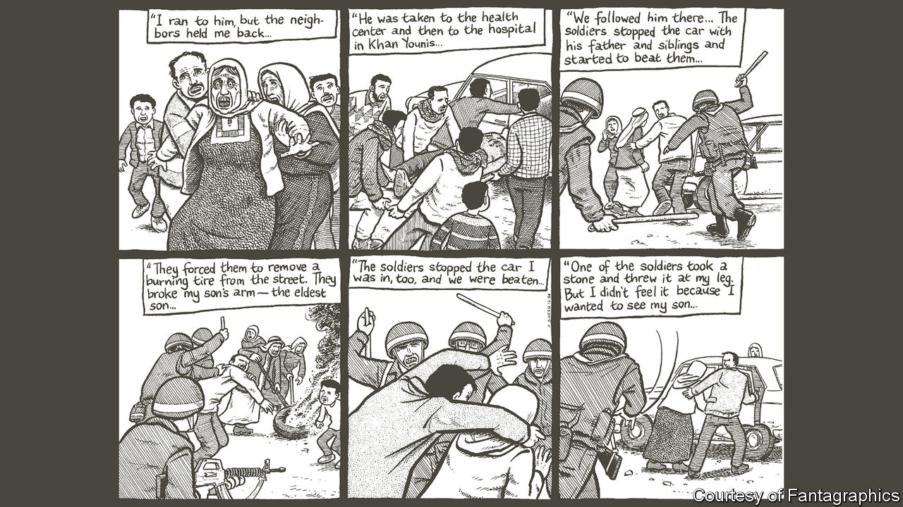

###### Cartoon gloom

# “Palestine”, an old graphic novel, is making a comeback 

##### Interest in Joe Sacco’s graphic novel is the highest it has been in 20 years 

 

> Feb 29th 2024 

In the winter of 1991, around the time of the first intifada, Joe Sacco, then a young cartoonist and journalist, arrived in Gaza with no particular aim except “to see what’s going on”. He suspected that the version of the he saw portrayed in the media was not the full story. For two months he travelled through the West Bank and the Gaza Strip, talking to wounded children, bereaved mothers and broken men. A Palestinian man urged him to write “something about us”. Mr Sacco promised, “I will alert the world to your suffering! Watch your local comic-book store.” 

Readers expect comic books to be fun and fantastical, and they usually are, from the serial adventures of Asterix and Tintin to the heroic exploits of , Superman and Wonder Woman. There may be hardship, but good always triumphs over evil. Even “Maus”, Art Spiegelman’s dark, Pulitzer-prizewinning graphic novel about the Holocaust, ends with the liberation of the camp’s survivors. Mr Sacco’s “Palestine”, a graphic novel that examines the lives of Palestinians under occupation, offers no such comforts. 

When the issues were first published in the 1990s, readers were mostly uninterested. Now, 30 years later, demand is so high that “Palestine” has been out of stock both online and in shops. The publisher, Fantagraphics, says interest surged after October 7th, when Hamas terrorists murdered 1,200 people in Israel. Google searches for the comic book shot up to their highest level since 2004, during the second intifada. As the conflict rages on, the book—a 285-page volume collecting all nine issues—has been rushed back into print in America and 11 other countries. 

“Palestine” is considered a landmark work of , or comics journalism, combining the techniques of eyewitness reporting with the visual storytelling of comics. The form has its roots in coverage of the American civil war, when photography was not advanced enough to capture battles, and newspapers sent illustrators to the scene instead. 

The cartoons are startling and graphic. A Palestinian boy shot by an Israeli settler bleeds to death in his parents’ arms because a curfew imposed by Israeli soldiers prevents them from taking him to hospital. An old woman watches soldiers bulldoze her home. 

As Mr Sacco travelled from refugee camp to refugee camp, families offered him tea and told him their stories. The old cartoons feel startlingly current. In one, Mr Sacco waits at roadblocks, where Israeli soldiers brandish M16s. In hospitals, children show him their injuries and nurses tell how soldiers invaded the operating theatres, interrogating the wounded. 

Again and again the familiar, bespectacled figure of Mr Sacco pops up in his images. His presence reminds readers that this story is being told through a particular lens—the perspective of a bewildered visitor trying to make sense of it all. He does not pretend to have the answers. He just watches, listens and . 

Today Mr Sacco lives in Oregon and still draws cartoons for newspapers and books. He says that “Palestine” remains relevant “because the fundamental features of the Israeli occupation haven’t really changed in 30 years, but they express themselves with a violence I couldn’t have imagined during the first intifada.” 

The story does not draw to any neat conclusion. As an old man in Jenin tells Mr Sacco, the situation “will go on for ever and for ever”. More settlements, more soldiers, more houses demolished and lives uprooted, more abuse and humiliation, more wandering within the narrow confines of the camps, more waiting. “What about the ” Mr Sacco wonders aloud? The old man just laughs: “It was dead before it was born.” ■


