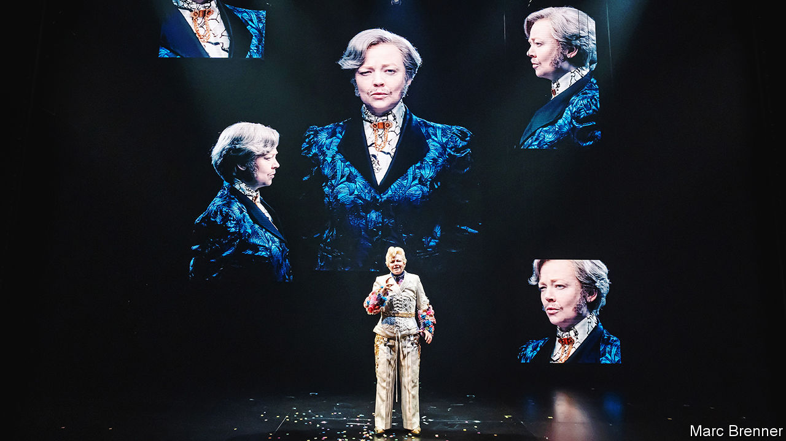

###### Back Story

# “The Picture of Dorian Gray” points to the future of theatre 

##### A triumphant one-woman show relies on Sarah Snook, daring tech and your imagination 

 

> Feb 29th 2024 

At least since 1998, when a critic described Nicole Kidman’s turn in “The Blue Room” as “pure theatrical Viagra”, the appearance of screen stars on the London stage has stirred complex feelings. Casting A-listers—including, recently, Sarah Jessica Parker, Matthew Broderick and Woody Harrelson—is a reliable way to shift tickets. To some, though, it is a cynical shortcut to success; a victory of marketing over art. 

The same goes for the use of screens themselves on stage, to complement the action or relay it in close-up. It suggests plays are “apologising for not being films”, a British critic once grumped. Screens have proliferated nonetheless.

“The Picture of Dorian Gray”, an adaptation of’s novel now at the Theatre Royal Haymarket, is, in a sense, a culmination of both trends. It has only one actor—Sarah Snook, best known as icy Shiv Roy in —and lots of screens. Purists might see it as stagecraft’s capitulation to celebrity and gimmicks, or as a sign of theatre’s desperation to attract younger, tech-addled punters. They would be wrong. The dizzying show is a vision of theatre’s future, and, at the same time, a study in its most basic age-old power.

In Wilde’s story a beautiful youth, Dorian Gray, wishes that a portrait of him could grow old while he remains young. This Faustian bargain is granted. As he descends from romantic betrayal to opium dens to murder, his vices scar the painting but leave his body unblemished. It raises big questions—Is morality a sham? Can you outrun your past?—but in truth the book is as much a compendium of witticisms as a novel. Lord Henry Wotton, a hedonistic toff, delivers most of the one-liners. “It is only shallow people who do not judge by appearances,” he quips, and “the only things one never regrets are one’s mistakes.”

The start of the adaptation, first produced in Australia in 2020, duly has an air of stand-up. Accompanied by a camera team, Ms Snook begins to narrate Wilde’s tale, her image appearing on a large screen suspended above the stage. She switches between Dorian, Lord Henry and other parts by turning to different cameras and swapping costumes and wigs. It is an amusing if simple trick, you think.

But, like instruments in a jazz ensemble, soon more characters, cameras, screens and Snooks join in. The screens relay both live shots of the actor and pre-recorded snippets of her in assorted roles (she plays 26 in all). The taped Snooks interact with the live one and each other in a  of dramatic timing. As Lord Henry she shares a table with five on-screen diners; as Dorian she is chased through a forest by a virtual nemesis.

Rather than being a distraction, the technology underlines Wilde’s themes. He thought the main characters were all refracted versions of himself; the one-woman format hints that they are jostling facets of a fractured personality. And the screens emphasise the link between Dorian’s vanity and the narcissism of the selfie era, in which many people hide a version of themselves offline. Theatre, said the great director Peter Brook, is “a phoenix that has to be constantly brought back to life” with the techniques of the moment. Today’s include photo filters, with which, phone in hand, Ms Snook makes her projected image look youthful or grotesque.

Through a mix of virtuoso tech and Ms Snook’s talent, the play crackles with the electricity and risk of live performance. In form it is unlike anything you are likely to have seen before. But theatregoers may well see other plays like it in the future, with slim casts fleshed out by convincing digital avatars and portable kit (just as some music gigs already feature virtual bands).

Yet in a deeper way “The Picture of Dorian Gray” recalls two other 21st-century productions that were hits in London and New York. In “War Horse”, the horse is a puppet operated by an onstage crew, which by the end seems magically to have come to life. In “”, three actors somehow depict more than 160 years of history without changing clothes. By the finale of “The Picture of Dorian Gray”, the distinction between the live and digital Snooks, artifice and reality, has crumbled.

Like those shows, this one is at bottom about the  to suspend your disbelief and make you see the world anew. In pulling off that ancient alchemy, the key is not the size of the cast, nor the fame of the actors, nor the sophistication of the props and sets. Rather it is theatre’s oldest asset: the faith and imagination of the audience. ■


