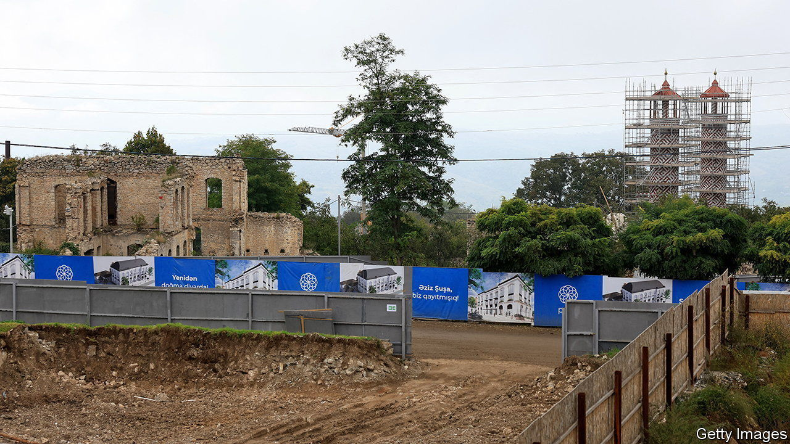

###### After the war

# Azerbaijan is racing to rebuild in recaptured Nagorno-Karabakh 

##### Exiled Azeris are returning 

 

> Feb 29th 2024 

Arif Hajiyev has spent his career working for the municipality of Agdam, his home town in Azerbaijan. For three decades, however, he was unable to set foot there. In the early 1990s, Agdam fell victim to the war in Nagorno-Karabakh, a multi-ethnic region claimed by both Azerbaijan and Armenia. Its Azeri population fled, and the town was looted and landmined. But in November 2020, Azerbaijan won back much of the territory, including Agdam. Now, Mr Hajiyev says, a new era has arrived. “I am more than excited to be moving back,” he says, gazing at the ruins of his former high school.

Agdam is the centrepiece of Azerbaijan’s reconstruction of Nagorno-Karabakh: a huge project to rebuild towns and villages and resettle some 700,000 Azeris who fled the region during a war with Armenia in the early 1990s. An area covering 4,400 square km was largely abandoned and militarised, and by the time Azerbaijan took back control there was barely a house left standing. (In September 2023, 120,000 ethnic Armenians fled a second Azerbaijani offensive in Nagorno-Karabakh; their homes are now abandoned as their Azeri neighbours’ once were.)

President Ilham Aliyev has pledged that 140,000 Azeris will return to the region by 2026. He is earmarking $2.4bn for reconstruction in 2024, more than a tenth of the country’s annual budget. Roads and railways as well as housing need rehabilitation, and the spending spree is bringing rewards for Mr Aliyev’s friends. Allies of Azerbaijan, a bewildering spectrum including Hungary, Israel, Japan, Britain and Iran, have expressed interest in bidding. Turkish firms have been prioritised, in return for Ankara’s decisive military support in Karabakh over the past four years; by the end of 2023, Turkish firms had won $3.4bn in contracts. 

Mr Hajiyev was 34 years old when he left the city. He remained on the municipality’s payroll, and is now involved in the town’s reconstruction. “A lot of people call me to ask when they can come back. Everyone is waiting for the day,” he says.

The official masterplan for the new Agdam shows concentric roads winding around preserved portions of the old ruins, spreading out into zoned municipal, residential and recreational areas. It will cover 2,000 hectares, and include a new stadium for Qarabag FC, the local football team, which has been playing from a borrowed stadium in Baku. Huge new buildings—a high school and residential blocks—already loom over the remains of the old city, and a tourist path has been marked out with multilingual signs. Several villages have already been completed, and families who have returned display photos with Mr Aliyev in their pristine new houses. Most of the area, though, is still a minefield and construction site: Agdam’s renewal is expected to last until 2050.

The Azerbaijan government says that Nagorno-Karabakh’s displaced Armenians can also return, but few are likely to accept; in October, Mr Aliyev was filmed trampling on their flag in their abandoned city. That’s not exactly an incentive. ■


