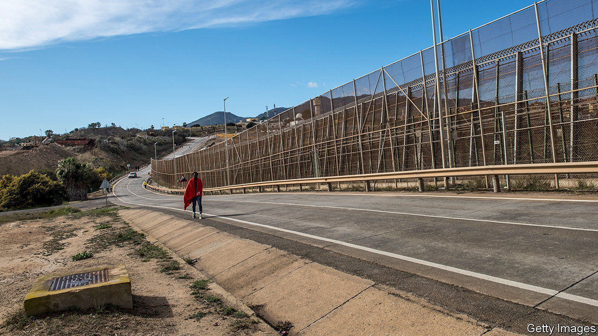
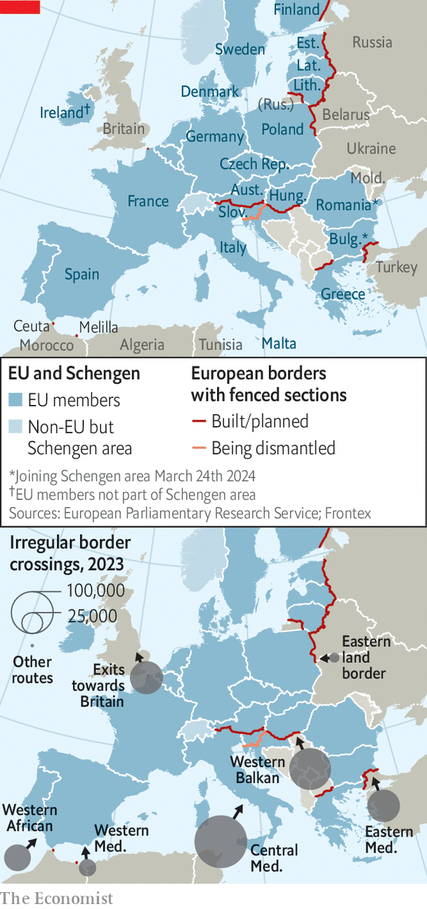

###### Get off the fence

# Europe hopes barbed wire will keep migrants out. It won’t 

##### Politicians feel compelled to respond to voters’ concerns 

 

> Feb 29th 2024 

When Spain first surrounded Ceuta and Melilla, its North African exclaves, in barbed wire in 1993 and 1996, few suspected the practice would catch on. The 1990s were, after all, an optimistic time in Europe, as the Berlin Wall came down. Alas, things have been changing. Between 2014 and 2023, the total length of border fences in the EU rose from 315 to 2,163km. Another 245km will go up this year.

Fences first spiked in popularity during the Syria-driven migrant crisis of 2015-16. Now, with pandemic-era restrictions gone, illegal migration is back in full spate. Frontex, the EU’s external-border agency, registered 380,000 illegal border crossings last year, the highest number since 2016. Europe is turning to fences to stem the tide and confront Russian hostility. Nowhere is that clearer than along its eastern border, where Russia and Belarus have engineered migrant influxes into Poland, Latvia, Lithuania and Finland. Each responded with barbed wire.

The costs are immense. Poland, which decided to build a €353m ($407m) electric fence along its border with Belarus in 2021, kitted out its Russian border with state-of-the art cameras and motion detectors for €80m last year. Finland will shell out €380m to fence off just 200km, or 15%, of its 1,340km-long border with Russia by 2026; maintenance costs are on top of that. 

Fences are pretty poor value for money. For all its high-tech gadgets, Poland’s fortified border failed to prevent a surge in crossings last year. Slovenia took down its fence with Croatia in 2022 after it failed to bring numbers down. Besides, “any kind of physical obstacle in one area…just shifts the movement to other areas,” says Chris Borowski from Frontex. 

 


Europe is hardly being flooded with migrants, either. Unauthorised crossings accounted for just 0.13% of all external crossings in the EU in 2022. Most enter Europe via the Mediterranean, not the Balkans or the eastern land border (see map). Large-scale migration from Russia is “not a very big risk”, admits Colonel Marko Saareks, deputy chief of Finland’s Border and Coastal Guard. “We have to prepare anyway.”

Voter unease has compelled leaders to act, however inefficiently. The EU has toughened its stance on migration over recent years. Funding for Frontex has surged. In December, member countries agreed on a new migration pact, which will make it easier to deport failed asylum-seekers. “There’s a willingness to do whatever is needed in order to keep people at bay,” says Helena Hahn from the European Policy Centre, a think tank. 

Mediterranean countries have long borne the brunt of illegal migration. The new pact may help (it requires countries to accept refugees or pay up) but it raises legal and moral conundrums for the EU. Fences “are the epitome of the failure of migration policies in the 21st century”, argues Sergio Carrera from the Centre for European Policy Studies, a think-tank. Hundreds of migrants have died at Greece’s fortified border with Turkey. Europe is fencing off its responsibilities to migrants and asylum-seekers, says Mr Carrera. ■


