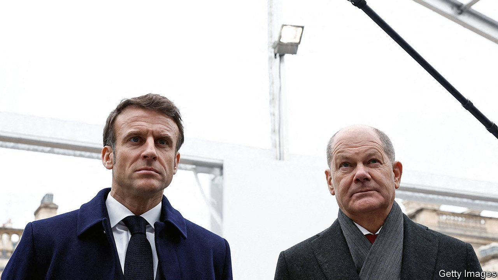
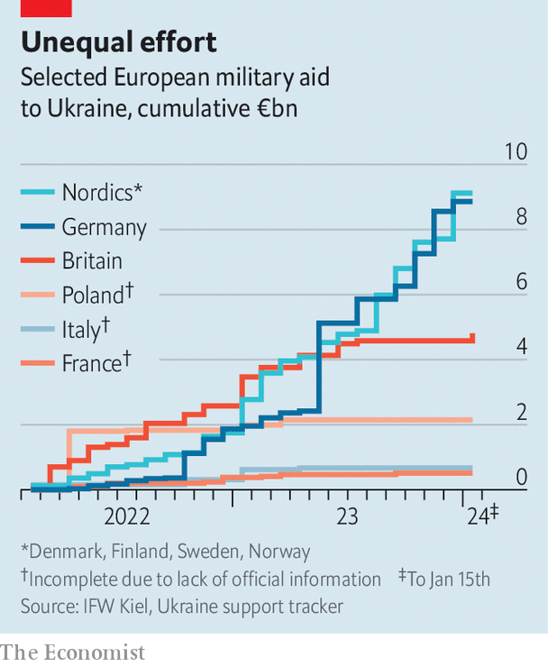

###### Friendly fire

# France and Germany are at loggerheads over military aid to Ukraine 

##### A summit in France made things worse 

 

> Feb 29th 2024 

EMMANUEL MACRON, France’s president, had presumably hoped that a summit in Paris on February 26th would demonstrate European unity behind Ukraine. Instead it seems to have resulted in an unseemly spat with Germany and raised awkward questions over the extent of both countries’ military aid. Mr Macron, who has taken an increasingly hawkish tone on the issue, declared that Russia’s “defeat”—his first unambiguous use of that word—was “indispensable to security and stability in Europe” and promised missiles for “deep strikes” into Russia. But he also criticised those “who say give them just sleeping bags and helmets”—a swipe at Germany’s initial policy—and said he did not rule out the deployment of ground troops to Ukraine (for non-combat tasks, officials later clarified).

 


The backlash was immediate. “It is clear,” tweeted Olaf Scholz, Germany’s chancellor, who had attended the summit in person. “There will be no ground troops from European countries or NATO.” That position was echoed by several other governments. Robert Habeck, Mr Scholz’s deputy, was even sharper. “I’m pleased that France is thinking about how to increase its support for Ukraine,” he said, “but if I could give it a word of advice—supply more weapons.” Mr Habeck’s rebuke reflects mounting criticism among German and other European officials that France has failed to pull its weight in Ukraine, despite Mr Macron’s grandstanding.


According to widely cited figures collected by the Kiel Institute, a think-tank in Germany, France has committed just €1.8bn ($1.94bn) in aid to Ukraine, including €640m of military assistance. The institute puts it in 14th place among allies. On Kiel’s count, its total pledges, military, economic and humanitarian, add up to around 0.1% of GDP, a dismal figure compared with 0.5% for Britain, 0.6% for Germany and a remarkable 3.6% for Estonia.

French officials vehemently dispute these numbers, however. They argue that many French deliveries are secret; that the Kiel tracker looks at pledges rather than actual deliveries; and that France has channelled a lot of its support though the European Peace Facility, an EU fund for Ukraine. Last year Sebastien Lecornu, France’s defence minister, insisted that his country would be in the top five if the latter were included. Mr Macron, eager to dispel the accusation of stinginess, has said that French aid in 2024 will hit €3bn this year, up from €1.7bn in 2022 and €2.1bn in 2023.

Even going by those figures, though, France’s pledged military aid, totalling €6.8bn, is still modest as a proportion of GDP and relative to both Britain (€9.1bn) and Germany (a whopping €17.7bn, albeit stretching to 2027). French deliveries have included highly impactful weapons like CAESAR howitzers and SCALP cruise missiles, according to Rym Momtaz of the International Institute for Strategic Studies, a think-tank, but only in limited quantities. “The amount of kit France has supplied isn’t commensurate with its rank as a military power,” she argues, emphasising its “below par” donation of shells. “France was late to the party.” 

Mr Macron’s increasingly robust stand on Russia—which marks a sharp divergence from his views early on in the war, when he called on allies not to “humiliate” Russia and proposed security “guarantees” for the country—have been welcomed in eastern Europe. “Macron is for real,” says one Baltic diplomat. “Times like these require political leadership, ambition and courage to think out of the box,” wrote Gabrielius Landsbergis, Lithuania’s foreign minister. “The initiative behind the Paris meeting…is well worth considering.” 

The view from Berlin is less charitable. For Germany, the key outcome of the Paris summit was that Mr Macron dropped what was seen as France’s egregious veto on the use of EU funds to buy ammunition from outside the bloc. Yet the post-summit friction also had other causes. Mr Macron’s emphasis on building a missile coalition was seen as an effort to cajole Germany into sending its Taurus cruise missile to Ukraine. Taurus would not only supplement a dwindling stock of British and French missiles, which have been used to devastating effect, but is also thought to be particularly well suited to destroying the Kerch Strait bridge from the Russian mainland to Crimea.

Mr Scholz has long resisted these calls, fearful that sending Taurus would lead to escalation with Russia. That is not just because of concerns over the sensitivity of Crimea or the fact that the missile could theoretically strike Russian cities. It also reflects a conviction—hotly contested by his many critics—that Germany would need to send troops to monitor how the missiles were used. That is not so much for technical reasons as political ones.

“What is being done in the way of…targeting support on the part of the British and the French can’t be done in Germany,” said Mr Scholz on February 26th, referring, obliquely, to the widespread belief that British and French special forces in Ukraine exercise oversight by identifying, vetting and programming targets into Anglo-French missiles. Britain and France can deploy such troops with virtually no political or parliamentary oversight. Germany cannot. Merely hinting at this, however, has been seen by some as an outrageous “outing” of what his allies are up to.

Moreover, some Germans worry that if the issue were to become a matter for the constitutional court, it could act to jeopardise support for wider German aid. “German soldiers”, insisted Mr Scholz, “must at no point and in no place be linked to targets [Taurus] reaches.” In theory, Germany could send the missiles to Britain or France, allowing their personnel to monitor the weapons’ use. In practice that would require a level of trust that, on the evidence of this week, is sorely lacking. ■


