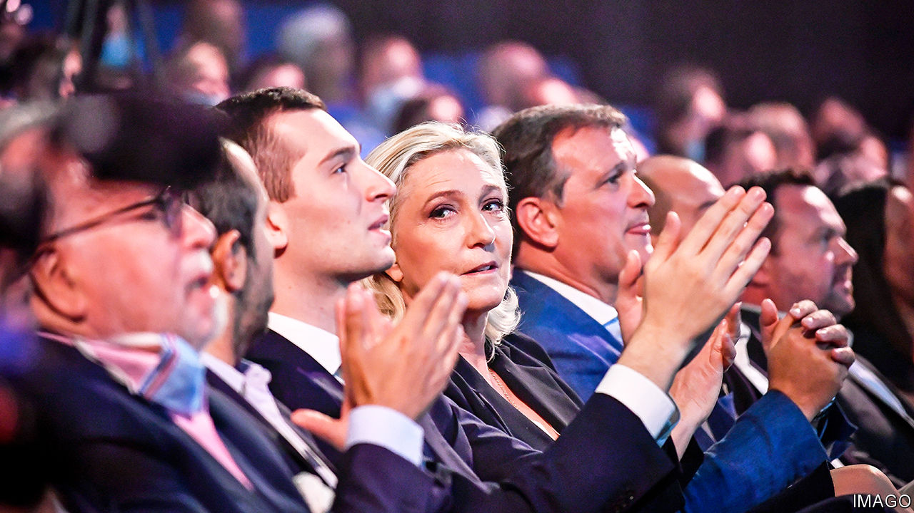

###### France’s National Rally

# How Marine Le Pen is preparing for power 

##### The party has its eyes not on protest but on the presidency 

 

> Feb 25th 2024 

It is an annual ritual in France for politicians to make a new year’s address. Time was that Marine Le Pen, the leader of the  (RN, formerly the National Front), did so from the back room of a boxy building in Nanterre, on the drab outskirts of Paris. In those days the party she took over in 2011 from her father, Jean-Marie, was more about low-budget protest and fringe provocation than taking power. 

This January the job fell to Jordan Bardella, her slick 28-year-old protégé and now RN president, whom she watched from the front row. In a dark suit and tie, he spoke from a grand on the swanky Avenue Hoche in Paris, a step away from the Champs-Elysées. The symbolism was potent. The shift from the capital’s periphery to the heart of elite Paris encapsulates a strategy: the RN is preparing for power.

Ms Le Pen is no stranger to national elections. Since taking the helm at what was then an extreme-right outfit, co-founded in 1972 by a former member of the Waffen SS and nostalgic for French-run Algeria, she has shaped it into a nationalist-populist party. Having stood at three presidential elections, she has made it to the final run-off in two. Each time, she has lost to the current president, Emmanuel Macron. But her final score has jumped: from 34% in 2017 to 41% in 2022. In 2027 Mr Macron will be barred from running for a third consecutive term. Some early polls now suggest—however prematurely—that this time Ms Le Pen could scrape a victory. 

The RN is changing gear. In quiet meetings in the back rooms of Paris, party officials and elected deputies are gathering input on everything from market risk to energy policy. Advisers, says one, are working on a handful of legislative bills that would be ready to go to parliament, and a programme for her first 100 days. A 60-page draft economic policy was handed to Ms Le Pen in February, written by Jean-Philippe Tanguy, a young RN deputy and business-school graduate. Each month a secret group of sympathetic high-level civil servants, many retired but some of them young, meets Ms Le Pen to offer advice. 

Such work is partly about scouting for technocratic talent in a party where this has long been scant. The RN has just recruited a top ex-Euro-official: Fabrice Leggeri, the hard-line former head of Frontex, the EU border-control body. A graduate of the elite École Nationale d’Administration, he has joined the campaign for elections to the European Parliament in June, which Mr Bardella will launch on March 3rd. 

The RN’s outreach is also part of a charm offensive on the Paris establishment. This is not so much an effort to woo support, unlikely to be forthcoming in a city that voted overwhelmingly for Mr Macron. Rather, it is a bid to neutralise influential opinion. In the tight circles of the capital’s elite, the RN hopes to persuade some prominent figures to stop spreading alarm about what the party’s victory might mean. 

Already some doors are opening. Mr Bardella was invited in November to debate with students at HEC, a top business school. Aides are trying, though with difficulty, to set up meetings for him and his boss with CAC 40 business leaders. Late last year Ms Le Pen lunched publicly with a former boss of EDF, the state-owned electricity utility, at an upscale Paris restaurant. 

For a party that portrays itself as the champion of the people, such efforts are necessarily tricky. In 2022 Ms Le Pen railed against the “globalist” Mr Macron, who “enslaves mankind to the logic of economics and accounting”. Yet the RN is also now courting more educated voters. In 2022 only 26% of those with a university degree voted for Ms Le Pen in the second round. 

Today’s watchword is reassurance. On policy, Ms Le Pen has dropped calls for “Frexit”, leaving the EU or the euro, which worried voters, while retaining her core nationalist demands. On style, today’s RN has been purged of its most thuggish elements and antisemitic rhetoric. Ms Le Pen’s 87 fellow deputies sit, besuited, in parliament; two periodically preside over sittings. Having renamed the party, evicted her father and shed its family-values conservatism, Ms Le Pen has installed a new generation of loyalists. The single biggest age group among RN deputies is now the 30- to 39-year-olds. For the first time in 40 years a poll in December showed that a plurality of the French (45%) no longer consider the party a “danger for democracy”. 

How far the RN really has shed its past instincts, however, let alone gained the skills to govern, is another question. Ms Le Pen is certainly not yet a guest at the clubs and debates frequented by the Paris elite. Toxic hangers-on still move in her orbit. She is an admirer of Hungary’s strongman, , and the RN sits in the European Parliament with Germany’s far-right AfD. A Kremlin-linked Russian bank financed some of her previous election campaigns. Even now the RN argues against Ukraine joining either NATO or the EU. 

The difficulty for centrist politicians, though, is that the RN’s normalisation has gone far enough to defang some of their usual tactics against it. Taking the moral high ground, or scaremongering, no longer washes with many voters. Younger ones, who barely recall her father, see Mr Bardella as just another politician; a pinned clip on his TikTok account has a massive 8.5m views. In Italy the relative moderation in office of Giorgia Meloni, the prime minister, whose party has roots in post-war neo-fascism, also weakens the case for panic. “Fear in public opinion is overestimated,” says Dominique Reynié, director of Fondapol, a think-tank. “People think that Le Pen is someone like them.”

Ahead of European Parliament elections in June, Mr Macron has installed a counterpoint to Mr Bardella as prime minister: the 34-year-old Gabriel Attal. Six years apart, each uncommonly poised in debates, the pair have faced each other in television studios before. Already, Mr Attal is far more popular than his boss, with a 53% approval rating, 17 points higher than Mr Macron’s. But his arrival has not yet dented the crushing ten-point lead that the RN enjoys over Mr Macron’s Renaissance grouping in polls for the Euro-election.

Most awkwardly, Mr Macron’s attempt to follow the electorate to the right on immigration has ended up helping the RN. In a tactical ambush the RN unexpectedly backed his recent immigration bill, embarrassing the government and allowing Ms Le Pen to claim an “ideological victory”.

Finding a way to resist nationalist-populism challenges all Europe’s centrists. Rational argument is a flimsy tool against its simplistic certitudes. Back in 2017, during a presidential debate, Mr Macron famously exposed Ms Le Pen as unfit to govern, when she confused two big French firms and failed to explain her unfathomable currency policy. The more her party does its homework, the harder this argument will be to make. “Our adversaries underestimate the RN,” says the party’s Mr Tanguy. “They don’t realise that we are ready.” ■


