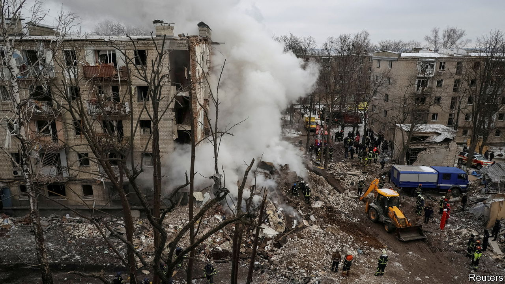

###### Within range

# Kharkiv is struggling under Russian rocket attacks 

##### A border region liberated by Ukraine’s army faces a new onslaught 

 

> Feb 26th 2024 

“THAT IS MY blood,” says Natalya Popova, showing a video she took on January 2nd in her flat in Kharkiv. When a missile hit nearby she grabbed her six-year-old son and put him in the bathtub, covering him in blankets for protection. A second explosion peppered her with shards of glass. They survived, but Ms Popova is sending her son out of the city. A renewed wave of attacks since December has shaken the confidence of this north-eastern Ukrainian city and region, leaving its people angry and dejected. 

Before Vladimir Putin’s invasion in February 2022, almost everyone in Kharkiv dismissed the idea that Russia would attack this predominantly Russian-speaking city, 40km south of the border. “Would your brother attack you? No, he would not!” yelled an angry woman your correspondent spoke to in a market at the time. Ten days later Russian troops entered Kharkiv, only to be  by Ukrainian forces. They then spent six months shelling it from the outskirts. 


Within weeks of the attack the city’s population had shrunk from over 1m to just 300,000, according to Oleh Syniehubov, the governor of Kharkiv province. When Ukraine’s army forced the Russians out in September 2022, hundreds of thousands of Ukrainians returned. Now Mr Syniehubov says that there are 2.3m people in Kharkiv province, compared with 2.7m two years ago. Shops and businesses began to reopen last summer, and people in Kharkiv shared the country’s widespread belief that a Ukrainian victory was within reach. 

 


That optimism is long gone. Some who returned have begun to leave again, though so far the numbers are small. “Compared with autumn, business is down by 50%,” says Lilia Muntian, co-owner of Pakufuda, a board game-themed café. She says some people have left because their companies have relocated to safer parts of the country. Anna, a teacher, says her 12-year-old son is panicked by the missiles. She plans to send him to family hundreds of kilometres away on Ukraine’s border with Romania. 

In the Nemyshliansky district of Kharkiv, teddy bears and toys form a memorial outside the remains of a house where three children died after a Russian drone strike on February 9th. The drones hit a nearby fuel depot, unleashing a torrent of flaming petrol that killed seven people in total. Since December 30th some 300 city buildings have been damaged or destroyed, and about 200 people injured. At least 20 have died. “It is not normal to live like this,” says Mr Syniehubov, an air-raid siren wailing in the background. People have grown used to war, but it is taking its toll. In the Victory metro station, a passageway has been converted into subterranean classrooms. 

Unlike Kyiv, Odessa and other big cities, Kharkiv is visibly battered by the war. The windows of homes and shops remain boarded up. Some rural parts of the province are barely hanging on. In Mala Komyshuvakha, 140km south-east of Kharkiv, seven villagers stand awaiting visitors from the International Rescue Committee, an aid organisation, to register them for a modest cash grant. Only 15 residents remain of the 80 who lived here before the invasion. Every house was destroyed or damaged during the Russian occupation. Sixteen months later there is still no electricity, gas or mobile signal. The stoical villagers make do with occasional aid and pensions, whatever produce they can grow and the chickens, rabbits, geese and goats they keep. For heating, they salvage logs once used to fortify Russian trenches. ■


