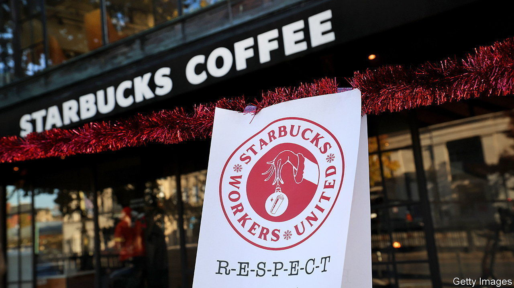

###### Stakeholders at the gate

# Activist investing is no longer the preserve of hedge-fund sharks 

##### ExxonMobil and Starbucks are victims of the latest trend 

 

> Feb 29th 2024 

Trade unions rarely look to corporate raiders for inspiration. Yet the Strategic Organising Centre (SOC), a coalition of North American workers groups, is mounting the sort of campaign normally associated with hedge funds. The group’s target is Starbucks, a coffee-shop chain with a market capitalisation of $107bn. Whereas traditional activist investors take a chunk of a company and pressure its management to change strategy, hoping to gain from a bump in the share price, the SOC owns a mere $16,000-worth of Starbucks shares, and ultimately wants to improve the lot of the firm’s workers.

Its pitch is that the interests of shareholders and workers are, in fact, aligned. Starbucks is wasting money and alienating customers with its approach to “human-capital management”, the group argues. Productivity would be higher, and spending on consultants lower, should Starbucks follow its workplace advice. Therefore it wants three of its candidates appointed to Starbucks’s 11-person board. The hot-drinks behemoth is less convinced. The board is already stocked with “world-class business leaders”, says a representative, who adds that in the last fiscal year a fifth of profits went towards wage increases, training and new equipment.

Five years after the Business Roundtable, a 200-strong group of chief executives at some of America’s biggest companies, embraced stakeholder capitalism, the mood is now rather different. Most bosses would prefer to leave politics to the politicians and avoid the boycotts and bad publicity that come with wading into culture wars. They are content to focus on shareholder returns, rather than trying to improve society at large. But although chief executives have mostly abandoned their flirtation with stakeholder capitalism, they are still living with its consequences.

This year’s proxy season, which gets under way in the spring, will probably surpass even 2023’s for proposals of non-binding resolutions. That year marked a record for environmental, social and governance (ESG) motions. At the large and small American companies that comprise the Russell 3000 index, 513 of the 836 proposals put to shareholders focused on such questions, according to the Conference Board, a think-tank. The increase reflected a legal shift. In 2021 the Securities and Exchange Commission (SEC), a regulator, said that it would no longer allow companies to exclude measures as irrelevant if they focused on a “significant social policy”.

Conservatives are also mobilising. Last year’s proxy season included 92 anti-ESG proposals, up from 54 the year before. On February 28th at the annual meeting of Apple, a tech giant, shareholders were asked to consider five such proposals, including one asking the firm to report on the risks of failing to consider “viewpoints” in its equal-opportunities policies. The supporting statement says there is evidence that conservatives may be discriminated against in Silicon Valley. Another two, submitted by conservative pressure groups, asked the company to report on how it arbitrates between government and consumer interests, in particular in its dealings with China. For their part, liberals offered only one resolution: asking Apple to change how it reports on racial pay gaps. The company recommended that shareholders reject every one, which they did. 

Politics by other means

Will other campaigns find more success? In 2023 the average environmental proposal received the support of just a fifth of shareholders, down from a third the year before. Shareholders are being more disciplined, says Lindsey Stewart of Morningstar, a research outfit, only backing climate-change resolutions that are focused on the emissions over which companies have direct control or that they will have to disclose to satisfy regulators, rather than those in their supply chains. Financiers have realised that it is not their job to set energy or industrial policy, he explains. Meanwhile, anti-ESG proposals fare even worse: on average they receive the support of only 5% of shareholders. 

Although such campaigns are rarely successful, they do matter. ExxonMobil, an oil supermajor, is taking the unusual step of suing its own shareholders who have put forward green proposals. Arjuna Capital, a hedge fund, and Follow This, a campaign group, used a stake of less than $4,000 to advance a non-binding proposal to accelerate greenhouse-gas reductions with targets and timelines. The proposal has been withdrawn, but Exxon is still pursuing the case. It says the underlying issue with the SEC’s approach is still unresolved: clarity is needed about proxy-voting rules that “are increasingly being infringed by activists masquerading as shareholders”. Many companies quietly agree.

And as the Starbucks case suggests, crusades are becoming increasingly ambitious. More shareholder-activist campaigns began in 2023 than ever before, according to Lazard, an investment bank. Smaller groups, including the SOC, have been helped by rules known as “universal proxy”, which were introduced in 2022 by the SEC and mean that both a company’s and its dissident shareholders’ nominees to the board of directors must be on the same ballot. Instead of shareholders choosing one slate or the other, they can now mix and match with outsiders and insiders. The SOC has spent about $3m on its fight. The result will indicate whether unions can enlist Institutional Shareholder Services and Glass Lewis, which advise institutional investors, to their cause.

Other small shareholders are pursuing similar strategies. In Europe Bluebell Capital, a tiny hedge fund, has begun a battle with BP, another oil supermajor. The fund argues that BP should quit the offshore-wind business, which it says is destroying value for shareholders. It would prefer BP to increase oil and gas production, as well as to return money to shareholders, who could then invest in better green options, says Giuseppe Bivona, a partner at Bluebell, defending the fund’s environmental credentials. “Contrary to probable superficial appearances, we believe BP is pursuing an ‘anti-woke’ strategy,” the fund’s letter to shareholders argues. 

Dissident investors do not need to win board seats to achieve some sort of victory. After presenting its latest set of results to shareholders, BP increased the pace of buybacks to placate investors who are cool on its green-energy strategy. Meanwhile, the SOC hopes that Starbucks’ defence against its campaign might include concessions. Traditional activist investors urge companies to break up, divest assets or return cash to shareholders. Even without campaigns being launched, boardrooms have come to do these things so as to avoid attracting the attention of corporate raiders in the first place. A new generation of corporate raiders, taking advantage of cuddly capitalism, will hope their campaigns have a similar impact. ■


