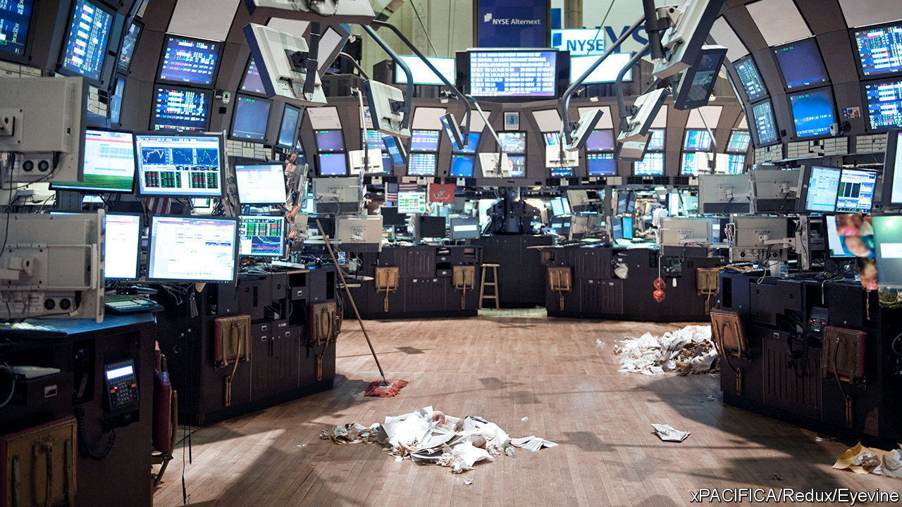

###### Too efficient

# Are passive funds to blame for market mania? 

##### They have killed off many of those willing to bet on a downturn 

 

> Feb 29th 2024 

The year is 2034. America’s “magnificent seven” firms make up almost the entirety of the country’s stockmarket. For Jensen Huang, the boss of Nvidia, another knockout quarterly profit means another dizzy proclamation of a “tipping point” in artificial intelligence. Nobody is listening. The long march of passive investing has put the last stockpickers and stock-watchers out of a job. Index mutual and exchange-traded funds (ETFs)—which buy a bunch of stocks rather than guessing which ones will perform best—dominate markets completely. Capitalism’s big questions are hashed out in private between a few tech bosses and asset managers.

In reality, the dystopia will probably be avoided: markets would cease to function after the last opinionated investor turned out the lights. However, that does not stop academics, fund managers and regulators from worrying about unthinking money, especially in times of market mania. After the dotcom bubble burst in 2000 Jean-Claude Trichet, a French central banker, included passive investment in his list of reasons why asset prices might detach from their economic fundamentals. Index funds, he argued, were capable of “creating rather than measuring performance”. America’s red-hot markets have brought similar arguments back to the fore. Some analysts are pointing fingers at passive investing for inflating the value of stocks. Others are predicting its decline.

 


Such critics may have a point, even if some are prone to exaggeration. It seems likely there is a connection between the concentration of value in America’s stockmarket and its increasingly passive ownership. The five biggest companies in the S&amp;P 500 now make up a quarter of the index. On this measure, markets have not been as concentrated since the “nifty fifty” bubble of the early 1970s. Last year the size of passive funds overtook active ones for the first time (see chart). The largest single ETF tracking the S&amp;P 500 index has amassed assets of over $500bn. Even these enormous figures belie the true number of passive dollars, not least owing to “closet indexing”, where ostensibly active managers align their investments with an index.

Index funds trace their origins to the idea, which emerged during the 1960s, that markets are efficient. Since information is instantaneously “priced in”, it is hard for stockpickers to compensate for higher fees by consistently beating the market. Many academics have attempted to untangle the effects of more passive buyers on prices. One recent paper by Hao Jiang, Dimitri Vayanos and Lu Zheng, a trio of finance professors, estimates that due to passive investing the returns on America’s largest stocks were 30 percentage points higher than the market between 1996 and 2020.

The clearest casualty of passive funds has been active managers. According to research from GMO, a fund-management firm, an active manager investing equally across 20 stocks in the S&amp;P 500 index, and making the right call most of the time, would have had only a 7% chance of beating the index last year. Little wonder that investors are directing their cash elsewhere. During the past decade the number of active funds focused on large American companies has declined by 40%. According to Bank of America, since 1990 the average number of analysts covering firms in the S&amp;P 500 index has dropped by 15%. Their decline means fewer value-focused soldiers guarding market fundamentals. 

Some now think that this trend might have run its course. Students embarking on a career in value investing will consult “Security Analysis”, a stockpickers bible written by Benjamin Graham and David Dodd, two finance academics, and first published in 1934. In a recently updated preface by Seth Klarman, a hedge-fund manager, they will find hopeful claims that the rising share of passive money could increase the rewards yielded by poring over firms’ balance-sheets.

Fees charged by active managers have declined significantly; perhaps election-year volatility will even help some outperform markets. A few might gather the courage to bet on market falls. If they are right, their winnings will be all the bigger for their docile competition. But for the time being, at least, passive investors have the upper hand. And unless the concentration of America’s stockmarket decreases, it seems unlikely that the fortunes of active managers will truly reverse. ■


