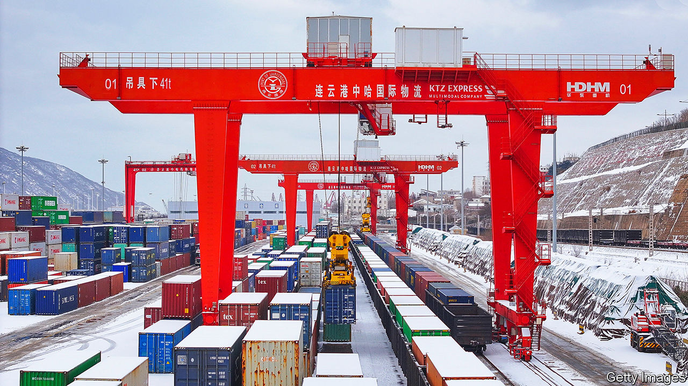
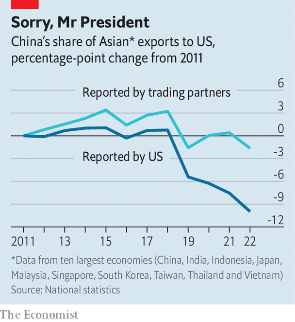

###### Still coupled

# How Trump and Biden have failed to cut ties with China 

##### It is hard to overcome economic incentives 

 

> Feb 27th 2024 

Donald Trump and Joe Biden do not agree on much, but they are of a similar mind when it comes to America’s trade relations with China. They believe that the world’s largest economy is simply too reliant on its second-largest. Thus American officials travel the world touting the benefits of “friendshoring”—or shifting production out of China and into less risky markets. Business leaders make positive noises, and are sincerely worried by China’s weak economic growth, not to mention its volatile politics. The number of comments in earnings calls referring to “reshoring” has exploded.

Yet how much of this is anything more than talk? Last year  that lots of the supposed decoupling between America and China is in fact illusory. Look closer, we wrote, and the two countries’ economic relationship is holding strong, even if this fact is masked by tricks on both sides. Since then a growing body of evidence confirms, and strengthens, our original findings. The economies of America and China are not coming apart. Indeed, some changes to supply chains may be binding the two countries even closer together. 

Of TikTok and solar panels

A complete picture of Chinese-American trade would cover trade in services, including America’s use of Chinese apps and China’s love of American films. But these flows are difficult to track, meaning that economists have focused their attention on trade in goods, which customs officials measure reasonably accurately. Here, the headline figures will cheer Messrs Biden and Trump. Last year Mexico overtook China as America’s largest source of imports. Since 2017 the share of America’s imports coming from China has fallen by a third to around 14%, according to American figures. A chunk of that decline came after Mr Trump implemented high tariffs in 2018. Another chunk reflects growing worries about China’s territorial ambitions: if China invades Taiwan, many Asian supply chains will become unworkable. 

 


The headline figures do not tell the whole story, however. To understand why, start with Mr Trump’s tariffs, which Mr Biden has largely kept in place. Before their introduction in 2018, American statistics suggested that America received many more imports from China than did Chinese statistics. Now the opposite is true. China reports that its exports to America rose by $30bn between 2020 and 2023, whereas America says its Chinese imports fell by $100bn. If China’s data are correct, the country’s share of American imports has still declined, but by much less. 

What accounts for the gap between the measures? Adam Wolfe of Absolute Strategy Research, an advisory firm, suggests that the switch reflects the fact that American importers have an incentive to underreport how much they are buying from China in categories covered by tariffs. Mr Wolfe estimates that, as a consequence, America now understates its imports from China by 20-25%. At the same time, in recent years the Chinese government has cut taxes on exporters, reducing the incentive for domestic businesses to undercount goods leaving the country.

Other data provide additional reason for scepticism about decoupling. “Input-output” tables, as published by the Asian Development Bank, show the share of a country’s economic activity that can be traced back to others. Examining 35 industries, we calculate that in 2017 the Chinese private sector contributed on average 0.41% of American firms’ inputs. That may not sound like much, but it beat the 0.38% that came from Germany and the 0.24% from Japan. By 2022 China’s share had more than doubled to 1.06%, a larger proportional increase than for either Germany or Japan. It is hard to know exactly what is behind this trend. America’s attempts to build clean-energy infrastructure could be one factor, making imports of Chinese electrical equipment much more important. American service-sector firms also appear to be increasingly reliant upon intellectual property owned in China. Whatever the cause, the figures are hard to square with supposed decoupling.

Developments on the Chinese side also push against decoupling. China’s leaders have no intention of relinquishing their country’s role in global supply chains, even as its biggest trading partner is half-heartedly trying to cut it off. In December the Central Economic Work Conference, China’s agenda-setting economic council, made expanding trade in intermediate products (those used to make finished goods) a priority. State banks are redirecting credit from property to manufacturing, raising the prospect of a glut of Chinese exports. And many of the new titans of Chinese industry, like Contemporary Amperex Technology, a battery firm; BOE Technology Group, a producer of organic light-emitting-diode displays; and LONGi Green Energy Technology, which makes components for solar panels, are well placed to benefit from this strategy.

Green with envy

Indeed, the growth of these sorts of companies is already having an impact. We estimate that since 2019 China’s global exports of intermediate goods have risen by 32%, compared with a rise in other sorts of exports, such as finished goods, of only 2%. The surge is driven by exports to countries such as India and Vietnam, which are two of the American government’s preferred trading partners. American trade with these countries is, in turn, increasing—from 4.1% of its goods imports in 2017 to 6.4% today. In combination, these trends imply that the two countries often act as something akin to packaging hubs for goods made with Chinese inputs that are destined for America’s shores.

Across the world, many such arrangements are emerging. Take the case of India, where the government is trying to build up its manufacturing base. Following the introduction of subsidies, mobile-phone exports have soared, suggesting that India is eating China’s lunch. However, in a recent paper Rahul Chauhan, Rohit Lamba and Raghuram Rajan, three economists, point out that the import of mobile-phone parts, such as batteries, displays and semiconductors, has also jumped. India appears to be more of a mobile-phone go-between than it does a smartphone powerhouse. 

 


Vietnam’s trade with America is booming. But its production remains deeply intertwined with Chinese supply chains, meaning that much of the increase may be accounted for by products with little Vietnamese content. In the most extreme cases, Vietnamese exports are essentially rerouted from China, as America’s Department of Commerce occasionally gripes. The correlation between Vietnam’s exports to America and its imports from China is now significantly higher than it was before Mr Trump’s tariffs were put in place. This suggests that that the South-East Asian manufacturing high-flyer increasingly plays a role as a conduit, matching Chinese production to American demand. 

In Mexico the situation is a little more complicated. Standards established by the United States-Mexico-Canada Agreement require a higher “regional-value content”, meaning that exports are scrutinised to ensure production was conducted in North America. In some industries where Mexican exports to America are booming, such as the production of cars, the growth is difficult to attribute to decoupling, since China has never exported large quantities of vehicles and parts to America: in 2018 it was the source of just 6% of American imports of such goods. All the same, Mexico’s imports of Chinese industrial supplies have surged, rising by about 40% since 2019. Even in America’s backyard, decoupling is not going to plan.

The overall picture is therefore clear: Chinese supply chains may be less visible, but they remain extremely important to the American economy. Will they retain their pivotal role?  on all Chinese products should he become president in November. Such levies may be enough to encourage some companies to move out of China for good. Aggression from Xi Jinping—whether in Taiwan or elsewhere—could have a similar impact. Over decades, some countries that currently act as a final step in production lines may develop more impressive industrial capabilities, and challenge China’s position. 

In the absence of dramatic shifts in American or Chinese policy, do not expect much to change any time soon. Many countries are more than happy to play both sides—receiving Chinese investment and intermediate goods, and exporting finished products to America. Economic efficiency, provided by China’s huge scale and manufacturing expertise, is a powerful force in favour of the status quo. Decoupling may be strong rhetoric, but that is not quite the same thing. ■


