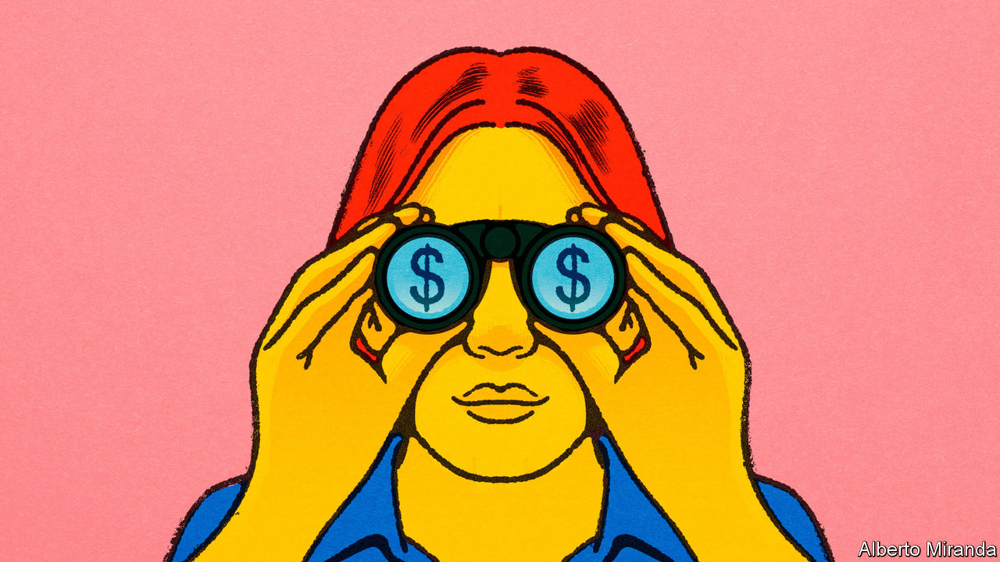
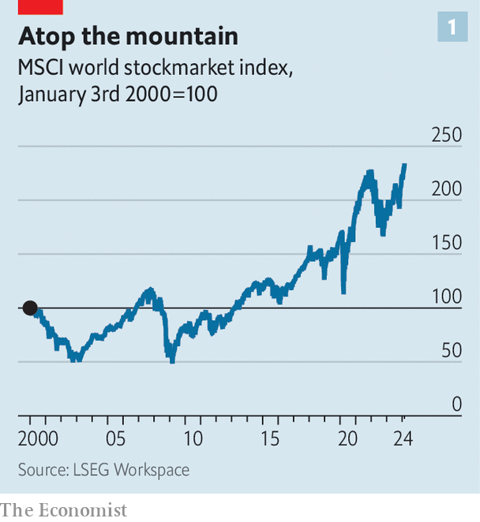
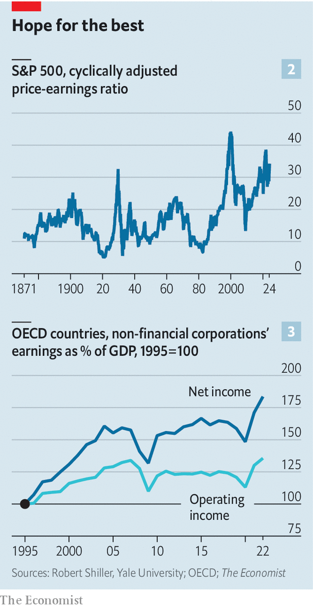
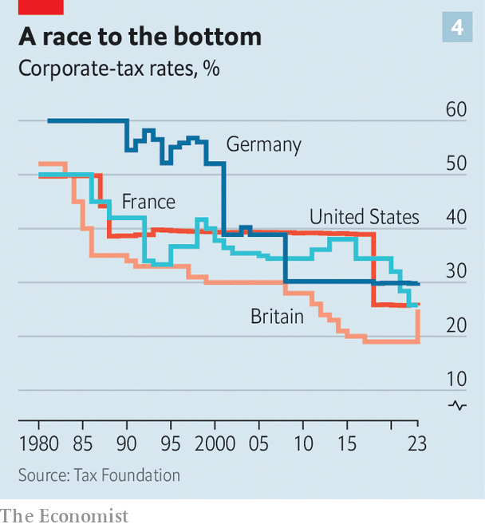

###### Fly up to the sky

# Stockmarkets are booming. But the good times are unlikely to last 

##### Although AI is propelling valuations, there are deeper forces at work 

 

> Feb 25th 2024 

Everywhere you look, stockmarkets are breaking records. American equities, as measured by the S&amp;P 500 index, hit their first all-time high in more than two years in January, surged above 5,000 points in February and roared well above that level on February 22nd when Nvidia, a maker of hardware essential for artificial intelligence (AI), released spectacular results. The same day, Europe’s STOXX 600 set its own record. Even before Nvidia’s results had been announced, Japan’s Nikkei 225 had surpassed its previous best, set in 1989. Little surprise, then, that a widely watched global stockmarket index recently hit an all-time high, too (see chart 1). 

 


This is quite a turnaround. Stocks slumped in 2022, when faced with fast-rising interest rates, and wobbled last March, during a banking panic. Now, though, both episodes look like brief interruptions in equities’ long march higher. Despite middling economic growth and the covid-19 pandemic, stockmarkets have offered annual returns, after inflation, of more than 8% a year since 2010, including dividends (cash payments to shareholders, funded by company profits) and capital gains (when the price of a share increases). These returns have been better than those produced by bonds and housing. Indeed, they have been better than those produced by just about any other asset class.

If the boom has a home, it is America. A hundred dollars invested in the S&amp;P 500 on January 1st 2010 is now worth $600 (or $430 at 2010’s prices). However you measure them, American returns have outclassed those elsewhere. Almost 60% of Americans now report owning stocks, the most since reliable data began to be collected in the late 1980s. Many of them, as well as many professional investors, have a question. Is the stockmarket surge sustainable—or the prelude to a correction?

For as long as stockmarkets have existed there have been those predicting an imminent crash. But today, in addition to the usual doomsaying, a chorus of academics and market researchers argues that it will be tough for American firms to deliver the long-term growth required to reproduce extraordinary recent stockmarket returns. Michael Smolyansky of the Federal Reserve has written about the “end of an era”, and warned of “significantly lower profit growth and stock returns in the future”. Goldman Sachs, a bank, has suggested the “tailwinds of the last 30 years are unlikely to provide much boost in the coming years.” Jordan Brooks of AQR Capital Management, a quantitative hedge fund, has concluded that “a repeat of the past decade’s equity market performance would require a heroic set of assumptions.” 

 


That is, in part, because valuations are already at eye-popping levels. The most closely followed measure of them was devised by Robert Shiller of Yale University. It compares prices with inflation-adjusted earnings over the previous decade—a long enough period to smooth out the economic cycle. The resulting cyclically adjusted price-to-earnings ratio, or CAPE, has never been higher than 44.2, a record reached in 1999, during the dotcom bubble. The previous peak was in 1929, when the CAPE hit 31.5. It now stands at 34.3 (see chart 2). 

Rarely have corporate profits been valued so highly. And the outlook for the profits themselves is also challenging. To understand why, consider the fundamental sources of their long-term growth. We have employed Mr Smolyansky’s methodology to examine national-accounts data for American corporations. Between 1962 and 1989 net profits increased in real terms by 2% a year. After that, profits accelerated. Between 1989 and 2019 they increased by more than 4% a year. We find similar trends across the OECD, a club of mostly rich countries. As a share of GDP, corporate profits were steady from the 1970s to the 1990s, then doubled (see chart 3). 

Market of mirrors

Yet much of this strong performance is, in a sense, a mirage. Politicians have reduced the tax burden facing corporations (see chart 4). From 1989 to 2019 the effective corporation-tax rate on American firms dropped by three-fifths. Since companies were giving less money to the state, corporate profits rose, leaving them with more money to pass on to shareholders. Meanwhile, over the same period borrowing became cheaper. From 1989 until 2019 the average interest rate facing American corporations fell by two-thirds. 

 


Mirroring Mr Smolyansky, we find that in America the difference in profit growth between the 1962-1989 period and the 1989-2019 period is “entirely due to the decline in interest and corporate-tax rates”. Extending this analysis to the rich world as a whole, we find similar trends. The surge in net profits is really an artefact of lower taxes and interest bills. Measures of underlying profits have grown less impressively. 

Now companies face a serious problem. The decades-long slide in interest rates has reversed. Risk-free interest rates across the rich world are about twice as high as they were in 2019. There is no guarantee that they will fall back to those lows—let alone decline fairly steadily, as they tended to in the decades before the pandemic.

As for taxes, the political winds have changed. True, Donald Trump may see fit to cut America’s corporation-tax rate if he wins in November. But our analysis of 142 countries finds that in 2022 and 2023 the median statutory corporate-tax rate rose for the first time in decades. For instance, in 2023 Britain increased its main rate of corporation tax from 19% to 25%. Governments have also established a global minimum effective corporate-tax rate of 15% on large multinational enterprises. Once it has bedded in, such companies will probably pay between 6.5% and 8.1% more tax, leaving a smaller pool of net profits. 

What needs to happen, then, for American stocks to keep offering exceptional returns? One possibility is that investors stretch valuations even more. In a world where interest and tax bills remain constant for the next decade while real earnings grow at 6% a year—an optimistic scenario—America’s CAPE would need to rise to 51 to reproduce the overall returns seen between 2013 and 2023. That would be higher than it has ever gone before. 

Now make things grimmer and assume that valuations revert towards their mean. The CAPE drifts towards 27, near the average since the end of the dotcom bubble. Assume, too, that interest and tax bills rise. Rather than clocking in at 25% of earnings, they drift up to 35%, or around the level in the first half of the 2010s. In this more realistic world, to generate even half the returns equity investors enjoyed since 2010, real earnings would have to grow at 9% a year. Only twice in the post-war period has America achieved this sort of growth, according to Mr Brooks, and in both cases the economy was rebounding from busts—once from the dotcom bubble and once from the global financial crisis of 2007-09.

Many investors hope ai will ride to the rescue. Surveys of bosses suggest great enthusiasm for tools that rely on the technology. Some firms are already adopting them, and claim they are producing transformative productivity gains. If deployed more widely, the tools may allow companies to cut costs and produce more value, juicing economic growth and corporate profits. 

Play the fool

Needless to say, this is a heavy burden for a technology that is still nascent. Moreover, technological developments are far from the only trend that will affect business in the coming years. Companies face an uncertain geopolitical climate, with global trade flat or declining depending on the measure. In America both parties are sceptical of big business. The battle against inflation is also not yet won: interest rates may not fall as far or as fast as investors expect. In recent decades you would have been foolish to bet against stockmarkets—and timing a downturn is almost impossible. But the corporate world is about to face an almighty test. ■


