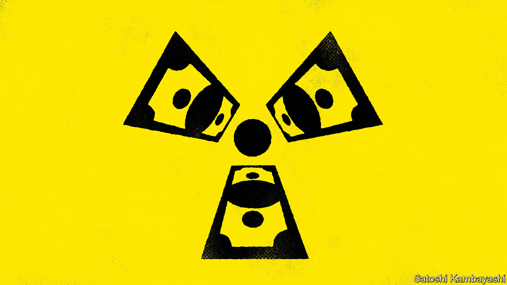

###### Buttonwood

# Uranium prices are soaring. Investors should be careful 

##### The metal has a history of meltdowns 

 

> Feb 29th 2024 

It is, by now, a familiar story. A metal previously only traded in a sleepy corner of commodity markets becomes vital for the energy transition. Constrained supply and geopolitical jockeying meet forecasts for ever-rising demand. Prices surge as investors foresee a crunch. The only wrinkle in the story is that this time the metal is not used in electric vehicles or solar panels; it is used in the decades-old technology of nuclear reactors. Uranium prices are blowing up. 

Hoarding uranium oxide—which, once processed and enriched, is the main fuel for nuclear bombs and reactors—might seem like a strategy more suitable for supervillains than investors. But speculators now have a number of ways to gain exposure. Stockmarket darlings include Yellow Cake, a firm that buys and stores the stuff, whose share price is up by 160% over the past five years, and Sprott Physical Uranium Trust, a fund that does the same and has enjoyed returns of 119% since its launch in 2021. Hedge funds have got in on the action, too, reportedly stockpiling the metal and buying options on uranium from banks. 

According to UXC, a consultancy, prices on the spot market have more than tripled from $30 a pound in January 2021 to a recent peak of over $100, the highest in 16 years. An initial rise was spurred by speculation that Western governments would impose sanctions on Rosatam, a Russian firm. A coup in Niger in July prompted another rise. Then in September Kazatomprom, the world’s biggest supplier, warned that a shortage of sulphuric acid would reduce production. 

At the same time, Western countries are trying to build their own supply chains, since Rosatom currently has more than half the world’s enrichment capacity. In December America, Britain, France and Japan together committed $4.2bn to build facilities to separate uranium-235 isotopes, the only naturally occurring material that can undergo fission, from the more common uranium-238. 

The world needs reliable low-carbon electricity and nuclear power is one of the few options available. Governments have announced plans to expand capacity: Sweden has pledged another two reactors by 2035 and the equivalent of ten more by 2045; last year Japan restarted three that had been mothballed; America recently connected its first new reactor in eight years. All of this is small-bore compared with China, which plans to build another 150 reactors over the next decade. Little wonder that investors are pouring in. 

Yet there are reasons for caution, which start with the supply crunch. Although Niger’s coup was dramatic, the country is only the seventh-largest uranium supplier and it is not clear that there will be a permanent reduction in output. Moreover, many governments have stockpiles, often acquired for defence purposes, which can be released for civilian use. Investors can only guess how much policymakers will be willing to let out. And energy firms have stockpiles of their own, which are often sufficient to keep them going for a few years.

Then consider demand. Nuclear’s history is one of false starts: it has never delivered the too-cheap-to-meter power once promised. During oil shocks in the 1970s uranium prices rose more than sixfold, reaching a peak of $44 in 1979, equivalent to $198 today. Owing to subsequent falls in oil prices, uranium prices had halved by 1981. Later, in the 2000s, a bubble grew. Prices jumped from $10 in 2003 to $136 in 2007 as investors forecast a nuclear renaissance thanks to “peak oil”, a supply crunch and dwindling Russian stockpiles. Things went wrong during the global financial crisis of 2007-09; Japan’s Fukushima accident in 2011 appeared to be the final nail in the coffin.

For a happy ending this time, nuclear power must finally come good. Demand—from energy firms, not just speculators—must rise, which will require someone to pay nuclear’s colossal upfront costs or make the power source cheaper. Both are plausible: net-zero targets might mean governments are willing to spend big; a number of startups are working on small modular reactors, which would lower construction costs if successful. China, which has the most ambitious plans to build capacity, has so far managed to contain costs. 

But return to the example of other metals. When prices surge, more supply is almost always found and customers discover cheaper alternatives. That is what happened with cobalt, lithium and nickel. High prices are the solution to high prices, goes the saying in commodity markets. How confident can investors really be that uranium is different? ■


