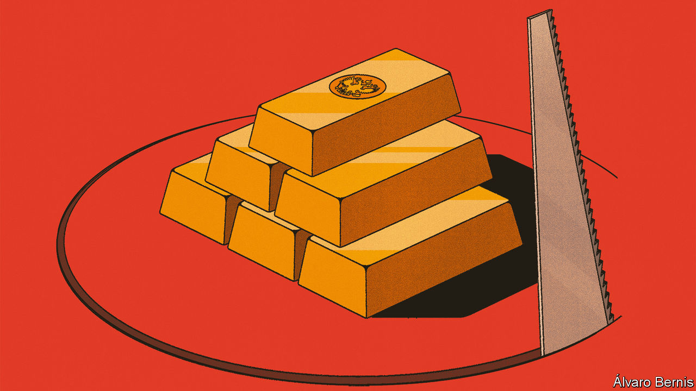

###### Free exchange

# What do you do with 191bn frozen euros owned by Russia? 

##### The question that now confronts Western policymakers 

 

> Feb 28th 2024 

In economic terms, an asset has value because an owner might derive future benefits from it. Some assets, like cryptocurrencies, require a collective belief in those benefits. Others, like wine, will undeniably provide future pleasure, such as the ability to savour a 1974 Château Margaux. Still others, like American Treasuries, represent a claim on the government of the strongest economy in the world, backed by a formidable legal system. 

To derive such benefits, however, an owner must be able to access their assets. And that is where the Central Bank of Russia struggles. Much like every other central bank, the CBR stores reserve assets abroad. After Vladimir Putin’s invasion of Ukraine in 2022, the G7 froze these assets and prohibited financial firms from moving them. Of the $282bn of Russian assets immobilised in Japan and the West, some $207bn (€191bn) are held at Euroclear, a clearing-house in Belgium. When coupon payments on Russia’s assets come due or bonds are redeemed, Euroclear puts the cash into a bank account. This account is now home to roughly €132bn. Last year it earned a return of €4.4bn, which conveniently belongs to Euroclear, as per the clearing-house’s terms and conditions. 

Western policymakers are now considering whether these assets can be used to help Ukraine. Russia might one day have to compensate the country for war damages, which the World Bank already puts at more than $480bn. Ukraine needs more money and weapons to push back Russian advances, as well as to maintain its state and economy. At the same time, Western governments are increasingly struggling to find room in their budgets to support the war effort, and to get approval from legislatures for such spending. On February 26th Dmytro Kuleba, Ukraine’s foreign minister, once again argued that Russia’s assets should be confiscated. A day later Janet Yellen, America’s treasury secretary, called on her colleagues “to unlock the value” of those funds. Ursula von der Leyen, president of the European Commission, wants to use Euroclear’s windfall to buy military equipment for Ukraine. 

How exactly could this be done? Taking assets from someone usually requires a court order, but in international law things are a little more complicated. The International Court of Justice would only be able to rule on the matter should Ukraine and Russia agree to let it decide upon reparations, which is unlikely at present. The UN Security Council has the ability to pass binding resolutions, over which Russia unfortunately holds a veto. 

Some, including Lawrence Summers, a former American treasury secretary, want to make use of states’ right to take so-called countermeasures. These are otherwise unlawful actions that are sometimes allowed in response to unlawful acts. That Ukraine is entitled to deploy countermeasures is undisputed. How broadly the same rules apply to those acting in support of Ukraine is more controversial. Sanctions and asset freezes fall under the category, and have been widely used against Russia. Asset confiscations do not, at least in most interpretations of international law. That is because they are irreversible and would seek to punish Russia, rather than to induce a change in its behaviour.

As Lee Buchheit, a veteran of international law, notes, the problem reflects a geographical mismatch. Ukraine has strong claims on Russia, but no frozen Russian assets it could use to settle them. The West has no claims but plenty of assets. Thus the challenge is to find a way to match these assets and claims.

In a recent paper, Mr Buchheit and co-authors suggest just such a way. They argue that the West could provide a loan to Ukraine, in return for which Ukraine could offer its claims on Russia as collateral. The West would agree to use only this collateral for redemption of the loan. When Russia inevitably refuses to pay up, the West would then be able to foreclose on the collateral.

Would this work? One difficulty is that an international body would still have to determine precisely how much Ukraine is owed. Perhaps the UN General Assembly could enlist the World Bank to crunch the numbers. But this would require careful diplomacy on behalf of the West, as well as the support of France and Germany, which have so far been unimpressed by suggestions involving creative interpretations of international law. Mr Buchheit argues the shift in approach is not quite as big as it might appear at first. The West has already gone quite far by freezing assets and making clear that it will not give them back unless reparations are paid. As he notes: “Russia won’t pay reparations. War reparations are paid by the vanquished to the victor, and this situation does not end with the Ukrainian flag flying over the Kremlin.” In effect, he argues, the West has already taken the assets.

A second difficulty is posed by Belgium, which has access to most frozen Russian assets and would therefore need to receive most of the claims against Russia from Ukraine. It might be reluctant to play such a pivotal role, given the potential for retribution. It would also be unfair to expect a country of its size to be the main provider of the initial loan to Ukraine. In order to overcome this difficulty, Mr Buchheit suggests that the initial loan to Ukraine is set up in a syndicated manner with a sharing clause, which would enable lending countries to group together both when providing the money and receiving collateral. Such an approach was adopted to fund emerging-market governments in the 1970 and 1980s before bond-financing markets took over. Just as is the case now, a mechanism was needed to share risk and access to collateral.

Gold rush

But perhaps there is no need to seize Russian assets after all. Indeed, the EU is already planning to implement a windfall tax on any profits they accrue. If returns continue to be siphoned off indefinitely, the difference between confiscating the asset and confiscating the income becomes . In economic terms, the West is already the owner of Russia’s assets. All that is left now is to fund Ukraine’s fight. ■


