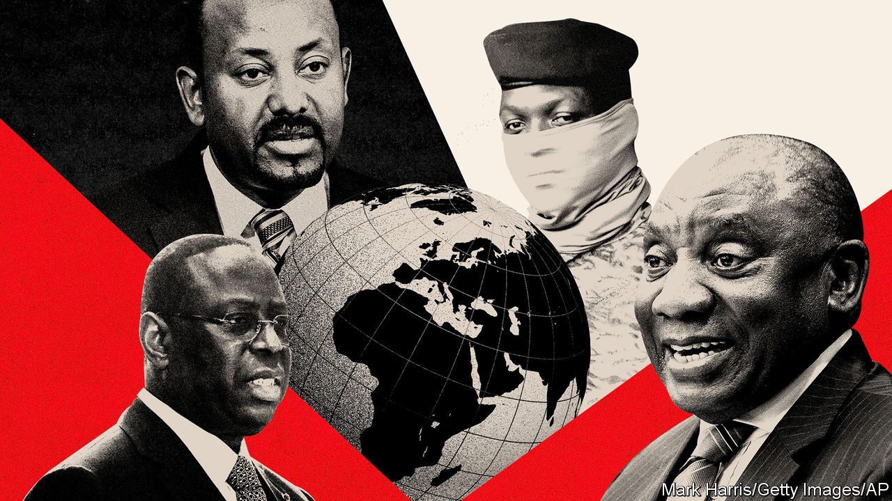
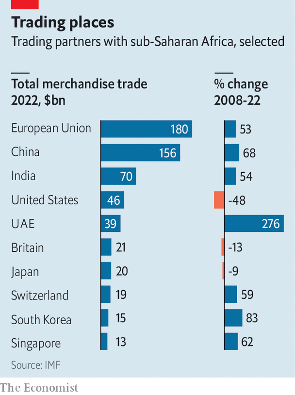

###### Surviving in a multipolar world

# Africa is juggling rival powers like no other continent 

##### African leaders need to balance vast opportunities against dire risks 

 

> Feb 28th 2024 

AFRICA’S WILLINGNESS to break with the West has been flaunted in recent years. After Russia invaded Ukraine 17 African countries abstained from a UN vote condemning the invasion. Last year, as the West refused negotiations with Russia, South Africa’s Cyril Ramaphosa and three other African presidents led a peace mission to Russia and Ukraine. This year South Africa’s case against Israel’s actions in Gaza in the International Court of Justice was a public act of defiance (America decried it as “meritless” and “counter-productive”). Mr Ramaphosa has also attended meetings with the presidents of China, Iran and Russia over the past eight months. 

African leaders believe that a multipolar world of transactional international relations, where many powers compete for influence, is in the ascendant. Iran, Russia, Saudi Arabia, Turkey and the United Arab Emirates (UAE) are among those offering themselves as investors, security partners and allies. Meanwhile, America has lost focus on Africa. It remains absorbed with Asia and preoccupied by wars in Europe and the Middle East. And if Donald Trump wins back the presidency in November, America may neglect African issues further. The result is that Africa, perhaps to a greater degree than any other region, is adapting itself to a multipolar world. 

The challenge involves both big opportunities and grim risks for the continent. Above all, it means African governments have more agency over their affairs. “The benefit of a multipolar world is that there is not just one centre of decision-making,” explains President Macky Sall of Senegal. “When there is just one centre it becomes a diktat, you have no choice.”

The greatest prize is investment, which is critical for a continent in extraordinary need of it. But a multipolar world is fraught with risks. Financing from new partners can become bad debt. And the dangers posed politically and militarily are greater still. Autocratic allies can help leaders to overstay in power and enable coups. Meddling foreign powers can spread conflict and make wars more destructive. 

History offers a sobering precedent. During the cold war African leaders also had greater flexibility to pick their partners. But the results were often ugly. With Soviet support, the Derg, the socialist junta in Ethiopia, stayed in power from 1974 to 1991 despite a famine that killed perhaps a million people. Mobutu Sese Seko, the dictator who ruled Congo absurdly and ruinously for more than three decades, was backed by the CIA. 

After the fall of the Berlin Wall American dominance ushered in a wave of democratisation in Africa and conflict abated somewhat. The continent’s economic progress was limited, however, and investment from the West failed to meet even a small share of its needs. That made many Africans receptive to China’s advances in the 2000s. While the Americans offered criticism, the Chinese offered cranes. Now other powers are offering alternatives.

Buying up friends

African leaders’ enthusiasm for a multipolar world makes greatest sense economically. About half of the 1.2bn people living in sub-Saharan Africa lack electricity. And some 400m people on the continent cannot access clean drinking water. Sorting all this requires vast investments. The World Bank estimates sub-Saharan Africa needs investment worth about 7% of its GDP in infrastructure every year to achieve near-universal access to water and electricity as well as improved roads by 2030. Current investments are only about half of that. 

 


Much can go awry with individual deals and loans but, given the scale of financing needed in Africa, more countries and institutions investing is welcome. So is a surge in new commercial partners. Trade with some non-Western countries has risen impressively (see chart). 

China has led the way on investment in Africa. From 2000-2022 Chinese state financiers lent it $170bn, about two-thirds of which was for infrastructure such as roads, railways and ports. The average Chinese project raised annual GDP growth by a healthy 0.41 to 1.49 percentage points after two years, finds Bradley Parks of AidData, a research group at William &amp; Mary University in Virginia, and co-authors. But amid economic troubles at home, China’s lending to Africa has recently fallen markedly. Chinese loan disbursements in 2022 were only about 10% of their peak in 2016. 

For African leaders that makes diversifying their sources of funding further even more important. It is beginning to happen. The UAE has invested nearly $60bn across the continent in the past decade, making it the fourth-biggest investor in that time after China, America and Europe. Turkish construction firms have completed some $85bn-worth of projects in Africa, say Turkish officials. Africa needs far more cash but the continent’s elites reckon that the Gulf countries, Turkey and perhaps India may be able to provide a useful chunk of it. Europe and America have interests and are trying to reassert themselves, particularly in critical minerals. The hope is that competition for Africa’s resources can help it secure better deals for them. 

New flows of cash bring new risks. Corruption is an obvious one. Debt can also prove difficult to manage. There is little evidence of debt-trap diplomacy in Africa (the idea that China tricks borrowers and later seizes their assets). But China does often require unusual levels of confidentiality, as well as special conditions, to ensure that it is the first creditor to be paid back. It also tends to use escrow accounts and can be inflexible with countries in trouble. Zambia defaulted in 2020 but only managed to strike a deal with China on restructuring its debt in the past month. 

Another risk is that a multipolar world splits. Rising tensions between China and America could divide the world into two isolated trading blocs, one led by China, the other by America and Europe. Sub-Saharan Africa would suffer a bigger economic hit in that scenario than any other region, with more than half of its international trade at risk, reckons the IMF.

The political effects on Africa from its multipolar dealings will also be vast. One advantage is that the new order will allow its governments to take positions that were their preferences for years but which they avoided to stay onside with the West, says Menzi Ndhlovu of Signal Risk, a consultancy in South Africa. But the results of greater African agency may at times cause consternation in the West. After decades of tensions between Uganda and America over gay rights, last year President Yoweri Museveni of Uganda finally concluded that he could ignore the Americans and passed harsh anti-LGBTQ laws. Ethiopia has built close ties with China to pursue unorthodox economic policies such as state-led development that America and the institutions it dominates, such as the World Bank, have long discouraged.

Other downsides may accompany a freer political hand. One is democratic backsliding. Mr Sall has been attempting to hold on to power in Senegal past the end of his mandate, presumably confident that plenty of foreign powers still support him. On February 3rd he announced that an impending election would be postponed indefinitely, but Senegal’s judges slapped down the move. Whether Mr Sall steps aside in April when his mandate ends remains to be seen, especially as there is now talk of an election in June. Others have tried similar ruses. In Ivory Coast the president is in his third term after an earlier tweak to the constitution. Last year the president of the Central African Republic, who is protected by Russian mercenaries, got approval for a constitutional change in a referendum so that he can run for a third term in office should he so choose. 

Backsliding is sometimes more abrupt. Under the American-led order putschists were often isolated. No longer. During the cold war there were on average over 20 successful coups in Africa each decade. By the 2000s that fell to just eight. Yet in the 2020s there have already been nine successful coups in Mali and Burkina Faso (two each) as well as in Chad, Guinea, Sudan, Niger and Gabon. Russia has backed the generals in Burkina Faso and Mali with fighters and arms. Niger has chucked out French troops (who had been pushed out of Mali and Burkina) and cosied up to Russia and Iran for cash and weapons.

The results of these manoeuvres are grim: more people died in violent conflict in the Sahel last year than in any year since jihadist violence began over a decade ago. Even so, Russian muscle, diplomatic cover and shipments of grain have helped keep the juntas in the Sahel and Guinea in power despite pressure from the West and sanctions from the Economic Community of West African States (ECOWAS), the regional bloc. The Sahelian trio are sufficiently confident in their Russian backing that last month they decided to quit ECOWAS altogether. 

Bloody stakes

The competition between rival powers in Africa also risks spreading insecurity and war. The number of conflicts on the continent has risen sharply from the relative lows of the 2000s to reach 104 in 2022, according to the Peace Research Institute Oslo. That is the highest in decades. And 2022 was the deadliest year for state-based conflicts in Africa for more than 30 years, largely owing to war in Ethiopia between the forces of Prime Minister Abiy Ahmed’s government and those of Tigray.

The brutal civil war in Sudan illustrates how the new geopolitics makes conflicts in Africa more destructive. The Rapid Support Forces, a genocidal militia, has been receiving a steady flow of weapons from the UAE (the country’s officials deny this). Mercenaries from Russia back them, too. The Sudanese Armed Forces are hitting back with Iranian drones and, it seems, the support of Ukrainian special forces. As the conflict rages, the result is that more people are displaced in Sudan than in any other country in the world, and among them are 3.5m children.

Today many countries are also willing to sell arms to regimes that take little care to avoid civilian casualties. Turkey has sold attack drones to Ethiopia, Burkina Faso and Mali—places the West has been reluctant to arm. And Russia is now the top weapons supplier to sub-Saharan Africa, accounting for a quarter of all sales between 2018 and 2022. China is in second place. Its drone sales have triggered recent escalations in conflict between Rwanda and Congo around Goma, the largest city in eastern Congo. Some 135,000 people have been displaced in just a month, joining a half a million already sheltering in the city.

Maximising the benefits of a multipolar world to ordinary Africans without exposing them to dire risks will require deft leadership. Yet such a world also makes it easier for bigwigs to rule in their own interest and retain foreign backing. The central question is likely to be whether African leaders ultimately act in the interests of their people or not. The record so far is worryingly mixed. ■

