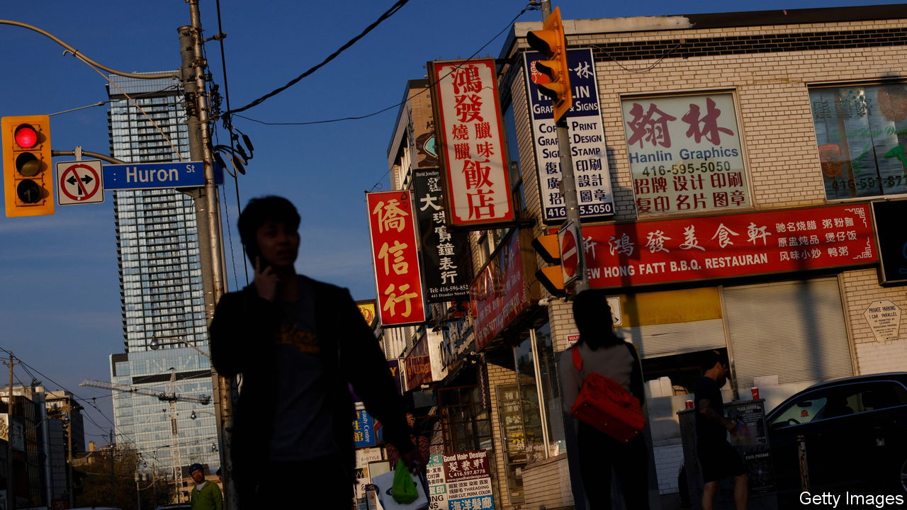

###### How tyranny travels

# Autocracies are exporting autocracy to their diasporas 

##### The new danger from transnational repression 

 

> Feb 29th 2024 

For Millennia exile has been a way for critics to escape the iron fist of tyrants and for regimes to silence naysayers. Yet the way authoritarian regimes interact with dissenting opinions abroad is changing dramatically for the worse.

Over the past 30 years open borders have created vastly  in foreign lands. Technology has amplified individuals’ voices and their connection to their homeland, but also enabled monitoring, intimidation and censorship by distant governments. The result is that the world’s autocracies can now plausibly aspire to control ideas and large numbers of people abroad as well as at home.

Exhibit A is China. Eleven million of its citizens or ex-citizens now live outside its borders. As we report its programme of monitoring, censorship and coercion is more elaborate and extensive than . And China is not alone. Under Vladimir Putin, Russia maintains an extensive apparatus to spy on and manipulate ethnic Russians abroad, which includes agents who poisoned former members of his regime in Britain. In January America and Britain accused an Iranian network of “numerous acts of transnational repression including assassinations and kidnappings…in an attempt to silence the Iranian regime’s perceived critics”. And under its leader, Recep Tayyip Erdogan, Turkey has been accused of trying to manipulate and police the Turkish diaspora in Europe.

Autocrats are trying to export autocracy. Targeted action against particular people helps create a broad climate of fear. Tyrannical regimes know that self-censorship—the pre-emptive quashing of dissent—is their most powerful tool. Today you often find it in diasporas. Cases of manipulation often seem small and go unreported, but the effect can be large and severe. Many Chinese students are wary of expressing their true views on university campuses that are thousands of miles from Beijing. 

How can countries protect the people they host? The most obvious step is to crack down on malign state-backed spies and proxies. Autocratic state-affiliated organisations should be prevented from conducting influence and intimidation campaigns on university campuses. The definition of espionage is expanding to include transnational repression, which should be punished harshly. Last summer America named and imposed sanctions on a group of Iranians involved in their country’s overseas anti-dissident operation.

Another focus should be tech platforms. Banning apps like WeChat, which although privately owned is headquartered in Singapore and used by the state to monitor Chinese abroad, would be an extreme move. In any case, doing so would not help the many recent emigrants who are users of Weixin, the Chinese version of WeChat, with accounts still registered to Chinese phone numbers. But it is reasonable to demand that foreign apps, particularly those based in autocratic states without human-rights protections, show that they protect personal data and that their operations abroad are separate from their parent company. America has imposed these kinds of safeguards on TikTok, another Chinese app.

Stop tyranny from travelling

Dealing with the threat from oppressive regimes and their tentacular reach inevitably involves monitoring what diasporas do and screening individuals who could pose a threat. To a diaspora, however, this risks seeming like scaremongering or discrimination. An essential part of protecting them, therefore, is to make their members feel welcome in their host societies. If they belong, they are more likely to feel safe enough to stand up to the bullies. That means upholding the values of openness which led people to make them their new home in the first place. ■

