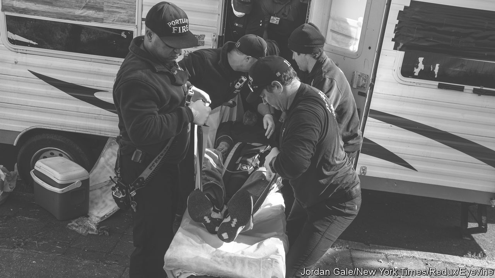
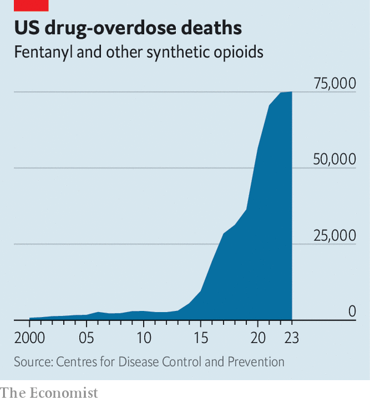

###### A losing battle

# Fentanyl cannot be defeated without new tactics 

##### Suppression works even less well than with other narcotics 

 

> Feb 29th 2024 

IT IS OVER 50 years since Richard Nixon initiated America’s , yet victory seems further away than ever. In the 12 months to September 2023 more than 105,000 Americans died from overdoses—almost double the number killed in combat in Vietnam, Afghanistan and Iraq. No matter how zealously the government patrols the border and how ferociously it pursues traffickers, the problem only seems to get worse. 

 


The deterioration in the past decade is largely owing to fentanyl, a synthetic opioid that is 50 times more potent than heroin and is involved in about 70% of drug-related deaths in America. It started as a substitute for opioids supplied under prescription, but its continuing spread is the logical outcome of the war on drugs. Peddling narcotics is so lucrative that traffickers have an incentive to innovate, the better to evade controls.  and its analogues are a near-perfect product: so cheap to make that even sold for 50 cents a pill, it is still hugely profitable; so powerful and addictive that a captive market is almost guaranteed; so easy to make, with such a variety of common chemicals, that it can be produced more or less anywhere; so concentrated that it is easy to hide and smuggle. 

No wonder America is . A crackdown on the Sinaloa gang in Mexico, said by American authorities to be the biggest source of it, has simply caused production to atomise. Attempts to stop Chinese exports of ingredients are hampered by ever-evolving recipes for the drug and ever-adapting supply chains, with India, for instance, becoming the latest source of chemical precursors. A focus by America’s border patrol on crossings near San Diego, which was once the main conduit into America, has caused smuggling to shift eastwards, into Arizona.

Predictably, many politicians think the best response is extreme tactics that are themselves also the logical culmination of the war on drugs. Senior Republicans have called for an invasion of Mexico, to eradicate the gangs (although Republicans in Congress have turned down Joe Biden’s request for more funds to patrol the border). Donald Trump is said to have contemplated missile strikes on traffickers’ hideouts when he was president.

To its credit, Mr Biden’s administration is already taking a broader approach. For the first time, the federal government is spending more to deter use and treat addicts than it is on trying to disrupt the flow of drugs. It has patched up relations with China well enough to resume efforts to curb the trade in precursors across the Pacific. Mindful of how mutable supply chains are, it is trying to build a global coalition to keep better track of chemicals.

These are welcome steps, but they should go further. If it is impossible to stop fentanyl getting to consumers, more must be done to help them cope with it. American authorities should distribute simple tests to let users check whether their drugs have, as is often the case, been mixed with cheap, addictive fentanyl; they should increase access to treatment schemes involving substitutes such as methadone; they should ensure that the antidote for overdoses is widely available; they should revamp drug education, which is woeful. And they should decriminalise less lethal drugs, such as cocaine, so as to free time and scarce funds to focus on the one that is killing Americans in droves.

Politicians of all stripes dislike such ideas, since they appear to condone taking drugs. America’s are unlikely to try anything so radical. But fentanyl is already a problem in Canada and is spreading in Mexico, too. Even more potent synthetic opioids called nitazenes have arrived in Britain. If the world is to cope it will, like the traffickers, have to innovate. ■

