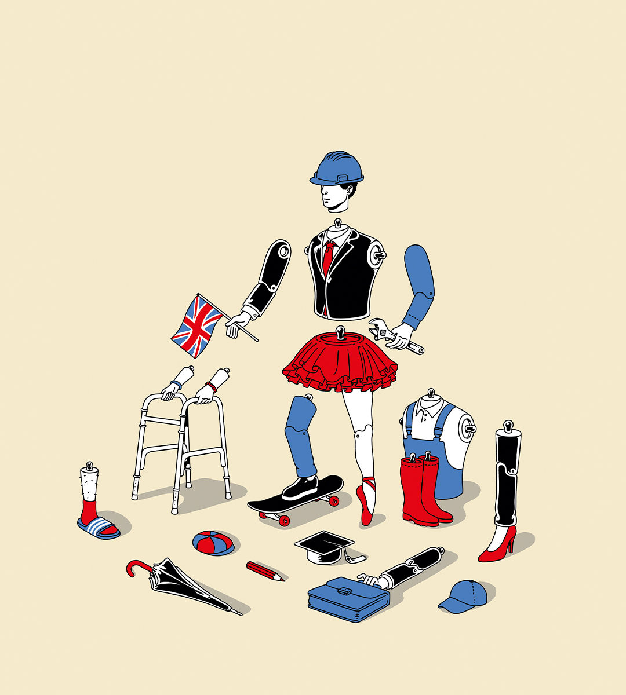

###### Voting intentions

# How to build a British voter 

##### Labour is assembling an electoral coalition that is young and broad, but volatile too 

 

> Feb 28th 2024 

LATER THIS year Britain’s voters will choose their next government.  that the ruling Conservatives will suffer a humbling defeat, and that Sir Keir Starmer, the Labour leader, will enter Downing Street. Much can still happen, obviously, but normality seems to beckon after years of political turmoil. A boring, managerial prime minister in charge of a centrist party would be welcome relief from the psychodrama of Tory factionalism. Brexit would fade still further into the political background. The union would be safer from nationalists in Scotland. And the electoral pendulum would have performed another of its slow and decisive swings. Britain has had two changes in governing party since 1979. This would be the next; instead of 1997 and Sir Tony Blair, think of 2024 and Sir Keir.

Think again.  has dug beneath the surface of the polls and compared voting behaviour at the 2019 election with voting intentions in 2024, drawing on data from 95,000 Britons surveyed by WeThink, a polling company. Our model calculates the probability that a voter will pick a political party based on eight characteristics, from their age and educational attainment to their ethnicity and what kind of property they live in. (You can see how people like you vote by ) It shows that the electoral coalition propelling Labour towards power sweeps up most young voters, but is also broad and volatile. What it does not augur is a return to politics as usual.

Class was once the engine of British politics; increasingly it is your date of birth. At the last election, the age at which voters became more likely to support the Conservatives than Labour was 45. Our data show that at the next one this crossover age will be almost 70. That makes Britain unusual: in Canada and America conservative parties still win around 40% of young voters. It is also historically exceptional. In 1997, the year Sir Tony won his first landslide victory, 27% of 18- to 24-year-olds voted Tory; our data suggest that the share of this cohort backing the Conservatives is now just 8%. The young Tory of today is as endangered as the natterjack toad or the European water vole. 

Even as younger people skew overwhelmingly towards Labour, other voters are also moving in its direction. Our model confirms that the tide is going out on the Tories everywhere. The probability that a voter would choose the Tories if the election were held tomorrow has dropped for 96% of British adults since 2019. The electoral coalition that Labour is stitching together is consequently very broad. Its core vote is the urban young, but our model  that the type of person who has swung most violently against the Conservatives is an older white man with a mortgage living in the north-west of England. In 2019 this sort of voter helped Boris Johnson break through Labour’s “red wall” of northern seats; that year, according to our model, such a man had an 81% chance of voting Conservative. The probability now is just 18%. 

Swings of this sort add up to a volatile electorate. At the last election Mr Johnson won the biggest share of the vote since 1979; Labour recorded its lowest post-war total of seats. The remarkable change in Labour’s fortunes can be traced partly to events and elites: Partygate, Liz Truss’s mini-budget, the cost-of-living crisis, the funding scandals of the Scottish National Party, Sir Keir’s tack to the centre. But it also belongs to a much older trend. In the 1960s around an eighth of British voters switched their choice between elections. By the early 1980s the figure was closer to a fifth. Next time, our data suggest, the share of voters who intend to change parties will reach two-fifths. 

Things can change between now and the election. Sir Keir might screw up; some grumpy Tories may return to the fold. But what does this picture mean for Britain? A volatile electorate is much better than a tribal one. If people are locked into parties, politicians compete within their party over who wins the backing of their own side’s radical true believers. The marketplace for centrist voters does not function; the incentives to govern well are blunted. That is how politics works in America.

Victory for a young electoral coalition also has the potential to change policy for the better. Britain’s biggest problem is economic stagnation, and one cause is an inability to build. England has fewer homes per person than any other big rich European country. The Conservatives do worst among people in social housing, renters and mortgage-holders. The Adam Smith Institute, a free-market think-tank, finds that Labour voters are more likely than Tories to agree that their area has a housing crisis by a net of 29 points—and are more supportive of large-scale house-building by a net of 16 points. Labour voters are also concentrated in urban areas, so they are unaffected by sorely needed new infrastructure, like pylons, that passes through rural ones. 

It is not obvious what the Tories can do to turn things around before the election. But it is clear what they should not do. The Conservatives have tried to shore up support by focusing on their core voters. If they keep lurching rightwards, they may protect seats by fending off Reform UK, an insurgent party that is fiercely critical of mass immigration. It will not help them win. 

From pendulum to metronome?

There is a lesson here for Labour, too. It is about to be elected by people who hold wildly varying views: socially conservative, white, working-class northerners and young, liberal, non-white southerners; nationalists and unionists in Scotland. For Labour, a future vulnerability might be cultural issues, where the progressivism of the young could turn off other voters. Bitter rows over the war in Gaza show how such pressures might tug apart this electoral coalition: Sir Keir must be careful not to pander to his base at the cost of alienating swing voters.

The volatility of British voters also suggests that Labour cannot assume it would have much time to get things done. Sir Keir does not inspire any great enthusiasm. His room for fiscal manoeuvre will be cramped. The potential for disaffection is high. Since 1979 one party has taken up residence in Downing Street for well over a decade at a time. In future the electorate may be much swifter to evict them. ■


