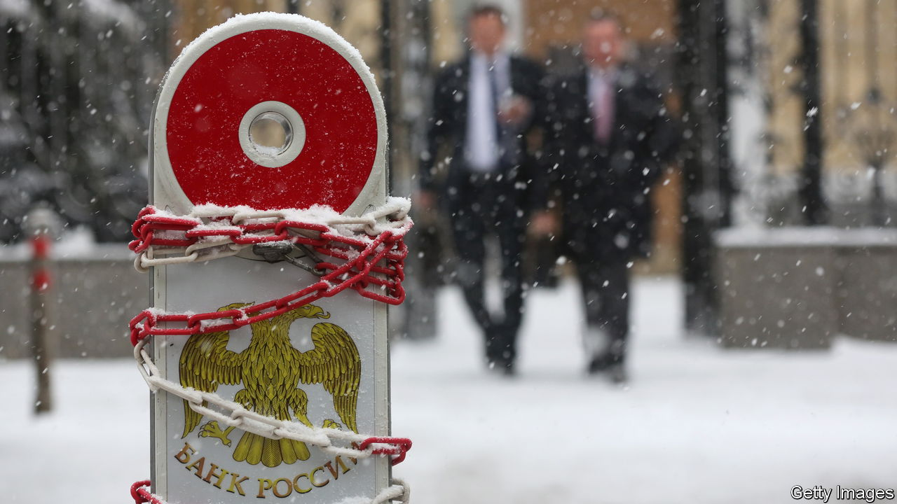
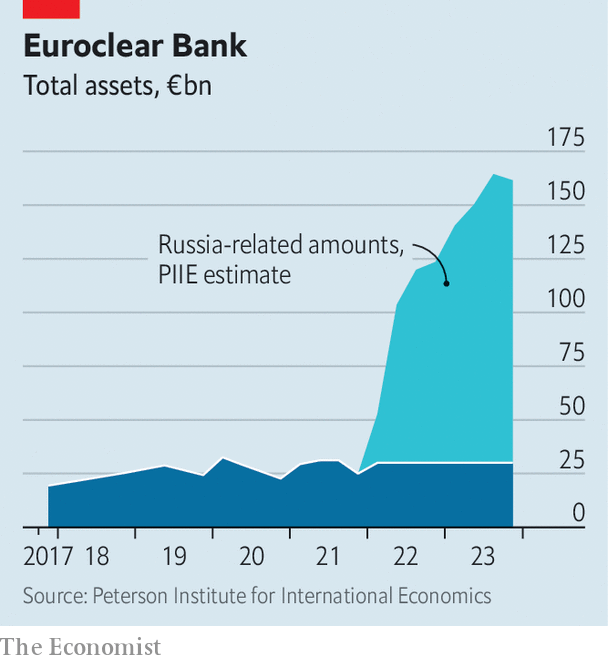

###### Don’t seize: capitalise

# How to put Russia’s frozen assets to work for Ukraine 

##### Exploit them to the full, but legally 

 

> Feb 28th 2024 

With America’s House of Representatives denying aid for , other Western politicians are hunting for an alternative source of funds. Their eyes have settled on assets worth €260bn ($282bn) belonging to Russia that have been frozen since its full-scale invasion two years ago. There is a growing clamour in support of the moral and practical case for using this money to help pay for Ukraine’s defence. On February 27th Janet Yellen, America’s treasury secretary, called for the value of these assets to be unlocked. But most of the portfolio sits in Belgium, and the European Union has been divided about the wisdom—and legality—of putting it to use. 

Those who want to do something with the money are right, but how it is done matters greatly. Seizing the assets outright would be a mistake. Sanctions have historically come with the caveat that if an aggressor like Russia changes its behaviour, it can get its money back. Reparations are typically negotiated with a defeated state after hostilities have ceased, not imposed and enforced while bullets are flying. Taking the money would add to the view, already common in the global south, that America and its allies hew to international law only when it suits them. Because the West’s case against Russia’s invasion is that it is illegal, this smacks of hypocrisy.

Yet the injustice Ukraine has suffered is manifest, its need for cash is urgent and Western governments’ finances are stretched. So lawyers are scrambling to find clever mechanisms by which Russia’s portfolio might be tapped legally. Their plans involve transferring the claim for reparations from Ukraine to the West, and offsetting it against the Russian assets. Yet even the cleverest are fraught with .

There is a simpler way. About €190bn of the assets are controlled in Belgium by Euroclear, a custodian. The investment returns and principal repayments it would pass on to Russia are instead piling up as a cash balance, which currently amounts to around €132bn and which Euroclear’s bank can profitably invest. The argument that Russia has no right to these returns is relatively uncontroversial, not least because Euroclear does not usually pay interest on cash holdings.

 


The free funding is helping Euroclear make extraordinary profits. The eu has already ordered the firm to hive them off and not to distribute them to shareholders; on February 28th Ursula von der Leyen, the president of the European Commission, said it was time to talk about taking the money and sending it to Ukraine. That would provide a drip of funding: Euroclear earned €4.4bn from the assets in 2023.

The EU could go one better. The flow of income from Russia’s assets will continue. The EU could therefore launch and guarantee a vehicle whose debts are serviced using the income from Russia’s funds. By issuing bonds, this vehicle could raise a large upfront amount to be sent straight to Ukraine. Investing the €132bn cash balance in five-year German debt would yield about €3.2bn per year, enough to service almost €114bn of joint EU debt at the same maturity. The figures would rise as more of Russia’s portfolio vests into cash. Such large amounts would both pay for ammunition now and signal to Russia that Ukraine has the economic staying-power to carry on the war.

If Russia never made peace on satisfactory terms, the EU would never have to spend a penny of its own money servicing the debt. If it did, the eu might end up on the hook—but in such circumstances it would also get a growth boost and a peace dividend from the end of the war. Most important, Ukraine would get the large infusion of cash it desperately needs now, without undermining any of the principles for which it is fighting. ■

