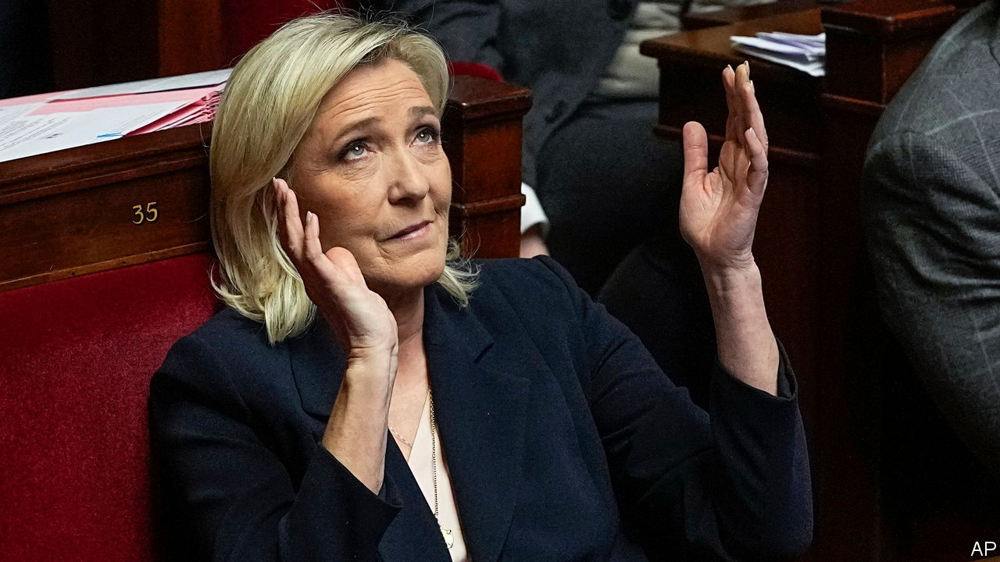

###### French politics

# The perils of a Le Pen presidency 

##### Even three years out, the prospect is alarming 

 

> Feb 26th 2024 

For over half a century the name Le Pen has sent a tremor through liberal France. Le Pen senior, Jean-Marie, prowled for decades around the political fringes, trading in xenophobic outrage and antisemitic provocation. He was as adept at stirring fear and offending the establishment as he was at securing convictions for incitement to racial hatred. Twice Mr Le Pen sat in parliament, and in 2002 he made it into the presidential run-off. Even then nobody took seriously the possibility that the blustering former paratrooper would win the highest office—or wish to.

The same cannot be said for his daughter, . Since taking over the National Front in 2011, rebranding it the National Rally (RN), she has converted a pariah into a party . Her protégé, the 28-year-old Jordan Bardella—now party president—is the only politician to feature in the top 50 favourite French personalities, alongside football stars and ageing rock legends. Over 60% of the French now see the RN as a political party like any other. Nearly two-thirds of voters think it can win office, up from 40% in 2018. A plurality of the French no longer fear that it is a “danger for democracy”.

The next French presidential election is not until 2027. Much could yet thwart a Le Pen victory, not least a credible successor to Emmanuel Macron, who is barred by the constitution from running for a third consecutive term. He has begun to promote a new generation, among them the 34-year-old prime minister, Gabriel Attal. One of his former prime ministers, Edouard Philippe, is among those readying themselves for a bid. Yet Ms Le Pen will be a formidable opponent. In 2022 she won the backing of nearly 42% of voters; next time she will do better.

It is, therefore, past time to consider how much a Le Pen presidency would change France and Europe. France is a country unlike any other. It is nuclear-armed, highly centralised and concentrates unusual powers in the hands of a single person—including the ability to dissolve parliament, name and fire the prime minister, and appoint the head of the armed forces, state-owned firms, institutions and the broadcasting authority. In neighbouring Italy, where Giorgia Meloni’s relatively moderate stewardship tempers some observers’ worries about a President Le Pen, the prime minister is appointed by the country’s president, who acts as a check on executive power. 

Although the RN has been disciplined in parliament, if Ms Le Pen is in the Elysée it may set less store by good behaviour. Her closest political allies in Europe are authoritarian strongmen, including Hungary’s Viktor Orban. State capture is a long game; Poland’s new government shows how difficult it is to undo. 

Outside France, a Le Pen presidency would imperil the foundations of the European Union, and question France’s commitment to the Western alliance. The RN leader may have dropped her calls for Frexit or for France to leave the euro. But her plans to hold a referendum to entrench in the constitution the superiority of French law over EU law would put it on a collision course with the union. Unlike the Atlanticist Ms Meloni, Ms Le Pen  to pull France out of NATO’s integrated military command, and is against Ukraine joining either the alliance or the EU. 

At best, a Le Pen presidency would choke the Franco-German engine that drives the union. At worst, an alliance between nationalist-populist leaders of France, Hungary, Slovakia and, possibly, the Netherlands might embolden Ms Meloni to shift their way. Voting together, those countries would be able to muster the 35% needed to block decisions in the council of the European Union. A paralysed, divided EU would be very different from the club that exists today.

Even three years out, France and its friends should take a long, hard look at Ms Le Pen and her project for power. A Le Pen presidency is not inevitable. But it is no longer unthinkable. Nothing would be more unwise than to assume that, if it came about, France, Europe or NATO would just carry on as before. ■


