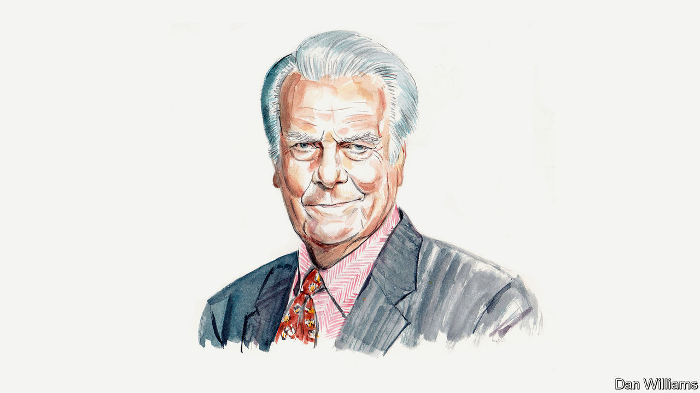

###### On Britain’s armed forces, cousins, business in Italy, private-equity backed insurance, age, Terry Pratchett

# Letters to the editor 

##### A selection of correspondence 

 

> Feb 29th 2024 


Challenges for Britain’s army

Your analysis of the state of the British armed forces rightly highlighted structural underfunding, short-termism, mismanagement and poor employment conditions (“”, February 3rd). Another consistent failing has been the lack of a coherent mission since the end of the cold war. Many people praised the integrated reviews and associated defence command papers of 2021 and 2023. Yet, reflecting the long-term over-ambition of each of the services, these reviews were conveniently ambiguous about whether Britain’s armed forces should commit to the defence of NATO or to global, Indo-Pacific operations (with little consideration of the actual resourcing available). 

Reform of the armed services cannot even start until Britain develops a coherent, sustainable military strategy, which unites the efforts of all of its now very limited forces on a specific mission. It is up to the service chiefs to define that mission and to concentrate every activity and all their resources to its achievement. 

Anthony King

Professor of defence and security studies

University of Exeter

The British and the Europeans are now in an arms race with Russia, which is spending 7% of its GDP on defence. Some of this expenditure is directly related to the war in Ukraine but, tested in the crucible of that war, Russia is rearming and restructuring its armed forces. Within three years, Vladimir Putin will have a modernised, and puissant, army at his disposal.

To counter this, Britain needs a radical uplift in defence spending. Rishi Sunak’s feeble 2.5% of GDP when “the fiscal and economic circumstances” allow is clearly inadequate. Many defence economists have suggested that 3% of GDP, sustained over a number of years, is a reasonable starting point. At the least, this would enable Britain to tackle issues quickly, such as poor housing and inadequate pay, that are contributing to poor recruiting and the haemorrhaging of trained personnel. 

Any increase must also be focused on current warfighting-capability gaps. Britain may need to upgrade its nuclear deterrent, but that should not come at the expense of spending on weapons that are more probably going to be needed now. It cannot be said loudly enough. Britain does not have until the mid-2030s, which is when the Ministry of Defence’s “modernisation plans” are due to bear fruit. In strategic terms, we face a “clear and present danger” today. 

Simon Diggins

Colonel (retired)


 


Breaking the familial ties

The dispute about the legitimacy of marriage between first cousins (“”, February 17th) touches on a crucial historical phenomenon. The church banned marriage between relations who were less than three or four times removed. In “The Weirdest People in the World”, Joseph Henrich argued convincingly that this explained why clans and tribes disappeared in Europe during the Middle Ages, making way for the rise of the individual and the state. And it promoted the idea of marriage based on love. 

Antony Black


 


The Italian model

Your article on business in Italy was short on “sweet” and long on “bitter” (“”, February 10th). No mention was made that in the fourth quarter of last year Italy’s economy grew, while Germany’s shrank and the EU stagnated. Milan’s stockmarket, small though it may be, outperformed all the other big euro area markets in 2023. Thanks to small- and medium-sized companies, Italy is the third largest exporter in the EU. So the French own several big-name Italian brands? Sadly, Italy does not have the same number of billionaires as France to buy them. French investors seek premium Italian companies because they are profitable, prestigious and enduring. When it comes to business in Italy small is beautiful, and successful. 

Vincenzina Santoro


 


Private equity and insurance

There are indeed many risks associated with private-equity-backed insurers (“”, January 27th). As you say, “pension promises matter to society” and accordingly, regulators should take notice. Upon instructions from Congress, the Department of Labour has done just that, holding public sessions to discuss the increasingly large role that private-equity-backed insurers are playing in the pension risk transfer (PRT) market. 

Financial markets corroborate your concern. Whether because of regulatory arbitrage, riskier or illiquid investments, and other factors, private-equity-backed insurers are deemed riskier than traditional insurers, as measured by the credit spread of their bonds. Conveniently, many insurers issue Funding Agreement-Backed Notes (FABNs) to the institutional bond market. FABNs are on an equal footing with policies issued by the insurance companies, so they represent an observable, market-based measure of the policy-level risk of the insurer. 

Our recent study of the largest PRT providers showed that the two-private equity-backed insurers in that group stood out as a higher risk, trading at spreads as much as one percentage point higher than that of the highest quality insurers. These spread levels are comparable to those of companies rated BBB or BBB-. We think an evaluation of credit spreads aligns well with Department of Labour guidance that requires fiduciaries to choose the “safest available annuity”, and have recommended as much to the department as part of its review of the PRT market. The power and insight of market forces strongly supports your thesis.

David Eichhorn

Chief executive and head of investment strategies

NISA Investment Advisors


 


Respect the elderly

I find it ironic that an article arguing that both Donald Trump and Joe Biden are too old for the presidency was written by someone several years older than both of them and who still holds a seat in the House of Lords (n, February 12th). Lord David Owen suggested that Mr Biden should decline the Democratic nomination and ask its national committee to pick another candidate, though he oddly failed to ask the Republican National Committee to do the same for the similarly elderly Mr Trump. 

Bengt Symstad


A hole in my shoe

A few books written by Terry Pratchett should have made it into your pick of the best comic novels (, February 1st). Several deal with topics relevant to the dismal science, including whether private or public services are best (“Going Postal”), economic theory and models of money (“Making Money”) and the Sam Vimes boots theory of socioeconomic inequality (“Men at Arms”). This posits that a rich man can spend $50 on one pair of boots that will still keep his feet dry in ten years’ time, whereas a poor man who can only afford cheap boots will spend $100 on several pairs over the same time, and still have wet feet. 

Henry Biggs


