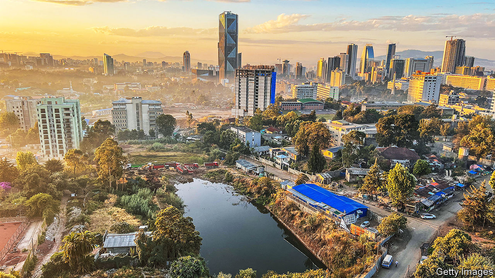
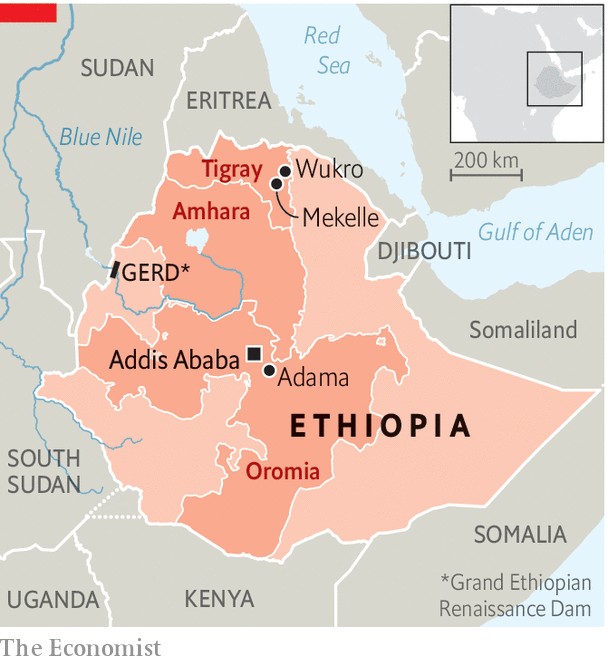

###### Dreaming of Dubai

# Africa’s tiger economy is shot 

##### Abiy Ahmed has big dreams for Ethiopia. Reality is far harsher 

 

> Feb 29th 2024 

To catch a glimpse of Abiy Ahmed, Ethiopia’s prime minister, visitors could book a table at a swanky new restaurant in Addis Ababa, the capital. Marcus Addis, the eponymous joint by Marcus Samuelsson—an Ethiopia-born, Sweden-raised, America-based celebrity chef—has proved a favourite. From the 47th floor of east Africa’s tallest building diners gaze out at the shiny infrastructure being built across the city under Abiy’s rule. The eatery symbolises the country he would like Ethiopia to be: modern, glitzy and rich.

The reality at ground level is less glamorous. Two years of war in Tigray killed hundreds of thousands and destroyed the region’s economy. Those close to Abiy argue that he can finish what he started when he took office in 2018, vowing to reform a dirigiste economy. An IMF loan to support this could be signed by the end of March. But financial instability and violence in other regions are causing huge problems for one of Africa’s most influential—if controversial—politicians. A country often seen as a model for the rest of the continent may instead be a warning. 

From 2004 to 2017 vast public investment helped Ethiopia’s GDP grow by more than 10% a year on average, outpacing every country save Qatar. But the state-led model accrued flaws: double-digit inflation, mounting public debt and the hogging of credit and hard currency by state firms. Repressive rule by the governing coalition, the EPRDF, provoked a backlash that aided Abiy’s accession in 2018. 

Abiy’s “Homegrown Economic Reform Plan” aimed to build on the strengths of the previous 20 years, especially in infrastructure and education, while fixing the weaknesses by liberalising the economy. Officials claim several successes. Lending to the private sector increased, and the government has chipped away at the monopoly of state-run Ethio Telecom by selling a mobile-phone licence to Safaricom. Competition from the Kenyan firm has accelerated the growth of digital payments. 

Then came the war in 2020. “There is little in the way of an economy here,” says Getachew Reda, who runs Tigray’s regional administration. In Mekelle young people plot how to escape the country. Outside the Tigrayan capital things are even worse. 

It has been more than three years since soldiers from Eritrea, the neighbouring state that allied with Ethiopia during the war, destroyed the Semayata Dimensional Stones Factory in Wukro, eastern Tigray. But it looks like it could have happened yesterday. Machines that cut granite lie in ruins of twisted metal. The roof is punctured by shrapnel. The only sign of passing time is the layer of bird droppings on the floor, softening the crunch of broken glass. Before the war the factory had 500 workers. Its stone was used in many of the buildings in Addis Ababa; among its unfulfilled orders is one from the national cyber-security agency. “Every machine was destroyed, everything was looted,” says Hadush Hailu, the finance manager. 

And there are effects of the war beyond Tigray. At Antex Textile in Adama, in the Oromia region, the staccato of sewing machines echoes around the factory. It might be the noise of manufacturing at the global frontier: Antex is a Chinese firm making garments for Western shoppers. A decade or so ago, economists saw Ethiopia as Africa’s best hope of replicating the export-led growth of Asian states like Vietnam or Bangladesh. Ethiopia had duty-free access to America under AGOA, a preferential trade policy. It also has low labour costs: an Ethiopian garment worker earns half of a Bangladeshi’s wage and a fifth of a Kenyan’s. 

But Azim Mohamed, the Bangladeshi factory manager, sounds despondent. In 2021 America, home to 60-70% of Antex’s customers, booted Ethiopia out of AGOA because of human-rights abuses in Tigray. A government order to make military uniforms has not completely filled the gap. Asked if Ethiopia might still be the next Bangladesh, Mr Mohamed pauses. “It’s supposed to be. But now I cannot say.”

A survey by the UN Development Programme (UNDP) found that almost 450 manufacturing firms (out of nearly 5,000) stopped production last year. More than 70% of executives said that the business environment had worsened in the past few years. Ethiopia attracted 11 foreign-direct-investment (FDI) projects in 2021 and 2022 combined, about a third of the total in 2019, reckons EY, a consultancy. 

The war has also exacerbated some macroeconomic problems. Borrowing rose and official military spending increased by 88% in 2022 alone, squeezing money for welfare. Fewer exports, as well as less FDI and overseas aid have led to a lack of foreign exchange. That has put pressure on the local currency, the birr, which is worth half its official value on the parallel market. The IMF reckons consumer prices will rise by more than 20% this year.

The results can be seen in the number of half-finished buildings across Addis. Property is seen as a hedge against inflation and the official devaluation of the birr that developers assume will be part of any IMF agreement. But they are struggling to get dollars to import the materials needed to finish their buildings. 

Abiy’s allies argue that they will succeed in pushing reform despite the macroeconomic problems and what they see as opposition from vested interests. In November the government reached a deal to reschedule payments due to official creditors including China. It hopes to cut a similar one with commercial creditors over a $1bn loan due in December. Officials hope that dollars from the IMF will give them the space to continue reforms. 

Abiy, meanwhile, is busy promoting the industries he sees as crucial to Ethiopia’s future. On social media he touts his initiatives to make the country an exporter of wheat and to double tea production. (Diplomats are sceptical of his claims of success in the former.) He posts slick videos of new state-built tourist lodges. 

 


But insecurity is making it hard for farmers and will put off holidaymakers. Latent conflicts in the regions of Oromia and Amhara have escalated (see map). Kidnappers are terrorising businesses; last year dozens of workers at a cement factory owned by the Nigerian magnate, Aliko Dangote, were taken. Exporters say it is becoming harder to shift goods. 

Like many African leaders, Abiy is more of a dealmaker than a policymaker. In January he infuriated neighbouring Somalia by suggesting he would recognise the sovereignty of Somaliland, a breakaway part of that country, in exchange for leasing land on the coast, a long-held aim of landlocked Ethiopia. A huge dam on the Blue Nile, known as the GERD, is filling up, angering Egypt. But bold—or, say critics, reckless—moves like these are not the same as the more prosaic work of reforming the economy while mollifying political elites and quelling popular anger. 

Ever since Abiy came to power many have seen what they want to see in him: a liberal reformer, a free-marketeer, a peacemaker. In truth, much like the food served at Marcus Addis, he is a fusion of influences. An ally compares Abiy to Deng Xiaoping, the Chinese reformer. One businessman says he is motivated by Pentecostalism’s “power of positive thinking”. Another likens him to Mohamed bin Zayed (MBZ), the leader of the United Arab Emirates (UAE), in his mix of mega-projects and brazen diplomacy. But, he cautions, “Abiy is not MBZ and Ethiopia is not the UAE.” No matter how glittering, the view from the 47th floor cannot obscure that. ■

