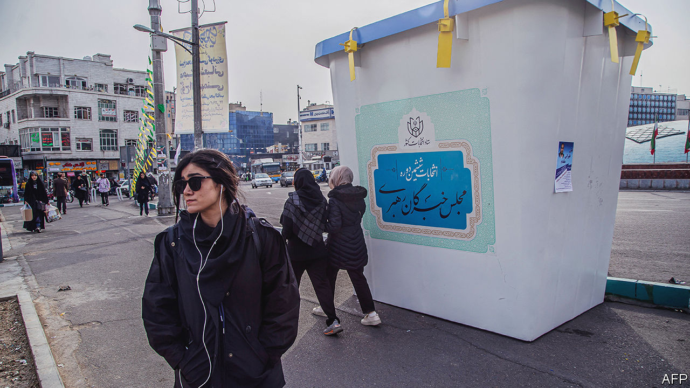

###### The beginning of the end

# As Iran scares the Middle East, at home its regime rots 

##### Iran’s phoney elections show how the clerics have lost public support 

 

> Feb 28th 2024 

The results of the shah’s last election were a triumph. His party won all 268 seats. Officially, nearly half of the electorate voted in 1975. But when revolution erupted in 1979 his party melted away. The elections on March 1st for Iran’s parliament and assembly of experts, which selects the supreme leader, share similar traits. Unlike previous polls, when pragmatists and reformists could stand, all but ardent hardliners have been disqualified, including a former president, Hassan Rouhani. Hence loyalists will sweep the board. 

But as the regime purges its reformists, it shrinks to its inner core. In its hunger to monopolise power, it hollows out the state. Once a hybrid theocracy-cum-democracy, Iran is morphing into an absolute dictatorship with a wobbly base. Clerical quangos increasingly override parliament, reducing the latter to a talking-shop. A recent government survey leaked to the BBC Persian service shows haemorrhaging support for the theocrats. According to the poll, support for a separation of religion and state has jumped from 31% in 2015 to 73% today. “Yes-men are wonderful when things are calm, but they’re useless under crisis,” says a political analyst frequently in Iran. “Without an opposition you lose the bridge to the people.”

Previously, the mullahs strove to get out the vote. Now they are so resigned to their unpopularity that they hardly bother. The election campaign has been Iran’s most lacklustre since 1979. According to a poll by the state broadcaster, more than half of Iranians are unaware of the date. Many are expected to boycott it. Fearing a fiasco, the regime has denied foreign journalists visas. Rather than assuaging popular anger, last year the government executed demonstrators who had protested in 2022. A popular song is “Strange Times” by Alireza Ghorbani. “The one who knocks on the door at night has come to kill the light,” he sings.

Faced with civil disobedience against their rules on modesty, the clerics are scuttling back to the seminaries. An Iranian visitor to Britain notes with surprise there are more veils on London’s underground than Tehran’s. So resolute is the unveiling that some draw comparisons with the last years of the shah, when women took the veil in defiance of his ban. “As with the shah at the end of its regime, the system is culturally bankrupt and can no longer control people’s bodies,” says Yaser Mirdamadi, a dissident cleric in northern England. 

Economics drives grievances. Iran’s hardline but ineffectual president, Ebrahim Raisi, has struggled to overcome American sanctions. Unlike the worldly cabinet of his reformist predecessor, Mr Rouhani, his ministers come from the barracks of the Islamic Revolutionary Guard Corps (IRGC) or Imam Sadiq, a private religious college in Tehran. Years of high inflation and a depreciating currency have eroded the value of savings. Prices of basics are soaring and subsidies are eating up the budget, leaving little for capital expenditure. Without funding for water management, lakes and rivers are drying up. Welfare payments come late. 

Mr Raisi’s foreign policy makes matters worse. The morning after a drone fired by an Iran-backed militia in Iraq killed three Americans, the rial tumbled. It is unclear whether Iran can rein in the militias that make up its axis of resistance: Hizbullah in Lebanon; the Hashd in Iraq; and the Houthis in Yemen. On paper these are assets. But they have proven to be liabilities. Iranians worry that their lobbing of missiles at Israel, American soldiers and shipping will bring hellfire down on Iran. 

Abroad, as at home, the clerics talk tough but then compromise. Iran has continued its rapprochement with the United Arab Emirates and Saudi Arabia, even though both are getting closer to Israel, which Iran calls a “cancerous tumour”. After failing to persuade Muhammad bin Salman (MBS), the Saudi crown prince, to come to Tehran, Mr Raisi visited the Saudi capital, Riyadh, in November. Iran has also signalled a readiness to change its line on Israel in the event of a peace deal with the Palestinians. In recent months its mullahs have voted (at the UN and at a meeting of the Organisation of Islamic Conference in Riyadh) in favour of a two-state settlement, implicitly recognising Israel. Interlocutors say Iran is committed to reining in its allied militias should Israel and the Palestinians make peace.

That’s me in the corner

The interlocutors are floating other balloons, too. When America and the Soviet Union convened an Arab-Israeli peace conference in Madrid three decades ago, they left Iran out in the cold, despite the wishes of its then president, Ali Akbar Rafsanjani, to participate. Snubbed, Iran’s new supreme leader, Mr Khamenei, convened his own conference for resistance against Israel instead. Hamas’s bus-bombings in Israel followed, undermining the peace process between Israel and the Palestinians.

With talk of a peace settlement again in the air, Badr Albusaidi, Oman’s foreign minister, , called for another Madrid-like conference, this time with Iran at the table. Although Israelis and Americans frame Israeli-Gulf normalisation as a common front against Iran, the Islamic Republic is signalling that it wants to be part of a new order.

Constructive diplomacy jars, given the hardliners’ history as spoilers. But it is a measure of their desperation that they are adopting policies at home and abroad that they had previously derided. “Everything that the hardliners opposed under Rouhani, they’re now doing themselves,” says Mr Mirdamadi. A place at an international conference (and de facto recognition of Israel) could throw the clerics the lifeline of international legitimacy and grant them a reprieve from sanctions.

It is not for want of trying alternatives. Mr Khamenei had tried reaching out to China. But it has at least partly complied with America’s sanctions on dollar flows. The $400bn in infrastructure projects over 25 years that China had promised in 2021 have had a slow start. Iranian officials now regret their foot-dragging over a new deal with America for sanctions relief in exchange for nuclear curbs. 

Short of a fresh start with America, Iranians wonder how long the uneasy stand-off between the clerics and their people will hold. Mr Khamenei’s age (84) and poor health have left a vacuum. Unlike his predecessor, Mr Khamenei shies from filling it by appointing a deputy. Hardliners look to the elections, particularly of the assembly of experts, to cement their grip on the succession. But they are hardly a united bunch. Conservatives want to shoehorn Mr Raisi into the job, though he lacks the credentials. Others propose Mojtaba, Mr Khamenei’s second son. 

Meanwhile, opposition forces are gathering against them. A circle of aggrieved, sidelined reformists hover in the wings, waiting for the hardliners to fail. Normally tight-lipped officials now brief foreigners about the hardliners’ abuses of power. Mohammad Zarif, who had been Mr Rouhani’s amicable foreign minister, is being kept under guard and has been stripped of his passport, some say. 

Yet those who want change also disagree about how to achieve it. Ambitious IRGC commanders aspire to the Pakistani model of a pseudo-democracy under the military’s thumb. Democrats hope for a new constitution, which would vest sovereignty in parliament. Some seek a reform-minded strongman. They all seem to agree that Iran’s , or rule of the religious jurist, has run its course. ■

