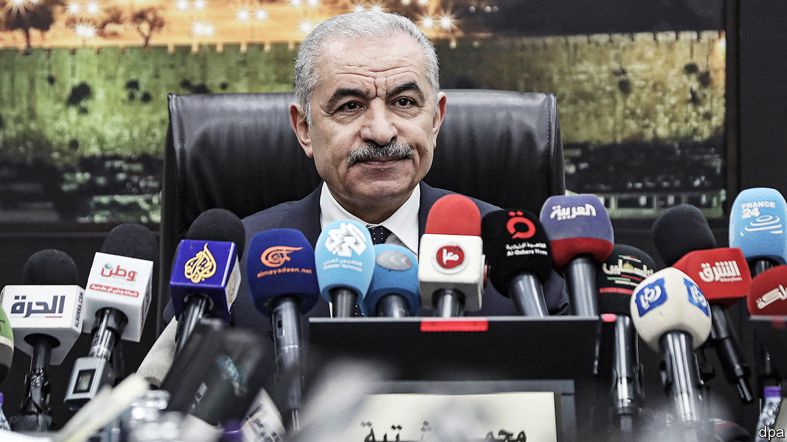

###### Fresh blood, same problems

# The Palestinians’ new prime minister faces a nightmare 

##### The PA says it is preparing for an “emerging reality” in Gaza 

 

> Feb 26th 2024 

VIOLENCE WAS again raging in Israel and the Palestinian territories. America had an ambitious plan to end it, with the support of Arab countries who offered to normalise ties with Israel. But America felt that it could no longer work with the ageing, isolated Palestinian president. Peace would require new blood, and so America pushed the Palestinian leader to name a technocratic prime minister who would reform the corrupt Palestinian Authority (PA) and build a state-in-waiting.

This sounds like today—but it was also the case in 2003, when America ran out of patience with Yasser Arafat during the second intifada, or Palestinian uprising. His choice for prime minister was none other than Mahmoud Abbas, who went on to become president himself in 2005 and is today in the 19th year of a four-year term. The PA is still corrupt; statehood has never been so far away. And now, amid the carnage in Gaza, an exasperated America wants Mr Abbas to choose his own reform-minded prime minister.


On February 26th Mohammad Shtayyeh, the Palestinian prime minister, tendered his resignation. The president accepted it but asked Mr Shtayyeh to stay on until a new government is formed. Mr Abbas’s envoys planned to meet Hamas and other Palestinian factions this week to seek their support (though they doubted it would be forthcoming). Mr Shtayyeh said that new “political arrangements” were required to consider “the emerging reality” in Gaza, where Israel has killed more than 30,000 Palestinians.

The clear favourite to succeed him as prime minister is Mohammad Mustafa, an economist who has cultivated a close relationship with the president as his economic adviser. He would be acceptable to America and Israel—although less so to his own people (his polling is anaemic). The hope is that he would clean up the PA’s endemic graft and dysfunction, a key demand of its supporters in the West and the Gulf in exchange for renewed financial support. Reality will probably be different.

Whoever takes the reins will face three big obstacles. First, the PA is broke. It relies on Israel to collect taxes on its behalf, which make up 64% of its total revenue. In October Bezalel Smotrich, the far-right Israeli finance minister, decided to withhold much of that cash. The PA has since been unable to pay public-sector salaries on time and in full. Adding to the economic misery, Israel has banned most Palestinian workers from entering its territory since the October 7th massacre, leaving more than 20% of the West Bank’s labour force jobless. Lost wages from Palestinians who had previously worked in Israel or Israeli settlements before the ban came to about 48m shekels ($13m) a day, according to the International Labour Organisation. It is hard to build a state with no money.

, who has become steadily more autocratic. The president has repeatedly postponed elections, fearing that his Fatah party might lose them, and rules by decree. He has tightened his grip on the courts, dissolving the council that appoints judges and stocking the bench with his supporters. Civil society has withered; activists have been jailed or killed for challenging his rule. The last time Mr Abbas appointed a technocrat—Salam Fayyad, a former IMF and World Bank official who was prime minister from 2007 to 2013—the two often clashed.

Mr Shtayyeh was a career apparatchik, a longtime member of Fatah’s central committee who served stints as housing minister and the head of the electoral commission. His government was defined by feuding between ministers—in recent years, he was barely able to sit in the same room as his own finance minister—and a complete failure to enact any meaningful reforms. Under his tenure the PA lost control of security in key cities and was crippled by strikes. His predecessor, Rami Hamdallah, was an academic chosen for his lack of political ambition; advisers said he kept an office at his university near Nablus and often spent afternoons there.

Both men ended their terms deeply unpopular with the Palestinian public. Yet they were also scapegoats. Real power was concentrated in the president’s office and among a handful of close advisers to Mr Abbas, including Majid Faraj, his intelligence chief, and Hussein al-Sheikh, who seems to be his preferred successor as president. There are no indications any of that will change with a new government.

The final challenge is Israel. The next Palestinian prime minister does not only need money and power: he also needs a credible prospect of ending Israel’s occupation of the territories it captured in 1967. Otherwise most Palestinians will continue to see the PA as illegitimate, a state-in-waiting that will never become a state.

America has urged Binyamin Netanyahu to commit to restoring the PA’s role in Gaza, which it ruled until Hamas expelled it in 2007, and to serious post-war diplomacy that would seek a two-state solution. After months of refusing to talk about any of this, on February 22nd Mr Netanyahu unveiled his “day after Hamas” policy. 

It was less a plan than a set of vague, sometimes open-ended aims, including “preventing a threat from Gaza” and retaining Israel’s freedom to operate there “without time limits”. Rather than an exit strategy, it is a recipe for a prolonged Israeli military presence in Gaza. No mention is made of the PA, though it rules out a role for “entities that support terrorism”, which is how the prime minister and his allies often describe the authority. Nor was there support for the two-state solution.

The cabinet has yet to discuss and endorse the policy, which for now seems aimed principally at appeasing the far-right parties in Mr Netanyahu’s coalition. But it is already clear that if this becomes Israel’s actual strategy, it would almost certainly put the country on a collision course with its key ally, the Biden administration. 

Whatever shape the new government takes, it is likely to be a far cry from the “” PA that America and its allies have demanded. Yet one Western diplomat suggests Mr Abbas may have outplayed them. The PA’s foreign backers may now be under pressure to increase aid: “We said reform the government and we’ll give you the support you need,” the diplomat says. Mr Abbas can now claim he delivered the former—and will expect the latter. First as tragedy, then as farce: two decades after he was brought in to placate Western donors, Mr Abbas now needs a figurehead of his own.■

