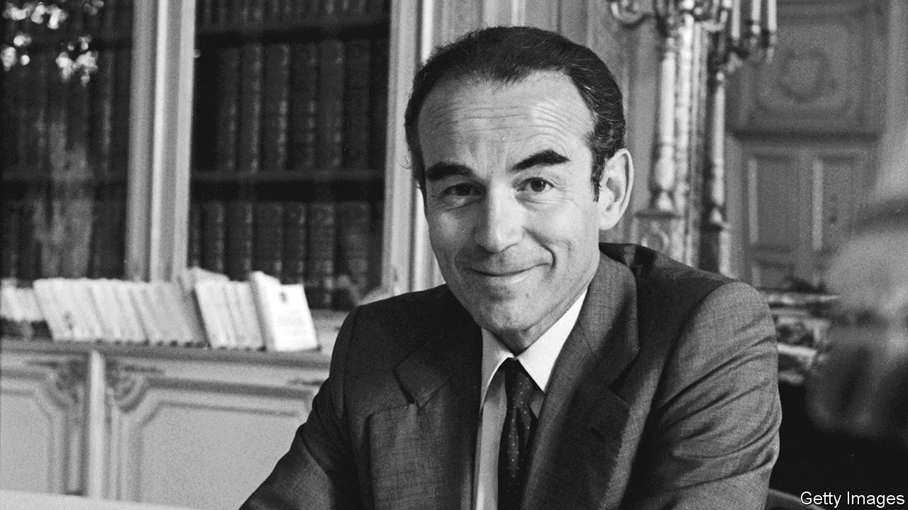

###### His old enemy

# Robert Badinter persuaded France to abolish the guillotine 

##### The man who fought to abolish the death penalty in France died on February 9th, aged 95 

 

> Feb 29th 2024 

What clothes do you wear to be killed in? What clothes do you wear to witness someone die? This was what was worrying Robert Badinter as he dressed on that cold, dank November morning in 1972. It was 3am and he was going to La Santé prison to witness his client, Roger Bontems, be guillotined. Ridiculous, really, to worry about clothes. They cut the collar off the condemned man’s shirt anyway: it helped the blade to fall better. And yet he hoped Bontems would get his own shirt back. To die in that hideous prison suit seemed somehow terrible. Badinter chose his own clothes with care, too: a dark suit. A pale shirt. A plain tie. For a lawyer to witness his client be guillotined, a little was surely necessary. 

Though by the end of that terrible morning he was, he felt, no longer his client’s “lawyer”. You cannot advocate for a corpse. Once your client has been sliced in two, you cease to be their lawyer and become instead “a man who remembers, that’s all”. Badinter was being modest. That was not all. From that day on, and for the rest of his life—first as a lawyer, then as justice minister, then finally as France’s moral conscience—he campaigned against the death penalty. And in France, successfully so: on October 9th 1981, France abolished it. Badinter had defeated the guillotine—“my old enemy”. He could not defeat the memories of that morning. For the rest of his life he would remember the sound of the blade as it had fallen: not with a hiss, or a swish, but a single, sharp, crack.

He had never expected to hear it, when he took on the case. He had been certain that his client Bontems—a prisoner who was complicit in the murder of a warder and a nurse but who had himself killed no one—would be acquitted. Badinter had been brought up by his Jewish father to love France, and its justice system. His father had fled to France from revolutionary Russia, arriving in 1919 with little more than his book-learned French, a fondness for “La Marseillaise”, and a conviction that France was the finest country in the world. And for a time, for him, it was. Soon, he had a young bride and enough money to buy his young family a fancy new apartment in a fancy arrondissement: his son Robert could see the Eiffel Tower from his bedroom. The whole family loved this land of “prosperity, freedom and peace”.

His father had adored France with an intensity that no Frenchman could match, giving his sons French names and making them read 19th-century novelists like Victor Hugo. His love didn’t even waver when some Frenchmen started making terrible, antisemitic speeches; nor when his sons found graffiti—“Death to Jews”—scrawled on the walls. He had reassured them. This, he said, was just a false note; France was a wonderful country. When his father had applied for a form of naturalisation, the official had asked him why he wanted it. He had said: “Because of my feelings towards France.” They would arrest his father in February 1943. He died in the Sobibor extermination camp. 

Hatred was never so frightening as when it wore the mask of justice. Badinter had seen enough of hatred to know that; all men of his generation had. And he always mistrusted the mob. As a teenager, he had watched two armed men drag a shorn, half-naked girl through the streets because she was a “fille à Boches”—“a girl of the Germans”. The men were despicable—but so too were the crowd. The mob played a part in his case, too. France wanted Bontems dead: a poll showed that most French supported the death penalty. But Badinter was not worried. The French mob might be angry but, like his father, he had faith in French justice: you could not kill a man who had not killed. He said so to Bontems: You have nothing to fear, he said. You’ll be pardoned, that’s for sure. 

But clemency never came. And so, on that cold Tuesday morning Badinter had set out to go to the prison in his well-chosen suit. The suit was ridiculous. But then his client had worried about his appearance, too. A few weeks before, Badinter had gone to visit him in prison and had been struck by how well his client had looked. “Oh, I do gymnastics, sir,” Bontems had replied. “I keep myself in shape.” That remark had struck Badinter as terrible. The death penalty made everything ridiculous. On the morning of the execution, before Bontems was led away, he had asked for a moment to do “a little grooming”. Then, ready for his beheading, he had carefully combed his hair. 

La Guillotine herself had been not absurd but grotesque. Badinter had seen the scaffold as soon as he had walked into the prison courtyard on that dark morning. The sight had shocked him: he had expected his old enemy would be hidden away, in some secluded courtyard. But there she was, in the open. He was not wholly surprised by his reaction: like his father, he adored Victor Hugo, the great abolitionist author. Hugo had famously written that the guillotine was so sinister it felt almost animate. That no one could look at the guillotine and remain neutral.

He certainly had not. After the execution, and his client was cut in two, he had left La Santé swearing that he would fight the death penalty for the rest of his life. His first chance to attack it came soon enough. In 1977 he took on a case in which a man had killed a young boy. Ostensibly, it was the man who was on trial; but Badinter turned it into a trial of the death penalty itself. Justice—and the jury—were in the dock. The jury could sentence his client to death, he told them. But if they did then they should know that his death was on their hands. “You are alone, and there will not be any presidential pardon.” They would all be guilty, each and every one of them: “You, and you, and you.”

He had won that vote. And then, a few years later, in 1981, he had won another when the French parliament had voted overwhelmingly to abolish the death penalty. La Guillotine, his old enemy, was finally defeated. She would now be relegated to the museum. When that vote was over, he had walked over to Victor Hugo’s seat in the Senate. He placed his hand on the commemorative plaque and he thought: “It is done.” And then he had walked out, into another Parisian morning. This time, it was a beautiful day. ■

