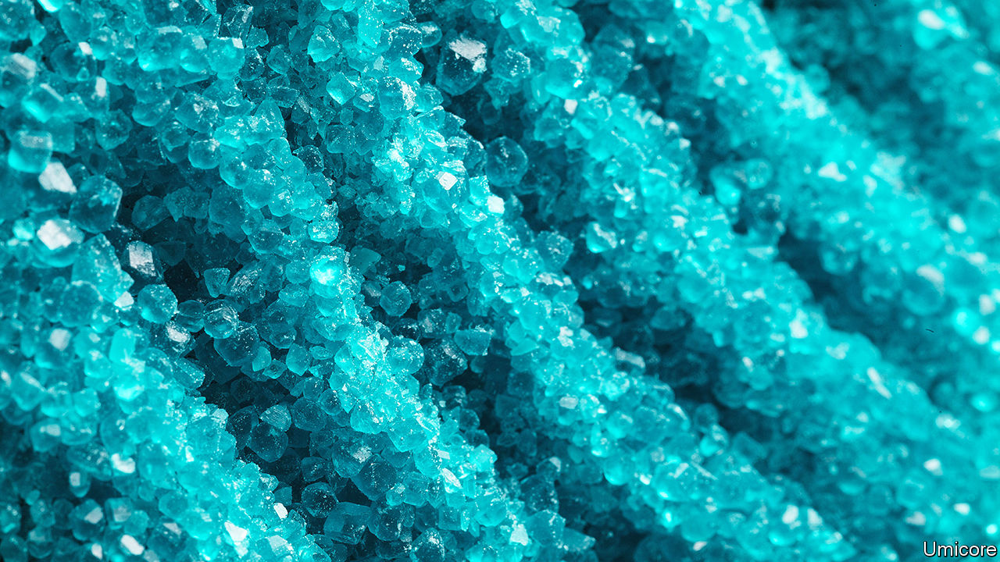

###### At the heart of the battery revolution

# A variety of new batteries are coming to power EVs 

##### All use different chemistries for cost or performance 

 

> Feb 28th 2024 

The tall grey buildings covering an industrial complex at Nysa, in south-west Poland, look like a modern car factory has been teleported into the surrounding farmland. The plant, though, does not make cars, but it is a new and vital part of the automotive supply chain for electric vehicles (EVs). These rely on batteries containing materials that can be expensive, hard to come by and are mostly processed in China. The plant at Nysa is the first to produce those materials at scale in Europe.

The lithium-ion (Li-ion) batteries that power most EVs are their single most-expensive component, typically representing some 40% of the price of the vehicle when new. The materials these batteries are made from define its performance, hence they help determine how far an EV can travel on a single charge, how fast it can go and how long its battery will last. In turn, the most critical component in those batteries are its cathodes, accounting for around half their value. The Nysa plant makes cathode materials, which puts it at the heart of a battery revolution.

As sales of EVs slow in some markets, carmakers are hoping to rev up sales with both cheaper and more-powerful batteries. Cheaper materials, however, can provide a reduced level of performance, so these are likely to be used in shorter-range city cars. The more costly high-performance versions are aimed at luxury and sports cars. And somewhere in the middle are versions of both. What all this means is that EVs will be using many different types of battery, and each version will need a different concoction of cathode active material (CAM).

Nysa shows how the industry is preparing for this multi-battery future. “We are not backing one horse,” says Mathias Miedreich, the boss of Umicore, a Brussels-based materials group which owns the Nysa operation. This strategy is reflected in the plant’s design. Most factories are configured in a linear way, with raw materials progressing along a production line as operations are carried out. Umicore’s existing CAM factories in China and South Korea operate this way. At Nysa, however, production is arranged in a modular fashion. Different processes are carried out in separate buildings, with materials transported between them in giant sack-like containers. This allows production to be switched quickly to making alternative battery chemistries according to demand, and for new processes to be introduced more easily as technologies evolve. This arrangement is being used as a template for a CAM plant the company is building in Canada. 

At present, the main raw material entering the Nysa plant is lithium, which mostly comes from mines in Chile and Australia. After tests, it is blended with various combinations of nickel, manganese and cobalt before being cooked in giant furnaces. It is then sieved, cleaned and dispatched to battery-makers to produce so-called NMC battery cells. The exact methods used at Nysa are complex and highly proprietary. Visitors and staff are relieved of their phones along with other items, including jewellery (some of the equipment uses sensitive magnetic forces).

Horses for courses

Battery-makers coat CAM onto a metal foil to form cathodes. When a battery is charged, electrons are stripped from lithium atoms on the cathode, creating charged particles called ions. The ions migrate through a liquid electrolyte to a second electrode, called an anode, which is often made from carbon. The electrons, prevented from taking this route by a separator material, travel instead along the wires of the charging circuit to the anode where they are reunited with the ions and stored. When the battery discharges, the process reverses, powering devices like an electric motor in the process.

Most carmakers are trying to use less cobalt, or eliminate it completely. Not only is it expensive, toxic and rare, but cobalt mining has been linked to labour abuses in the Democratic Republic of Congo, its primary source. For this reason, Umicore uses a monitoring process to exclude unethical practices. Such traceability is becoming increasingly important, not least in the EU where “battery passports” will be required for EVs from February 2027. These will detail the source and nature of the materials used in their production.

A cheaper alternative to NMC cells use lithium-iron phosphate (LFP). These do without cobalt and nickel, but have a lower energy density. For some uses this might not matter. In China LFP-powered vehicles are proving popular with urban motorists who travel shorter distances. Some standard-range Teslas also use LFP cells.

Another alternative for lithium is sodium, which despite being heavier is inexpensive and easy to obtain. Sodium batteries can use cathodes made from relatively cheap metals, such as manganese and iron, but these too have a lower level of performance than NMC cells. A number of battery-makers including China’s CATL, the world’s biggest, are already setting up production lines for sodium cells. IDTechEx, a firm of analysts, thinks they could be 20-30% cheaper than Li-ion batteries. One potentially huge market is storing renewable power on the grid, where increased weight is less of a problem. 

At the same time, Li-ion batteries are improving too. , which do without a liquid electrolyte, are on the horizon. Toyota, among others, are developing these. They will be smaller and lighter, doubling the range of existing EVs and cutting recharging times to a few minutes. At first these will be expensive and likely to appear in luxury and sports models. Umicore has started producing solid-state batteries at a purpose-built prototyping centre in Olen, Belgium, for testing in vehicles. 

Still more battery chemistries are coming. Umicore is exploring DRX (disordered rock salt) which refers to a crystalline structure that could give Li-ion cells an energy density that matches cobalt and nickel, but with more readily available materials, such as manganese and titanium. Gerbrand Ceder and his colleagues at the University of California, Berkeley, reckon DRX batteries might be commercially available within five years.

Despite the patchy slowdown in EV sales, demand for battery materials is booming. The Nysa plant, which opened in September 2022, is already expanding and a second factory is being built next door in a joint venture with PowerCo, a company which combines the Volkswagen Group’s battery activities. Combined, the two plants have the potential to produce over 200GWh of cathode material a year, enough for some 3m EVs.

On the other side of the battery, anodes are also starting to see more innovation. Group14 Technologies, a company based near Seattle, has begun manufacturing an anode material made from a silicon-carbon composite. Typically, anodes are made from graphite. Silicon, which is plentiful and inexpensive, can in theory absorb ten times more lithium ions than graphite. In doing so, though, silicon can swell to three or four times its size, which would make batteries using them prone to damage. Group 14’s composite contains the expansion because it cages silicon in a “scaffold” made from carbon nanoparticles, explains Grant Ray, the firm’s head of strategy. This will allow a silicon-composite anode to boost a battery’s energy density by up to 50%. As the company scales up production the first batteries using silicon anodes are likely to have high-performance applications—Porsche, a German sports-car maker, is one of the firm’s backers. 

Exactly how all these rival battery technologies develop will depend on material prices. The increasing use of cheaper substances, like sodium, could alleviate pressure on supplies of lithium, nickel and cobalt. So will recycling, because an increasing amount of battery materials will come from a growing number of EVs reaching the end of the road. Picking winners will indeed be difficult. Like the factory at Nysa, the battery industry needs all the flexibility it can get. ■


